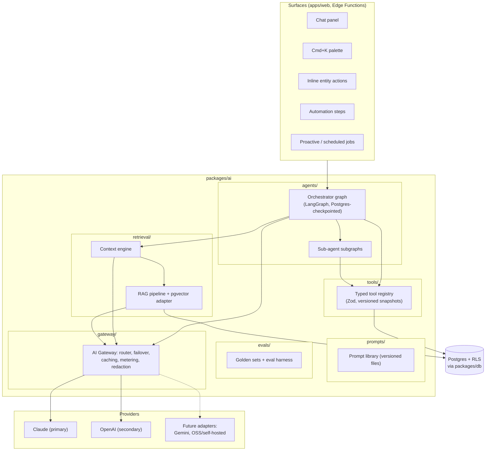
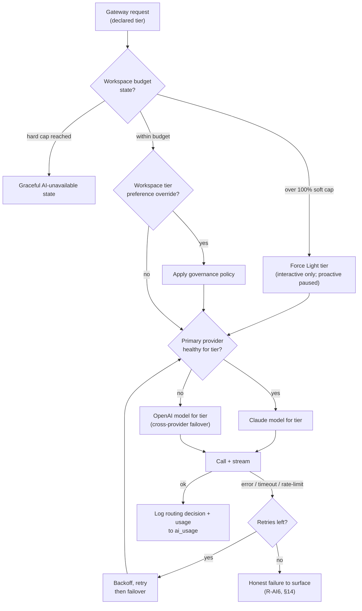
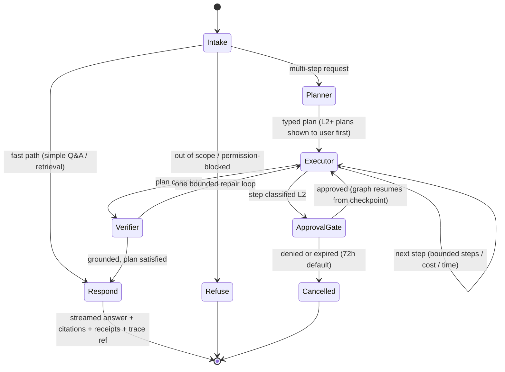
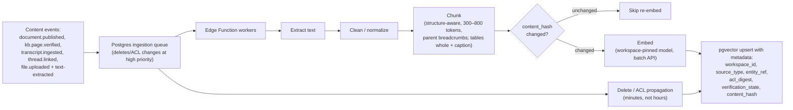
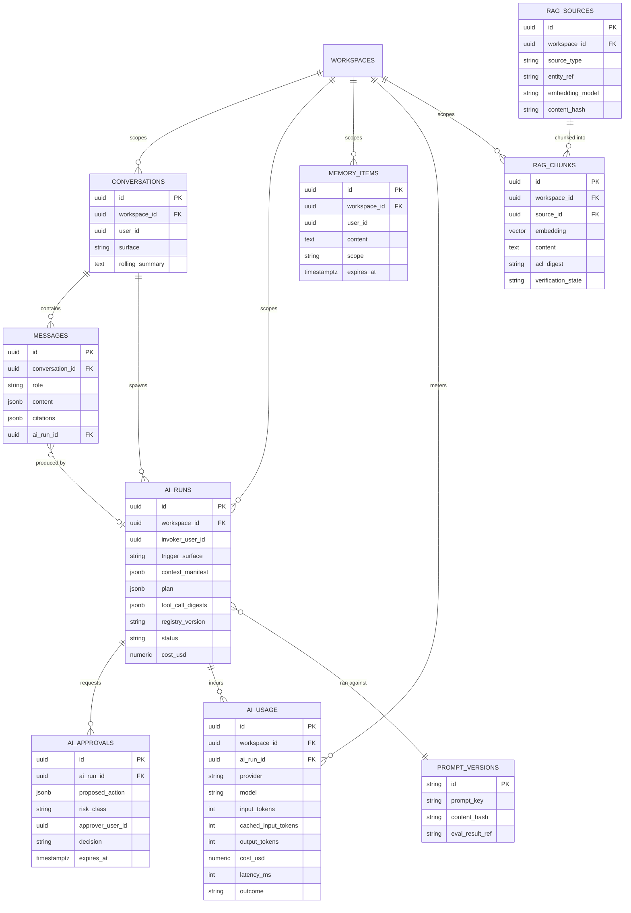

# AI Architecture — Aurex Engineering Design

| | |
|---|---|
| **Document** | AI Architecture — AurexOS |
| **Status** | Approved — Living Document |
| **Version** | 1.0 |
| **Date** | 2026-07-08 |
| **Owner** | Founding CTO, AurexDesigns |
| **Related** | [Architecture.md](./Architecture.md) · [SearchArchitecture.md](./SearchArchitecture.md) · [SecurityArchitecture.md](./SecurityArchitecture.md) · [AutomationArchitecture.md](./AutomationArchitecture.md) · [../07_AI_Strategy.md](../07_AI_Strategy.md) · [../08_Tech_Stack.md](../08_Tech_Stack.md) · [../05_User_Roles.md](../05_User_Roles.md) |

[../07_AI_Strategy.md](../07_AI_Strategy.md) is the binding strategy; this document is its engineering architecture — components, data model, and operations. Nothing here introduces a new strategic decision: the philosophy ("one brain, many surfaces", trust as the product, model-agnostic by contract) lives in the strategy doc and is not restated. What this document adds is the layer beneath: how `packages/ai` is composed, what every subsystem's contract is, which tables hold AI state, and how the whole thing is routed, metered, evaluated, and degraded in production. Where this document and [../07_AI_Strategy.md](../07_AI_Strategy.md) could ever be read to disagree, the strategy doc wins and this one gets fixed.

The AI project rules R-AI1 through R-AI6 ([../12_Project_Rules.md](../12_Project_Rules.md) §5) are assumed throughout and cited where they bite.

---

## 1. Package Architecture: `packages/ai`

The entire AI layer lives in `packages/ai` ([../13_Folder_Structure.md](../13_Folder_Structure.md) §1), headless by construction — it may import `core` and `db`, never `ui`, so the same code serves the web app, Edge Function pipelines, and future workers. `apps/web/modules/aurex/` is only the *surface* (chat panel, streaming UI, palette actions); the brain is here.



**Directory contracts (binding):**

| Directory | Owns | Must never |
|---|---|---|
| `gateway/` | Provider adapters, model router, streaming, caches, `ai_usage` metering, redaction hooks | Leak provider SDK types upward; be bypassed (R-AI1) |
| `agents/` | Orchestrator graph, sub-agent subgraphs, checkpoint plumbing | Call a provider SDK directly; mutate data except through `tools/` |
| `tools/` | Tool definitions + registry, derived from `packages/core` schemas | Contain raw SQL, generic HTTP, or code-execution tools |
| `retrieval/` | Context engine, RAG ingestion/query, the swappable vector-store interface | Return ACL-unfiltered content into context |
| `prompts/` | Versioned prompt files, PR-reviewed, eval-gated (R-AI5) | Be duplicated as inline strings in feature code |
| `evals/` | Golden sets, retrieval/agent/safety suites, LLM-judge harness | Harvest PII-classified fields ([../07_AI_Strategy.md](../07_AI_Strategy.md) §8.6) |

---

## 2. AI Gateway

The gateway is the **only** code path to model providers (R-AI1; [../07_AI_Strategy.md](../07_AI_Strategy.md) §4). Provider SDK imports outside `packages/ai/gateway` fail lint. Everything above the gateway speaks one internal contract:

```ts
// Conceptual — the shape, not the implementation.
interface GatewayRequest {
  workspaceId: string;
  invoker: { userId: string; runId: string; surface: Surface };
  tier: "light" | "standard" | "frontier" | "embeddings";
  messages: InternalMessage[];        // our types, never a vendor's
  tools?: ToolSpec[];                 // derived from the registry snapshot
  cachingHints: { stablePrefixLength: number };
  bounds: { maxOutputTokens: number; timeoutMs: number };
}
interface GatewayResponse {
  stream: AsyncIterable<Delta>;       // text + tool-call deltas, SSE-ready
  usage: { inputTokens: number; cachedInputTokens: number; outputTokens: number; costUsd: number };
  routing: { provider: string; model: string; failedOver: boolean };
}
```

The gateway owns, in one place:

1. **Routing policy** — the model router (§3).
2. **Failover** — health checks, retry with backoff, cross-provider failover mid-conversation. Conversation state is ours (Postgres), not the provider's, so failover is invisible to the orchestrator.
3. **Streaming** — first-class SSE end-to-end; tool-call deltas surface as live "working" states; approval cards can interrupt a stream.
4. **Caching, two layers** — (a) provider prompt caching for stable prefixes (system frame, registry prefix, workspace profile), engineered for the >60% cached-input target on agentic runs ([../07_AI_Strategy.md](../07_AI_Strategy.md) §9); (b) a gateway response cache for deterministic low-temperature tasks, keyed by `(model, prompt hash, tool state)`, short TTL, **workspace-keyed and never shared across workspaces** (R-AI4).
5. **Uniform telemetry** — every call writes an `ai_usage` row (workspace, run ref, model, tokens in/out/cached, latency, cost, outcome). Features cannot skip this: the gateway writes it, not the caller (R-AI2 enforcement pattern).
6. **Redaction hooks** — PII-classified fields stripped from telemetry and logs per [../07_AI_Strategy.md](../07_AI_Strategy.md) §8.6.
7. **Budget enforcement** — §12 caps are checked at admission, before tokens are spent.
8. **Compliance posture** — zero-retention / no-training agreements with every provider adapter; an adapter without that agreement does not ship.

---

## 3. Model Router & Provider Support Matrix

### 3.1 Routing decision

Tiers and their workload mapping are fixed by [../07_AI_Strategy.md](../07_AI_Strategy.md) §4.1: **Frontier** (planning, multi-step agentic runs, contract/proposal drafting), **Standard** (single-step drafting, summarization, extraction), **Light** (classification, triage, routing chores), **Embeddings** (pinned per workspace corpus — mixing embedding models in one index breaks retrieval; migration is a re-embed backfill job, §8.4). Tier is *declared* per orchestrator node and per tool `cost_hint`, never guessed at runtime.



Router configuration (tier → concrete model IDs, health thresholds, cohort rollout flags) is **config, not code** — model migrations roll out and roll back via router config with no deploy ([../07_AI_Strategy.md](../07_AI_Strategy.md) §10).

### 3.2 Provider support matrix

Adding a provider = writing one adapter behind the gateway contract. Zero orchestrator, tool, or prompt-pipeline changes (validated by [../07_AI_Strategy.md](../07_AI_Strategy.md) §4.1 "adding a provider = adding an adapter").

| Provider | Status | Role | What it serves | What adding/keeping it requires |
|---|---|---|---|---|
| **Claude** (Anthropic) | **Current — primary** | All tiers primary | Agentic tool use, planning, long-context document/email analysis | Zero-retention agreement (in place); eval baselines maintained per model version |
| **OpenAI (GPT)** | **Current — secondary** | All tiers fallback; embeddings candidate | Cross-provider failover, capability gaps | Same contract; shadow-eval parity checks each model refresh |
| **Gemini** (Google) | **Future** | Tertiary fallback / long-context or price niches | TBD by evals | New adapter (translate contract, streaming, tool-call format); zero-retention/no-training agreement; full eval suite shadow run; router config entry; cost model in `ai_usage` pricing table |
| **Open-source / self-hosted** | **Future (Phase 5 cost lever)** | Light-tier volume workloads first | Classification, triage, extraction at scale | One **OpenAI-compatible adapter** covering vLLM/Ollama-class servers; plus what no agreement can wave away: we own hosting, capacity, model updates, and the same eval bars — an OSS model that misses the Light-tier quality bar does not route, regardless of price |

The embedding tier has a stricter rule than the chat tiers: the embedding model is **pinned per workspace corpus**. Provider swap for embeddings is never a router flip — it is a scheduled re-embed backfill (§8.4) gated on measured retrieval-eval gains ([../07_AI_Strategy.md](../07_AI_Strategy.md) §13 Q2).

---

## 4. Orchestrator & Multi-Agent System

### 4.1 The canonical graph

One LangGraph (TypeScript) orchestrator serves every surface. It is a typed, inspectable state machine — never a free-running loop — checkpointed to Postgres after every node, so approvals can be decided days later and crashes resume rather than restart.



Node responsibilities, tiers, and bounds are exactly as specified in [../07_AI_Strategy.md](../07_AI_Strategy.md) §2.2 — Intake on the Light tier with a fast path for trivial requests; Planner on Frontier producing explicit typed plans with per-step risk classes; Executor bounded by max steps/cost/wall-time; the Approval Gate suspending the checkpointed graph and emitting `ai.approval.requested`; the Verifier performing success, plan-satisfaction, and grounding checks (every factual claim must trace to a retrieval or tool output) with one repair loop before honest error reporting.

### 4.2 Sub-agents as subgraphs

Specialized capabilities (Proposal Drafter, Collections Assistant, and future peers) are **LangGraph subgraphs invoked as tools** by the main orchestrator: they appear in the tool registry with their own key, input/output schemas, `required_permission`, and risk class, so they inherit permission checks, autonomy floors, auditing, and run bounds with no special casing. A sub-agent's internal tool calls are recorded in the parent `AIRun` trace; its checkpoints nest under the parent run.

### 4.3 Future marketplace agents (Phase 5)

The subgraph-as-tool seam is deliberately the extension point for the Agents Marketplace ([../07_AI_Strategy.md](../07_AI_Strategy.md) §12). An installable agent = packaged subgraph + tool-permission manifest + prompt assets + eval set. Architecturally nothing changes: marketplace agents get **no new primitives**, only compositions of registered tools, run strictly within the installing workspace's autonomy policy and the invoking user's permissions, are sandboxed by the same run bounds, and produce the same `AIRun` traces. The prerequisite gates (registry stability, eval maturity, audited isolation, public API) are listed there and are not relitigated here.

---

## 5. Tool Calling

Tools are the **only** AI mutation path — no raw SQL tool, no generic HTTP tool, no code-execution tool in production surfaces ([../07_AI_Strategy.md](../07_AI_Strategy.md) §2.3).

```ts
// Conceptual tool definition — schemas come from packages/core (one Zod spine, 08_Tech_Stack.md §2.7).
interface ToolDefinition<In, Out> {
  key: `${ModuleName}.${string}`;            // e.g. "finance.draft_invoice"
  description: string;                        // model-facing; versioned + eval-gated
  inputSchema: ZodType<In>;                   // validated on call — malformed calls rejected, never fixed up
  outputSchema: ZodType<Out>;                 // validated on return
  requiredPermission: AtomicPermission;       // 05_User_Roles.md §3.1, checked per call
  riskClass: "read" | "create" | "mutate" | "outbound" | "destructive";
  sideEffects: DomainEventName[];             // declared emissions; idempotency-key support
  costHint: "cheap" | "expensive";            // planner ordering/pruning input
  surfaceScope: "internal" | "portal" | "both";
}
```

**Execution rules (all mechanical, none aspirational):**

1. Handlers run under the **invoker's RLS context** — the `required_permission` check is defense-in-depth on top of RLS, never instead of it ([../05_User_Roles.md](../05_User_Roles.md) §8.1).
2. Read tools return **shaped DTOs**, not rows: field-level permissions (compensation, margins, deal values per [../05_User_Roles.md](../05_User_Roles.md) §3.4) are applied in DTO shaping, so the model never sees what the invoker couldn't.
3. `riskClass` drives the autonomy floor (§10): `outbound` and `destructive` can never execute below L2 (R-AI3).
4. Portal Aurex sees only `portal`-scoped tools — surface scoping is registry-level filtering, not prompt-level pleading.
5. The registry is **snapshot-versioned**; every `AIRun` records the registry version it ran against, so evals and incident reviews replay against the exact tool surface the run saw.
6. Every module ships its tools as part of its definition of done ([../07_AI_Strategy.md](../07_AI_Strategy.md) §1) — a module without registered tools, context providers, and event semantics is not done.

---

## 6. Context Engine

Context assembly is a **budgeted, ranked pipeline** ([../07_AI_Strategy.md](../07_AI_Strategy.md) §2.4) implemented in `retrieval/`. Layer order, per-layer token budgets, and ranking (relevance × recency × trust) are fixed:

| # | Layer | Source | Trust tier |
|---|---|---|---|
| 1 | System frame | Aurex identity, workspace profile, invoking user, autonomy policy, date | Highest — instructions |
| 2 | Surface/entity anchor | What the user is looking at (this deal, this project, this thread) | Highest — data |
| 3 | Conversation memory | Current conversation + rolling summary (§7) | High |
| 4 | Retrieved context | RAG hits (§8) + structured reads via read tools, ACL-filtered | Per-source (§8.5 weighting) |
| 5 | Event recency signals | Recent `domain_events` for anchored entities | High |
| 6 | Memory items | Curated user/workspace preferences and standing facts (§7) | High |

**Every context block carries provenance and a trust tier** — the input to the prompt-injection defenses in [../07_AI_Strategy.md](../07_AI_Strategy.md) §8.3: untrusted tiers (inbound email, client uploads, web) enter only as delimited data blocks, never interpolated into instructions, and their presence in context drops the effective autonomy of `outbound`/`mutate`/`destructive` tool calls by one level.

The engine's core anti-hallucination invariant: **facts that have a table are queried fresh through read tools, never memorized or answered from embeddings alone.** Aurex does not "remember" an invoice status; it looks it up.

---

## 7. Memory & Conversation History

Five layers, five stores, five lifetimes ([../07_AI_Strategy.md](../07_AI_Strategy.md) §2.5):

| Layer | Store | Scope / lifetime | Notes |
|---|---|---|---|
| **Short-term** | `conversations` + `messages` + rolling summary | Per conversation | Summarization compresses beyond a token threshold; pinned facts survive compression |
| **Working** | LangGraph checkpoints (Postgres) | Per run | Plan, intermediate tool results, pending approvals — what makes multi-day approvals resumable |
| **Long-term explicit** | `memory_items` | Per user / per workspace, until edited or expired | **User-visible and editable** — memory is a feature, not surveillance. Writes are L1 ("should I remember this?") or explicit user command |
| **Workspace knowledge** | pgvector chunks (§8) | Per workspace, per ACL | The RAG corpus |
| **Structured truth** | Postgres via read tools | Live | Never memorized — §6 invariant |

**Conversation history** is a first-class product surface, not just model context: conversations are workspace-scoped RLS rows owned by their user; messages store role, content, citations, tool-call receipts, and the `ai_run_id` linkage; the rolling summary is stored beside the conversation and regenerated asynchronously. Deletion of a conversation cascades per GDPR erasure rules (§14), including any memory items or cache entries derived from it.

---

## 8. Knowledge Base, Embeddings & the RAG Pipeline

### 8.1 KB as the RAG backbone

The Knowledge Base module is the highest-trust retrieval corpus: verified KB pages outrank every other source (§8.5), staleness flags down-weight them, and answer citations disclose verification state. Documents, meeting transcripts, and linked email threads join the corpus with descending trust. This makes KB curation directly and visibly improve Aurex answer quality — the product loop the strategy doc intends.

### 8.2 Ingestion pipeline

Event-driven, not batch ([../07_AI_Strategy.md](../07_AI_Strategy.md) §5.1): content events enqueue ingestion jobs on the Postgres queue, worked by Edge Functions (`supabase/functions/ai-pipelines/`).



Chunking rules are normative: block/heading-aligned for documents and KB with breadcrumb enrichment (`doc title → section path`), speaker-turn windows for transcripts, thread-message units for email; tables and pricing blocks are chunked whole with a generated natural-language caption. Re-ingestion is hash-diffed — only changed chunks re-embed. A revoked document must promptly stop appearing in answers; deletion/ACL propagation runs at queue priority.

### 8.3 Retrieval: hybrid, weighted, ACL-enforced twice

- **Hybrid by default:** pgvector semantic search + Postgres FTS, fused with reciprocal rank fusion — semantic recall plus exact-match precision (invoice numbers, names, jargon).
- **Re-rank** (Light tier) on the fused top-K for planner-flagged high-stakes queries.
- **Source weighting:** verified KB ≻ published documents ≻ meeting summaries ≻ raw transcripts ≻ email.
- **Two-stage ACL enforcement:** metadata pre-filter on `acl_digest` (optimization) + authoritative post-filter re-checking the invoker's effective permission on every hit before context inclusion ([../05_User_Roles.md](../05_User_Roles.md) §8.3). The post-filter is the guarantee. Embedding a document never widens its audience.
- Retrieval telemetry (hits, used-in-answer flags, "wrong source" feedback) feeds the retrieval eval set (§13).

### 8.4 Embeddings operations

The embedding model is **pinned per workspace corpus** and recorded on the corpus. A model migration is a scheduled **re-embed backfill**: new model writes to a shadow column/index, retrieval evals compare old vs. new on the workspace's own query set, cutover flips per workspace, old vectors are purged. Non-interactive embedding work uses provider batch APIs (§12). Annual review cadence; migrate only on measured retrieval-eval gains ([../07_AI_Strategy.md](../07_AI_Strategy.md) §13 Q2).

---

## 9. Vector Database: pgvector Decision & Upgrade Path

**Decision (made in [../08_Tech_Stack.md](../08_Tech_Stack.md) §4.4, restated as binding):** embeddings live in the primary Postgres via `pgvector` with HNSW indexes, every vector row carrying `workspace_id` under the **same RLS policies as every other table**. The decisive argument is tenancy: one isolation model, auditable in one place, no sync pipeline, no second backup/consistency story (R-AI4). At our scale — millions of vectors per large tenant, not billions — pgvector is comfortably sufficient through Phase 4, with per-workspace partial HNSW indexes as the first in-place optimization.

**Pre-committed upgrade path**, behind the `retrieval/` interface that exists from day one so the swap touches one package:

| Step | Move | Trigger |
|---|---|---|
| 1 | Dedicated Postgres+pgvector instance (same code, new connection string) | p95 vector search over budget, or vector storage distorting primary sizing ([../09_Scaling_Strategy.md](../09_Scaling_Strategy.md) §4.2) |
| 2 | Dedicated vector store (Turbopuffer/Qdrant-class) behind the same adapter | Step 1 exhausted |

Any adapter must honor the identical isolation contract: workspace-scoped rows, two-stage ACL enforcement, deletion propagation SLO. An adapter that cannot express these does not qualify, whatever its benchmarks say.

---

## 10. AI Permissions & Autonomy Enforcement

The binding rules live in [../05_User_Roles.md](../05_User_Roles.md) §8; this section states the enforcement mechanics.

1. **Zero escalation, mechanically.** Tool handlers execute under the invoker's RLS context; `required_permission` is checked per call; DTO shaping applies field-level rules. There is no AI service role visible to end users, and no aggregation loophole — a question whose answer requires unviewable data gets a permission-aware refusal.
2. **Effective autonomy = min(workspace ceiling, action-category level, tool risk-class floor, invoker's own manual permission).** Computed at plan time per step and re-checked at execution time (plans can outlive permission changes).
3. **Hard floors no configuration can lift:** outbound ≤ L2, destructive ≤ L2 (plus reversibility requirement), contract sending permanently human-gated, Settings/roles/permissions mutations permanently human-only, no L4.
4. **Trust ratchet:** approval statistics generate L0 recommendations to raise specific categories — suggestions only, Owner acts.
5. **Proactive/scheduled runs** execute under the workspace AI service context (Owner-configured, default read-only); outputs are filtered **per recipient's** permissions — two users get different digests.
6. **Approvers must hold the permission being exercised** — an approval card is a permission exercise, not a rubber stamp.

---

## 11. AI Data Model, Logs & Audit

### 11.1 Entities

All tables follow the platform conventions ([../08_Tech_Stack.md](../08_Tech_Stack.md) §3.2): UUIDv7 keys, `workspace_id` + RLS, timestamps, soft delete where applicable.



### 11.2 The AIRun trace (R-AI2)

Every run records: trigger + surface, invoking identity, the **full context manifest** (what was assembled, with provenance — stored as references + hashes, not full copies, for storage sanity), every model call (gateway telemetry), the plan, every tool invocation with input/output digests, approval records, final output, cost, and the registry + prompt versions it ran against. Mutations land in the platform `audit_log` as `actor via aurex` with `ai_run_id` linkage ([../05_User_Roles.md](../05_User_Roles.md) §10 `ai.action_executed`). Retention: **12 months full trace, summarized thereafter** — with the pending storage-cost review noted in §15.

This trace is what makes the rest of the architecture honest: incident review replays the exact context, tools, and prompt versions; evals regress against real failures; the trust ratchet computes from real approval records.

---

## 12. Cost Monitoring

Enforced at the gateway (the one choke point), per [../07_AI_Strategy.md](../07_AI_Strategy.md) §9:

| Control | Mechanism |
|---|---|
| Workspace monthly budget | 80% → notify Owner · 100% → interactive continues Light-tier-only, proactive jobs pause · hard cap → graceful AI-unavailable state (§14) |
| Per-user daily soft caps | Prevent single-user runaway inside a healthy workspace budget |
| Run bounds | Max steps / cost / wall-time per run — worst-case spend per interaction is a known constant |
| Tiering | Router default: cheapest tier meeting the eval-set quality bar — bars set by evals, not vibes |
| Prompt caching | Stable-prefix engineering (system frame, registry prefix); target >60% cached input tokens on agentic runs |
| Batch APIs | All non-interactive work (embedding backfills, digest generation, nightly predictions) uses provider batch pricing |
| Context frugality | Budgeted assembly (§6); retrieval precision work is cost work |

**Observability:** cost per run / capability / workspace / model on the internal Analytics surface, sourced solely from `ai_usage`; weekly cost-regression review is an engineering ritual; every new AI capability ships with a projected and then measured unit cost. Phase 5 turns the same metering into a billable plan dimension.

---

## 13. AI Monitoring & Evals

AI behavior is tested like code (R-AI5; [../07_AI_Strategy.md](../07_AI_Strategy.md) §10). The eval harness lives in `packages/ai/evals` and runs in CI.

**Prompt library & versioning:** every prompt is a versioned file in `packages/ai/prompts` — never an inline string in feature code (lint-banned). Prompt files carry a key, version, and changelog; a `prompt_versions` registry row (content hash + eval result ref) lets every `AIRun` pin exactly what it ran. Behavior-affecting prompt changes are PRs that must pass their eval layer before merge. Prompt construction is engineered for provider cache stability (stable ordering, stable prefixes) — prompt hygiene is cost hygiene.

**Eval layers:**

| Layer | Scope | Gate |
|---|---|---|
| Unit | Per prompt / tool description: golden input→behavior sets | CI on every prompt-asset change |
| Retrieval | Query→expected-source sets per corpus type; recall@K, precision, ACL-leak checks | CI; **an ACL leak is a build-failing event, not a metric** |
| Agent/scenario | Scripted multi-step runs against a seeded fixture workspace: plan quality, tool sequence, approval-gate triggering, final state; LLM-judge for narrative quality with periodic human calibration | Pre-merge for graph/routing changes |
| Safety regression | Prompt-injection corpus, permission-boundary probes, cross-tenant probes, autonomy-floor probes | **Blocking — any regression blocks deploy** |

**Live monitoring:** draft acceptance rate, action approval rate, edit distance on accepted drafts, citation clicks and "wrong source" feedback, proactive acted-on rates (auto-throttling noisy surfaces), plus gateway health (latency, failover counts, cache hit rate) — dashboarded per capability. Failures become eval cases; the eval set grows from production, not imagination.

**Model migration protocol:** shadow-run the full suite on the candidate → review cost/quality deltas → staged rollout by workspace cohort via router config → rollback is a config revert, no deploy.

---

## 14. Where AI Runs; Degradation & Failure Modes

### 14.1 Execution contexts

Three contexts, one architecture — same orchestrator, registry, context engine, and audit trail ([../07_AI_Strategy.md](../07_AI_Strategy.md) §3):

| Context | Trigger | Identity & permissions | Runtime |
|---|---|---|---|
| **Interactive** | Chat / Cmd+K / inline action | Invoking user | Web request → orchestrator, SSE stream back |
| **Automation step** | Automation Studio flow | Automation creator, re-validated per run | Automation runner invoking the same graph |
| **Proactive/scheduled** | `pg_cron` / event patterns | Workspace AI service context, default read-only; outputs per-recipient filtered | Edge Function jobs, batch APIs, Notifications delivery |

### 14.2 Degradation ladder (R-AI6)

The platform without AI degrades to an excellent conventional platform, never a broken one — **no core OS workflow hard-depends on a live model**. Failure handling is a ladder, each rung explicit:

| Condition | Behavior |
|---|---|
| Single call error / timeout / rate limit | Retry with backoff on the same provider |
| Provider unhealthy for a tier | Cross-provider failover mid-conversation (state is ours; transparent to the user) |
| All providers down | AI surfaces show honest unavailability; manual fallbacks remain on every AI surface; queued proactive jobs defer, never silently drop |
| Workspace at 100% budget | Interactive on Light tier only; proactive paused; Owner notified |
| Hard budget cap | Graceful AI-unavailable state, identical UX to provider outage |
| Run exceeds step/cost/time bounds | Graph pauses and asks the user — never silent truncation |
| Verifier failure after repair loop | Honest error with the partial trace, never a confident wrong answer |
| Approval expired (72h) | Run cancelled, requester notified, trace retained |
| Injection screening hit | Content enters as flagged data; effective autonomy dropped; user informed in-line |

**GDPR erasure** is a platform failure mode we handle by design, not exception: hard-delete flows cascade to vectors, memory items, conversation logs, and cached artifacts — deletion propagation is part of the ingestion pipeline's contract (§8.2) and is tested, not assumed.

---

## 15. Open Questions

1. **Gateway response-cache TTLs per task class** — classification vs. digest sub-queries likely want different TTLs; set from Phase 3 hit-rate data rather than guessed now.
2. **Checkpoint compaction policy** — LangGraph checkpoints for long-suspended runs (approval pending for days) may warrant compaction before the 72h expiry; measure state sizes in Phase 3 before adding machinery.
3. **Embedding migration cadence** — annual review, migrate only on >10% measured retrieval-eval gains (shared with [../07_AI_Strategy.md](../07_AI_Strategy.md) §13 Q2); the shadow-index mechanics in §8.4 are ready either way.
4. **Open-source Light-tier hosting shape** — dedicated GPU VM vs. serverless inference for the Phase 5 cost lever; decide when Light-tier volume data exists ([../07_AI_Strategy.md](../07_AI_Strategy.md) §13 Q3).
5. **AIRun trace retention for L0/read-only runs** — the 12-month full-trace default may shorten for read-only runs after the 6-month storage review ([../07_AI_Strategy.md](../07_AI_Strategy.md) §13 Q5).
6. **Sub-agent trace nesting depth** — whether marketplace-era nested subgraphs need a depth cap beyond run bounds; revisit at the Phase 5 prerequisite review.
