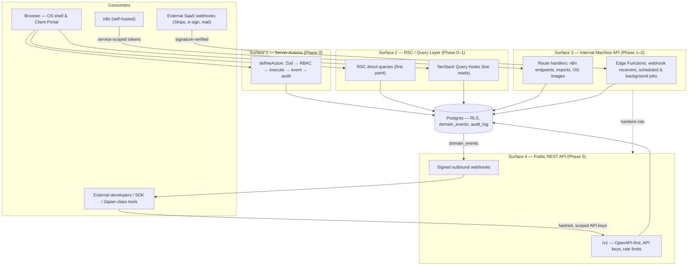
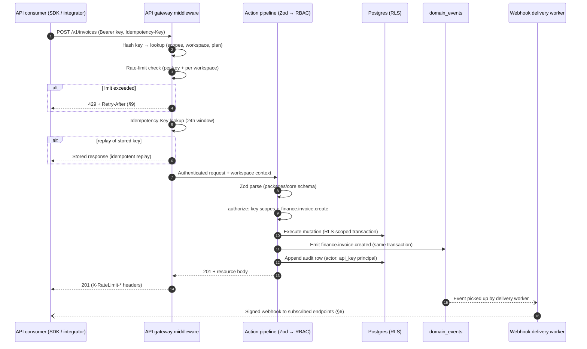
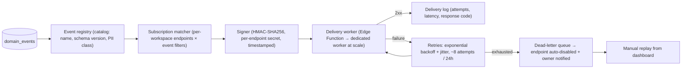

# API Strategy — Internal Surfaces, Public REST, Webhooks & SDK

| | |
|---|---|
| **Document** | API Strategy — AurexOS |
| **Status** | Approved — Living Document |
| **Version** | 1.0 |
| **Date** | 2026-07-08 |
| **Owner** | Founding CTO, AurexDesigns |
| **Related** | [Architecture.md](./Architecture.md) · [AuthenticationArchitecture.md](./AuthenticationArchitecture.md) · [FutureArchitecture.md](./FutureArchitecture.md) · [08_Tech_Stack.md](../08_Tech_Stack.md) · [15_Future_Ideas.md](../15_Future_Ideas.md) · [12_Project_Rules.md](../12_Project_Rules.md) |

This document defines how anything talks to AurexOS — the browser, our own background jobs, n8n, and (in Phase 5) external developers. It formalizes the layered API model already implicit in [08_Tech_Stack.md](../08_Tech_Stack.md) §2.1/§3.4/§5, decides REST over GraphQL and tRPC for the public surface, and lays down the versioning, authentication, webhook, and deprecation policies that make [15_Future_Ideas.md](../15_Future_Ideas.md) §5 buildable without freezing internal evolution. The governing insight: **we do not build an API in Phase 5 — we grow one from Phase 0.** The internal machine surface hardens gradually until publishing it is a policy decision, not an engineering project.

---

## 1. The Layered API Model

AurexOS has exactly four API surfaces. Every request path in the system belongs to one of them; a request that fits none is a design error. This is the API-level projection of the mutation spine in [12_Project_Rules.md](../12_Project_Rules.md) R-A3 and the hybrid-edge topology in [MicroservicesStrategy.md](./MicroservicesStrategy.md) §5.

| # | Surface | Consumers | Protocol | Auth | Phase |
|---|---|---|---|---|---|
| 1 | **Server Actions** (internal UI mutations) | Our own React components in `apps/web` | Next.js Server Actions via the shared `defineAction` wrapper | Supabase Auth session (JWT claims: `workspace_id` + role) | 0 |
| 2 | **RSC / query layer** (internal reads) | Server Components (first paint), TanStack Query hooks (interactivity) | Direct RLS-scoped Supabase queries; no HTTP API of our own | Supabase Auth session; RLS backstop | 0–1 |
| 3 | **Internal machine API** | n8n, inbound webhooks (Stripe, e-sign, mail), scheduled jobs, exports, OG images | Route handlers (exports, OG images, n8n endpoints) + Supabase Edge Functions (webhook receivers, scheduled/background logic) | Service-scoped tokens (workspace-scoped, least-privilege per R-S6); provider signature verification for inbound webhooks | 1–2, hardening continuously |
| 4 | **Public REST API** | External developers, integration marketplace partners, Zapier/Make/n8n-cloud users, our own SDK | Versioned REST (`/v1`), OpenAPI-first | Per-workspace API keys (hashed, scoped, expiring) | 5 (+1 for GA per [15_Future_Ideas.md](../15_Future_Ideas.md) §5) |

Binding rules across all four surfaces:

- **One mutation spine.** Every surface that mutates state funnels into the same sequence — validate (Zod) → authorize (RBAC) → execute → emit domain event → audit — whether the caller is a form submit, an n8n workflow, or a public API request (R-A3, R-D4). Surfaces differ in *transport and auth*, never in *pipeline*.
- **Route handlers are the exception, not the norm.** Next.js route handlers exist only for: inbound webhooks that must terminate on Vercel, file/CSV exports, and OG image generation. Internal reads never go through hand-built REST endpoints — RSC queries and TanStack Query hooks cover them ([08_Tech_Stack.md](../08_Tech_Stack.md) §2.1, §2.5).
- **n8n never touches the database.** It calls authenticated internal machine-API endpoints only ([08_Tech_Stack.md](../08_Tech_Stack.md) §5.1). This keeps RLS/RBAC/audit as the single enforcement path — and, as §3.3 argues, makes surface 3 the embryo of surface 4.
- **Edge Functions own event-driven and scheduled logic** — webhook receivers, `pg_cron`-triggered jobs, AI background pipelines — anything that must outlive a Vercel request ([08_Tech_Stack.md](../08_Tech_Stack.md) §3.4).



---

## 2. REST vs. GraphQL vs. tRPC — the Public API Decision

**Decision: the public API is versioned REST, OpenAPI-first.** GraphQL is rejected for the public surface; tRPC is rejected for any public surface. Scored against the constraints that actually bind us (✅ strong fit · ⚠️ workable with friction · ❌ disqualifying):

| Criterion | **REST (chosen)** | GraphQL | tRPC |
|---|---|---|---|
| Per-resource RLS/RBAC enforcement | ✅ One resource per endpoint; the `authorize` check and RLS predicate are obvious and testable per route | ❌ Arbitrary query shapes mean authorization must be re-derived per field resolver — a second permission system beside [05_User_Roles.md](../05_User_Roles.md) | ⚠️ Procedure-level checks work, but only for TS consumers |
| Per-workspace rate limiting & cost control | ✅ Cost is per request; limits key cleanly on `(key, endpoint class)` | ❌ One query can be arbitrarily expensive; requires query-cost analysis, depth limits, persisted queries — infrastructure we'd build only to constrain the flexibility we bought | ✅ Per-procedure, but moot (see below) |
| OpenAPI → SDK/docs generation | ✅ Zod → OpenAPI → typed TS SDK is a straight pipeline (§7) | ⚠️ SDL-driven codegen exists but abandons the Zod spine as source of truth (R-T4) | ❌ No language-neutral contract at all |
| What agency-ecosystem integrators consume | ✅ Zapier, Make, n8n and every accounting/ads connector speak REST + webhooks | ❌ None of them meaningfully consume GraphQL | ❌ TypeScript-only by construction |
| Maintenance load for a 2–4 person team | ✅ One contract, one versioning policy, one gateway | ❌ Schema + resolvers + cost-limiter + persisted-query store — a second API discipline | ⚠️ Cheap, but couples external consumers to our internal types — deploys become breaking changes |
| Stability guarantees ([15_Future_Ideas.md](../15_Future_Ideas.md) §5: contracts never casually broken) | ✅ Additive-only within `/v1` is easy to lint and honor | ⚠️ Field deprecation is workable but query-shape freedom makes "what do consumers depend on?" unanswerable | ❌ Internal refactors leak directly into the public contract |

**Verdict:** REST is the only column with no ❌. The internal type-safety benefit that tRPC would offer is **already achieved** by Server Actions + Zod + generated Supabase types ([08_Tech_Stack.md](../08_Tech_Stack.md) §2.2, §2.7) — tRPC would solve a problem we do not have while creating a public-coupling problem we cannot afford. GraphQL's genuine strength — flexible cross-entity querying — fights our three hardest constraints simultaneously: RLS-backed authorization, per-workspace rate limiting, and predictable cost.

**Revisit trigger (recorded, per R-DOC2):** strong partner demand for flexible cross-entity querying that the saved-views/reports API (built on the Analytics semantic layer, [06_Module_Breakdown.md](../06_Module_Breakdown.md) §19) cannot serve. If that demand materializes, the revisit is a new ADR proposing GraphQL *as an additional read-only surface* over the same authorization layer — never a replacement for REST.

---

## 3. Internal API Architecture

### 3.1 The `defineAction` spine

Every internal mutation is declared through the shared `defineAction` wrapper (R-A3, R-T3). The wrapper is not a convenience — it is the enforcement mechanism that makes the rest of this document possible:

1. **Validate** — parse input against the action's Zod schema from `packages/core`. Unparseable input never reaches business logic.
2. **Authorize** — `requirePermission("module.resource.action")` against the atomic permission model of [05_User_Roles.md](../05_User_Roles.md) §3. An action without a declared permission fails CI.
3. **Execute** — the module service performs the mutation under the caller's RLS context.
4. **Emit** — the domain event (`module.entity.verb`, past tense) is written to `domain_events` in the same transaction ([08_Tech_Stack.md](../08_Tech_Stack.md) §5.2).
5. **Audit** — the append-only audit row is written automatically (R-D4); features cannot skip it.

### 3.2 The Zod boundary rule

Zod is the single schema spine ([08_Tech_Stack.md](../08_Tech_Stack.md) §10.3): the same `packages/core` schemas drive form validation, Server Action parsing, Edge Function payload validation, AI tool definitions ([07_AI_Strategy.md](../07_AI_Strategy.md)), and — in Phase 5 — the OpenAPI spec derivation (§4.2). One schema, five consumers, zero drift (R-T4). Internal function calls may trust the type system; every network boundary — including our own machine API and every inbound webhook — parses with Zod first (R-T3).

### 3.3 Error handling contract

All surfaces share one error envelope shape so that a consumer (human UI, n8n, or SDK) handles failure uniformly:

```json
{
  "error": {
    "type": "validation_error | authorization_error | not_found | conflict | rate_limited | idempotency_conflict | internal_error",
    "code": "finance.invoice.immutable_after_send",
    "message": "Sent invoices cannot be edited. Void and reissue instead.",
    "details": [{ "path": "line_items.0.amount", "issue": "must be a positive integer (minor units)" }],
    "request_id": "req_01J..."
  }
}
```

- `type` is a small closed set; `code` is namespaced like permissions and events (`module.resource.reason`) and is a stable contract; `message` is human-readable and never load-bearing for logic.
- `details` carries Zod issue paths on validation errors — derived directly from the schema parse, never hand-written.
- `request_id` correlates with Sentry and the audit log; internal errors expose nothing else (no stack traces, no SQL, no tenant data).
- Not-found and forbidden are indistinguishable to unauthorized callers (`not_found` for both) — existence itself is workspace-scoped information, matching the search rule in [06_Module_Breakdown.md](../06_Module_Breakdown.md) §22.

### 3.4 The internal machine API — n8n endpoints as the public API's embryo

n8n calls authenticated internal endpoints only, never the database ([08_Tech_Stack.md](../08_Tech_Stack.md) §5.1). Those endpoints are authenticated with **service-scoped tokens**: machine credentials that are (a) scoped to exactly one workspace, (b) scoped to a declared set of atomic permissions (R-S6 least privilege), (c) stored hashed, (d) rotated quarterly, and (e) attributed in the audit log as a service principal — never as a person. Full lifecycle detail lives in [AuthenticationArchitecture.md](./AuthenticationArchitecture.md).

This surface is deliberately the **embryo of the public API**, because from Phase 2 onward it is forced to develop every property Phase 5 requires, under the safest possible consumer — ourselves:

| Public API requirement (§4) | Where the machine API rehearses it |
|---|---|
| Token auth with workspace + permission scoping | Service-scoped tokens from Phase 2 |
| Stable resource-shaped endpoints | n8n workflows break when we break them — we feel contract pain internally first |
| Idempotency on mutations | n8n retries; idempotency keys are required from the first mutating endpoint |
| Rate limiting keyed per workspace | Middleware limits from Phase 2 ([09_Scaling_Strategy.md](../09_Scaling_Strategy.md) §2.4) |
| Error envelope + request IDs | §3.3 applies from day one |
| Versioned event payloads | Event registry governance ([06_Module_Breakdown.md](../06_Module_Breakdown.md) Appendix A) |

By Phase 5, "building the public API" means: freeze the mature subset of this surface under `/v1`, generate the OpenAPI spec, and open key issuance to customers. Publishing is the commitment — the engineering already happened ([15_Future_Ideas.md](../15_Future_Ideas.md) §5).

---

## 4. Public API Design (Phase 5)

### 4.1 Resource model

Public resources map 1:1 onto the canonical entities of [06_Module_Breakdown.md](../06_Module_Breakdown.md) — the same rows the UI operates on, exposed under stable plural nouns:

| Resource root | Canonical entity (module) | Notes |
|---|---|---|
| `/v1/clients`, `/v1/client_contacts` | Client, ClientContact (Clients §14) | |
| `/v1/companies`, `/v1/contacts`, `/v1/deals`, `/v1/leads` | CRM §3 | Pipelines exposed read-only initially |
| `/v1/projects`, `/v1/milestones` | Projects §4 | |
| `/v1/tasks`, `/v1/comments`, `/v1/time_entries` | Tasks §5 | |
| `/v1/invoices`, `/v1/expenses`, `/v1/payments` | Finance §9 | Money as integer minor units + currency, exactly as stored (R-D8) |
| `/v1/proposals`, `/v1/contracts` | Proposals §10, Contracts §11 | Send/sign remain UI-gated initially (human-approval flows) |
| `/v1/documents`, `/v1/files` | Documents §12, Files §25 | File content via short-lived signed URLs, never inline |
| `/v1/events` | `domain_events` (read, filtered) | The pull-based twin of webhooks (§6) |
| `/v1/webhook_subscriptions`, `/v1/api_keys` | platform resources | Key management is itself API-accessible |

Sub-entities nest one level at most (`/v1/projects/{id}/tasks`); deeper traversal uses filters. Public payloads use the same field names as the canonical schemas (snake_case, per R-D6 mapping at the data layer) — the public API is a *projection* of the internal model, never a parallel model.

### 4.2 OpenAPI-first workflow

The pipeline, in dependency order: **Zod schemas (`packages/core`) → OpenAPI 3.1 spec (generated, committed, diffed in CI) → TypeScript SDK (generated) → docs portal (rendered from the spec)**. The spec is an artifact, not a source: hand-editing it is forbidden (the R-T4 argument at the API layer). CI fails if the committed spec drifts from the schemas, and a spec diff that removes or changes any field/endpoint fails the additive-only lint (§8) unless accompanied by an ADR.

### 4.3 Versioning policy

- **Path versioning:** `/v1`, `/v2`. One major version live per resource family wherever possible; two at most, during a deprecation window.
- **Additive-only within a version:** new endpoints, new optional fields, new enum values (consumers must tolerate unknown values — the tolerant-consumer contract of [06_Module_Breakdown.md](../06_Module_Breakdown.md) Appendix A applies to API consumers symmetrically).
- **Event payloads version independently** with the `.v2` suffix (`crm.deal.stage_changed.v2`), per the event registry governance.
- **Every breaking change requires an ADR** (R-DOC2) recording the motivation, the migration path, and the sunset schedule (§8).

### 4.4 Pagination, filtering, and conventions

| Concern | Convention |
|---|---|
| Pagination | **Cursor-based only** (`?cursor=…&limit=…`, default 50, max 200). Opaque cursors from UUIDv7 ordering ([08_Tech_Stack.md](../08_Tech_Stack.md) §3.2) — stable under concurrent writes, no offset scans. Responses carry `next_cursor` (null at end). No offset pagination, ever. |
| Filtering | Explicit whitelisted params per resource (`?status=active&client_id=…&updated_after=…`). No generic query language — that is the GraphQL door §2 closed. Complex reporting queries belong to the saved-views/reports API on the Analytics semantic layer. |
| Sorting | `?order_by=created_at&direction=desc`, whitelisted fields only, always tie-broken by `id`. |
| Idempotency | Every mutating endpoint (POST/PATCH/DELETE) accepts an `Idempotency-Key` header (required for POST). Keys are stored per workspace for 24h with the response snapshot; replays return the original response; same key + different body → `409 idempotency_conflict`. |
| Errors | The §3.3 envelope, verbatim — one contract inside and out. |
| Deletes | Soft-delete semantics surface honestly: `DELETE` sets `deleted_at` (R-D3); deleted entities return `404` on read; no public hard delete exists. |

### 4.5 Rate limits per plan and sandbox workspaces

Per-plan limits (indicative — final numbers are plan configuration, not code, per R-S4):

| Plan | Sustained (req/min per workspace) | Burst | Webhook subscriptions | Notes |
|---|---|---|---|---|
| Starter | 60 | 120 | 5 | |
| Pro | 300 | 600 | 25 | |
| Business | 1,000 | 2,000 | 100 | |
| Enterprise | Custom | Custom | Custom | May ride the dedicated-instance tier ([09_Scaling_Strategy.md](../09_Scaling_Strategy.md) §2.5) |

**Sandbox workspaces:** every workspace with API access can mint a linked sandbox — a real workspace flagged `sandbox`, seeded with fixture data, with outbound side effects neutered (emails suppressed, Stripe in test mode, webhooks deliverable only to the developer's own endpoints). Sandbox keys never work against production workspaces and vice versa. RLS makes a sandbox exactly as isolated as any other workspace — no special code path, hence no special holes.

### 4.6 Request lifecycle



---

## 5. API Authentication — Key Lifecycle

Full mechanics in [AuthenticationArchitecture.md](./AuthenticationArchitecture.md); the policy layer is normative here. The `ApiToken` entity is anticipated in [06_Module_Breakdown.md](../06_Module_Breakdown.md) §21 (Settings & Permissions, Phase 5).

| Stage | Rule |
|---|---|
| **Create** | Owner/Admin only (`settings.api_keys.manage`). The secret (`aurex_sk_live_…` / `aurex_sk_sandbox_…`) is shown exactly once; only a SHA-256 hash plus a display prefix is stored (R-S2 — the plaintext never exists at rest). |
| **Scope** | Every key declares a subset of the atomic permissions of [05_User_Roles.md](../05_User_Roles.md) §3 (`module.resource.action` — e.g. `finance.invoice.create`, `tasks.task.view`), bounded by the creator's own effective permissions — a key can never exceed its creator, mirroring the Automation Studio ownership rule ([06_Module_Breakdown.md](../06_Module_Breakdown.md) §17). Scope presets ("read-only", "per-module") are sugar over atomic grants. One permission vocabulary serves humans, automations, AI tools, and API keys. |
| **Expire** | Expiry mandatory; default 1 year, maximum 2. Expiring-key notifications at 30/7/1 days through the Notifications engine. |
| **Rotate** | One-click rotation issues a successor key with identical scopes and a configurable grace overlap (default 7 days) during which both keys work — rotation without downtime, quarterly by policy for service tokens (R-S6). |
| **Revoke** | Immediate and unceremonious; takes effect at the gateway on the next request. Automatic revocation when the creating member is deactivated ([05_User_Roles.md](../05_User_Roles.md) §11) unless re-owned first. |
| **Audit** | Every key carries `last_used_at` and a per-key request log (endpoint class, status, timestamp). Every mutation made with a key writes the standard audit row with the key's service principal as actor (R-D4) — "which integration changed this invoice?" is always answerable. |

---

## 6. Webhooks

### 6.1 Outbound webhooks (Phase 5)

The internal event core becomes the external contract: the append-only `domain_events` table ([08_Tech_Stack.md](../08_Tech_Stack.md) §5.2) already carries versioned, registry-governed payloads designed "as if external customers will read them" ([06_Module_Breakdown.md](../06_Module_Breakdown.md) Appendix A). Outbound webhooks are one more consumer of that stream — the same relationship Automation Studio and Notifications have.



- **Registry as catalog:** customers subscribe to event types from the same versioned registry CI validates against — the docs portal's event reference is generated from it. Only `external: true` events are subscribable; PII classification gates payload fields.
- **Signing:** every delivery carries `Aurex-Signature: t=<unix_ts>,v1=<hmac_sha256>` over `timestamp.body` with a per-endpoint secret (rotatable with overlap, like API keys). Consumers must verify the signature and reject stale timestamps (replay defense).
- **Delivery semantics:** at-least-once, per-endpoint ordering *not* guaranteed (events carry `id` and `occurred_at` for consumer-side ordering/dedup). Consumers must be idempotent and tolerant of unknown fields — the tolerant-consumer contract, stated in the docs as a requirement, not advice.
- **Failure handling:** exponential backoff with jitter across ~8 attempts over 24 hours; exhausted deliveries land in a per-workspace dead-letter queue; endpoints failing persistently are auto-disabled with owner notification. The delivery log (attempt history, response codes, latency) is visible in Settings and via `/v1/events` — which also serves as the pull-based fallback for consumers who missed deliveries.

### 6.2 Inbound webhook handling standard

Every inbound webhook receiver (Stripe, e-sign vendor, email provider, n8n callbacks) is a Supabase Edge Function ([08_Tech_Stack.md](../08_Tech_Stack.md) §3.4 — untrusted payloads stay off the Next.js app) following one normative sequence:

1. **Verify the provider signature** before reading anything else. Unverifiable → `401`, log, done.
2. **Zod-parse the payload** (R-T3 — third parties are boundaries too). Parse failure → log + alert; never partially process.
3. **Enqueue, don't process:** persist the verified event (idempotent on the provider's event ID) and hand off to background processing.
4. **Return `200` fast** — within the provider's timeout, always. Processing failures are our retries, not the provider's.

Processing then flows through the standard pipeline: the handler executes module logic, emits domain events, and writes audit rows exactly as a Server Action would (e.g., Stripe `payment_intent.succeeded` → Payment recorded → `finance.invoice.paid` → automations, notifications, CRM health — [06_Module_Breakdown.md](../06_Module_Breakdown.md) §9).

---

## 7. SDK Strategy

- **TypeScript SDK first**, generated from the OpenAPI spec (§4.2) — typed resources, cursor-pagination iterators, idempotency handled by default on POSTs, automatic retry on `429`/`5xx` with backoff, and a webhook signature-verification helper. Generated, thin, and boring by design: hand-written SDK logic is a second implementation of the contract and is forbidden beyond the ergonomic wrapper layer.
- **Why TS first:** our own stack dogfoods it (n8n custom nodes, internal tooling, sample apps), the agency-tooling ecosystem is Node-heavy, and Zapier/Make integrations are built in JavaScript. Other languages ship as OpenAPI-generated community templates; a second first-party SDK (likely Python) requires demonstrated demand and an ADR.
- **Docs portal:** generated reference (endpoints + event catalog) from the spec/registry, plus hand-written guides (auth, pagination, idempotency, webhook verification, sandbox setup) and a changelog (§8). Sustained docs investment is a named prerequisite of [15_Future_Ideas.md](../15_Future_Ideas.md) §5 — the portal is a product surface with an owner, not a build artifact.
- **Sample apps:** at GA, at minimum — a webhook consumer (signature verification + idempotent processing done right), a data-sync script (cursor pagination + rate-limit handling), and an n8n/Zapier recipe. Samples are CI-tested against the sandbox so they cannot rot.
- **Support policy:** SDK majors track API majors; the SDK for a deprecated API version receives security fixes until that version's sunset date (§8), features only on current. Issues via GitHub; SLAs arrive with plan tiers, not before.

---

## 8. Deprecation & Stability Policy

The prime directive from [15_Future_Ideas.md](../15_Future_Ideas.md) §5: **published contracts are never casually broken. Publish narrow, expand deliberately.** Every endpoint we publish is a contract we maintain for years — so the v1 surface starts as the smallest set of resources with proven internal stability (the machine-API veterans of §3.4), and grows additively.

| Policy | Rule |
|---|---|
| Additive-only | Within a major version: add endpoints, add optional fields, add enum values. Never remove, rename, retype, or change semantics. CI lints the committed OpenAPI diff for violations. |
| Breaking changes | Require: an ADR (R-DOC2) with migration path → a new major version (or `.v2` event payload) → the old version entering a sunset window. No exceptions, including "nobody uses this field" (we cannot know that; usage metrics inform the window, not the rule). |
| Sunset windows | Minimum 12 months for API majors, 6 months for event payload versions, from the deprecation announcement. Deprecated surfaces emit `Deprecation` and `Sunset` headers on every response; keys that touched a deprecated surface in the last 30 days get targeted notifications at announcement and at 90/30/7 days. |
| Changelog | Every API-visible change lands in the docs-portal changelog in the same PR (R-DOC3 extended outward). Additive changes: notice. Deprecations: notice + migration guide. |
| Experimental surface | New capabilities may ship under an explicit `beta` flag (opt-in header, documented as unstable, excluded from the stability promise) — the pressure valve that keeps `/v1` honest without freezing product development. Beta surfaces either graduate additively or disappear with 30 days' notice. |

---

## 9. Rate Limiting & Abuse

Rate limiting is a tenancy-fairness mechanism before it is an abuse mechanism — the API-surface arm of the noisy-neighbor controls in [09_Scaling_Strategy.md](../09_Scaling_Strategy.md) §2.4.

- **Phase 2 (internal):** per-workspace keyed limits at the application middleware for API calls, realtime subscriptions, and automation executions — protecting tenants from each other long before external keys exist.
- **Phase 5 (public):** two nested buckets, both must pass: **per-key** (sustained + burst, token bucket) and **per-workspace** (the sum of a workspace's keys cannot exceed its plan ceiling — §4.5). A workspace cannot out-consume its plan by minting keys, and one integration cannot starve its siblings within the workspace.
- **Headers on every response:** `X-RateLimit-Limit`, `X-RateLimit-Remaining`, `X-RateLimit-Reset`. On rejection: `429` with the standard error envelope (`type: rate_limited`) and a `Retry-After` header. The SDK honors these automatically (§7). Limits are plan configuration in the database, never literals in code (R-S4).
- **Expensive-endpoint classes** (exports, bulk reads, search) carry lower per-class sub-limits — the REST answer to the query-cost problem GraphQL would have generalized (§2).
- **Abuse controls:** per-key anomaly detection (sudden volume, scope-probing 403 sequences, enumeration-shaped access patterns) alerting internally; hard workspace-level circuit breaker for pathological consumers, following the throttle → isolate → re-tier playbook of [09_Scaling_Strategy.md](../09_Scaling_Strategy.md) §2.4. Repeated signature-verification failures on inbound webhook receivers alert as a probe attempt.
- **Fairness at the DB:** middleware limits are the front line; statement timeouts and per-workspace quotas ([09_Scaling_Strategy.md](../09_Scaling_Strategy.md) §2.4) backstop anything that slips through — the same defense-in-depth stance as RLS behind RBAC.

---

## Open questions

1. **Machine-API path convention pre-Phase 5:** do internal service endpoints live under `/internal/…` and migrate to `/v1` at publication, or adopt `/v1` paths (unpublished, key-gated) from Phase 2 so publication is purely a key-issuance event? *Lean: `/internal` until the OpenAPI pipeline exists, to avoid implying stability we haven't promised.*
2. **Idempotency-key storage at scale:** 24h response snapshots per workspace — in Postgres (simple, transactional) or a cache tier when volume demands? Trigger metric to be defined with [09_Scaling_Strategy.md](../09_Scaling_Strategy.md) §3 capacity reviews.
3. **Human-approval actions over the API:** proposals/contracts/invoice *sends* are approval-gated in the UI (R-AI3 analog for machines). Does `/v1` expose them as "create approval request" endpoints, or exclude send-class verbs from v1 entirely? *Lean: exclude from v1; revisit with partner demand.*
4. **Webhook delivery worker placement:** Edge Functions suffice at launch volume, but at what delivery rate does the dedicated-worker upgrade path ([08_Tech_Stack.md](../08_Tech_Stack.md) §3.4) trigger for the signer/delivery pipeline specifically?
5. **Per-key IP allowlists and mTLS:** enterprise-tier hardening — bundle with the WorkOS/SSO Phase 5 work or defer to first enterprise contract?
6. **Sandbox data refresh:** fixture-seeded once, or periodically resettable by the developer? Reset semantics interact with webhook subscriptions and stored idempotency keys.
