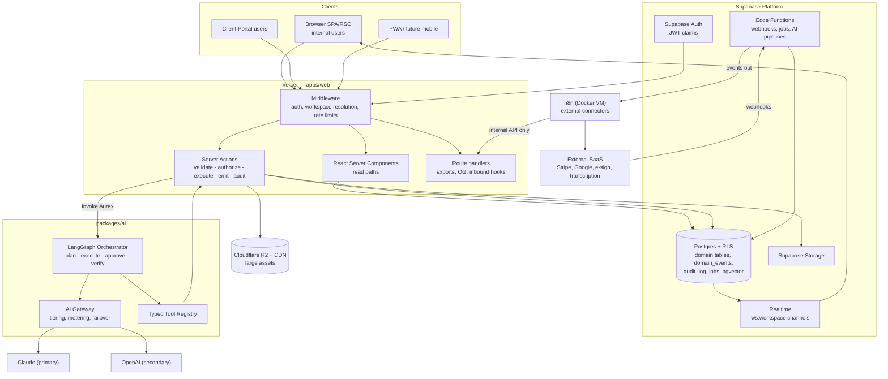
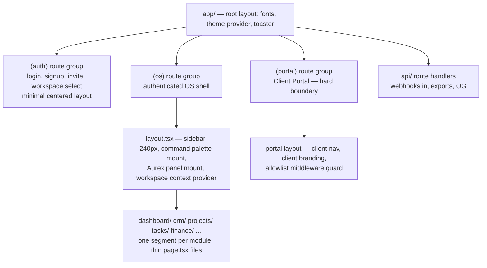
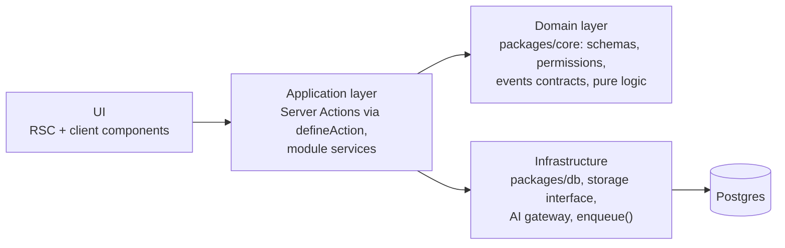

# Architecture — AurexOS Enterprise Architecture Overview

| | |
|---|---|
| **Document** | Enterprise Architecture Overview — AurexOS |
| **Status** | Approved — Living Document |
| **Version** | 1.0 |
| **Date** | 2026-07-08 |
| **Owner** | Founding CTO, AurexDesigns |
| **Related** | [../01_Project_Vision.md](../01_Project_Vision.md) · [../02_Product_Requirements_Document.md](../02_Product_Requirements_Document.md) · [../08_Tech_Stack.md](../08_Tech_Stack.md) · [../09_Scaling_Strategy.md](../09_Scaling_Strategy.md) · [../12_Project_Rules.md](../12_Project_Rules.md) · [../adr/0001_Multi_Tenant_Modular_Monolith.md](../adr/0001_Multi_Tenant_Modular_Monolith.md) |

This is the root document of the AurexOS enterprise architecture suite. It explains the complete system in one pass, states the system-type decision, and specifies the two layers that have no dedicated sibling document — the **frontend architecture** and the **backend architecture**. Everything else is delegated to the specialized documents indexed in §2.

This suite **builds on** the approved planning docs (01–15); where a planning doc already decides something, this suite deepens it — it never overrides it. Conflicts are resolved in favor of the planning docs plus the ADR process ([../12_Project_Rules.md](../12_Project_Rules.md) R-DOC2).

---

## 1. The System in One Page

AurexOS is a **multi-tenant, AI-native operating system for digital agencies**: ~21 modules (CRM, Projects, Tasks, Finance, Proposals, Contracts, Documents, Knowledge Base, Email, Calendar, Meetings, Clients, Portal, Team & HR, Automation, Notifications, Analytics, Monitoring, Settings, Dashboard, Aurex AI) behind **one permission model, one event stream, and one AI assistant** with workspace-wide context and typed, audited tools.

Five structural commitments define the architecture. Everything else derives from them:

1. **Modular monolith, mechanically enforced.** One deployable (Next.js on Vercel + Supabase), decomposed into modules with lint-enforced import boundaries and public surfaces. Service extraction is a pre-planned escape hatch, not a default ([MicroservicesStrategy.md](./MicroservicesStrategy.md)).
2. **Shared-schema multi-tenancy in the database.** Every tenant row carries `workspace_id`; Postgres Row-Level Security — deny-by-default, CI-tested — is the isolation guarantee. Storage keys, realtime channels, vectors, caches, and logs all inherit the same scoping ([DatabaseArchitecture.md](./DatabaseArchitecture.md), [SecurityArchitecture.md](./SecurityArchitecture.md)).
3. **One event spine.** Every state-changing mutation transactionally emits a typed event into the append-only `domain_events` table. Automations, notifications, analytics read models, AI context, activity feeds, and (Phase 5) customer webhooks are all *consumers of the same stream* ([ModuleArchitecture.md](./ModuleArchitecture.md), [AutomationArchitecture.md](./AutomationArchitecture.md)).
4. **AI as a governed runtime, not a feature.** A single assistant (Aurex) reaches every module through a typed tool registry, retrieves through permission-filtered RAG, and acts under graduated autonomy (L0–L3) with human approval gates and total auditability. The AI gateway is the only path to model providers ([AIArchitecture.md](./AIArchitecture.md)).
5. **Everything user-configurable is data.** Pipelines, templates, automations, permission sets, prompts, and recipes are rows, not code — which is what makes them multi-tenant now and marketplace-distributable later ([FutureArchitecture.md](./FutureArchitecture.md)).

### 1.1 Overall system diagram

The full diagram atlas — frontend, backend, auth, AI, database, automation, notifications, storage, integrations, deployment, future scaling — lives in [SystemDiagram.md](./SystemDiagram.md).

### 1.2 System type: the decision

**AurexOS is a modular monolith with hybrid edges.** Not a pure monolith (module boundaries are lint-enforced and extraction-ready), not microservices (a 2–4 person team building 20+ deeply relational modules would pay the distributed-systems tax with none of the organizational pressure that justifies it), and not "hybrid" as a goal (the serverless web tier, Edge Functions, and the n8n VM are deployment topology, not service decomposition). This is the only system type that is simultaneously **fast for a startup today** and **extraction-ready for 100,000+ users tomorrow**: the module seams, the event spine (which doubles as an outbox), and workspace-keyed everything mean workers can be extracted and tenants sharded into cells when — and only when — named metric triggers fire. The complete argument, comparison matrix, and 10-year evolution path: [MicroservicesStrategy.md](./MicroservicesStrategy.md); the founding decision record: [../adr/0001_Multi_Tenant_Modular_Monolith.md](../adr/0001_Multi_Tenant_Modular_Monolith.md).

---

## 2. Document Map

| Document | Answers |
|---|---|
| **Architecture.md** (this) | Overview, system type, frontend architecture, backend architecture |
| [SystemDiagram.md](./SystemDiagram.md) | The visual atlas — every layer as a Mermaid diagram |
| [ModuleArchitecture.md](./ModuleArchitecture.md) | What a module is; how all modules communicate |
| [MicroservicesStrategy.md](./MicroservicesStrategy.md) | Monolith vs microservices; extraction triggers; cells |
| [DatabaseArchitecture.md](./DatabaseArchitecture.md) | Schema organization, naming, tenancy, indexes, partitioning, scale |
| [AuthenticationArchitecture.md](./AuthenticationArchitecture.md) | Identity, sessions, OAuth, MFA, RBAC, switching, impersonation |
| [SecurityArchitecture.md](./SecurityArchitecture.md) | Defense in depth, encryption, secrets, OWASP, isolation, compliance |
| [APIStrategy.md](./APIStrategy.md) | Internal/public API surfaces, REST-over-GraphQL, versioning, SDK, webhooks |
| [AIArchitecture.md](./AIArchitecture.md) | Gateway, orchestrator, tools, RAG, memory, cost, evals, providers |
| [AutomationArchitecture.md](./AutomationArchitecture.md) | Automation engine, triggers/conditions/actions, n8n, scheduling |
| [NotificationsArchitecture.md](./NotificationsArchitecture.md) | Engine pipeline, channels, preferences, digests, queue/retry |
| [DeploymentArchitecture.md](./DeploymentArchitecture.md) | Environments, CI/CD, rollback, backups, DR, observability |
| [StorageArchitecture.md](./StorageArchitecture.md) | Files, versioning, CDN, virus scanning, lifecycle |
| [SearchArchitecture.md](./SearchArchitecture.md) | Global search, hybrid/AI search, the no-Elastic decision |
| [FutureArchitecture.md](./FutureArchitecture.md) | Marketplaces, plugins, white-label, mobile, voice — carried, not built |
| [../adr/](../adr/) | ADR-0001 tenancy/monolith; ADR-0002…0006 formalize this suite's technology decisions |

---

## 3. Frontend Architecture

The frontend is a single Next.js App Router application (`apps/web`) rendering three audiences from one codebase: the authenticated OS shell, the auth surface, and the Client Portal. Design language and interaction law are governed by [../11_Design_Principles.md](../11_Design_Principles.md); this section defines the engineering structure.

### 3.1 App Router, layouts, route groups

- **Route groups map 1:1 to audiences**, not to modules: `(auth)`, `(os)`, `(portal)`. Module structure lives inside `(os)` as URL segments. The `(portal)` group is a **hard security boundary** — portal sessions can only reach `(portal)` routes (middleware allowlist, [AuthenticationArchitecture.md](./AuthenticationArchitecture.md) §7).
- **Pages are thin** (≤ ~30 lines): resolve workspace context, compose one or two components from `apps/web/modules/{module}`. All real code lives in module folders ([../13_Folder_Structure.md](../13_Folder_Structure.md) §2).
- **Nested layouts** carry chrome: the OS shell layout owns the sidebar, command palette, and Aurex panel mounts; per-module layouts own module-local tab bars only. Layouts never fetch entity data a page then refetches — data fetching belongs to the page/component that renders it.
- **Parallel + intercepting routes** are used for exactly two patterns: the entity peek panel (right context panel rendering an entity route without losing list state) and modal-over-list flows (task detail over board). No other clever routing.

### 3.2 Rendering & data strategy

| Concern | Decision |
|---|---|
| Default rendering | **React Server Components.** All list/detail first paints fetch server-side inside the RLS-scoped Supabase client. `"use client"` only on interactive leaves, pushed low (R-A2). |
| Post-load interactivity | **TanStack Query v5** for everything after first paint: optimistic mutations (boards, pipeline drags, comments), infinite scroll, background refetch. |
| Cache keys | Always `[workspaceId, module, entity, params]`. Workspace-leading keys make workspace switching a cache-namespace change — cross-workspace bleed is structurally impossible client-side. |
| Realtime | Supabase Realtime payloads are **invalidation hints**, never truth: a channel event invalidates the matching query key; Postgres remains authoritative. Degrade path is polling per feature. |
| Client-only state | **Zustand** stores for UI state the server never sees (palette open, panel layout, selection sets, unsent drafts). Rule: *if the server knows about it → TanStack Query; if only this tab cares → Zustand.* |
| Providers | A deliberately short provider stack at the shell: theme, workspace context (static DI via React Context), TanStack QueryClient, tooltip/toast. Frequently-changing state never lives in Context. |
| Forms | React Hook Form + `zodResolver`, schemas imported from `packages/core` — the same schema the server action parses (client validation is UX; server validation is the contract, R-T3). |

### 3.3 Component architecture & design system

- **Two-tier component model.** `packages/ui` holds the design system: vendored shadcn/ui primitives themed by semantic tokens, composed patterns (`DataTable`, `EntityCard`, `ApprovalCard`, `EmptyState`), motion variants, and React Email templates. `apps/web/modules/{m}/components` holds module-specific compositions. The second cross-module use of any component forces extraction to `packages/ui` (R-A4).
- **Design tokens** are the single theming source (semantic CSS variables over Radix-style primitive ramps, [../11_Design_Principles.md](../11_Design_Principles.md) §2). This is also the white-label mechanism: per-workspace portal branding (Phase 4) and full white-label (Phase 5) are token overrides, not component forks.
- **Hooks** split by ownership: data hooks (`useContacts`, `useDealMutations`) live in the owning module; UI-only hooks (`useMediaQuery`, `useHotkey`) live in `packages/ui/hooks` and never fetch data.
- **Utilities**: pure shared logic (money, dates, ids, formatting) in `packages/core/lib` — zero I/O, fully unit-tested; app-level plumbing (Supabase clients, auth helpers) in `apps/web/lib`.

### 3.4 Error handling, loading, and resilience

- **Error boundaries at three levels**: root (app-fatal, honest full-page error with Sentry event id), route-segment `error.tsx` per module (module fails, shell survives), and component-level boundaries around independently-failing widgets (a broken dashboard widget never takes the dashboard down).
- **Errors follow the content law** ([../11_Design_Principles.md](../11_Design_Principles.md) §11): specific, human, recoverable; raw codes never reach the UI; unexpected errors reach Sentry with `workspace_id` + `request_id` context (R-Q6).
- **Loading UI**: route-segment `loading.tsx` renders content-shaped skeletons matching final layout; suspense boundaries per data region; spinners only for sub-element in-flight states. No full-page spinners after the shell paints; zero layout shift on data arrival.
- **Offline tolerance** (not offline-first): optimistic updates queue with retry on reconnect; failed mutations roll back with an undo-style toast; connectivity state is explicit in the shell. Silent data loss is a Sev-2.

### 3.5 Caching strategy (client)

Ordered by preference: (1) RSC/full-route caching only for non-tenant surfaces; (2) TanStack Query cache with workspace-keyed invalidation driven by Realtime hints — the workhorse; (3) `router.prefetch` on hover/intent for sub-150 ms perceived transitions; (4) **no CDN caching of tenant data, ever** ([../09_Scaling_Strategy.md](../09_Scaling_Strategy.md) §4.2 — a cache-key-by-tenant mistake is a data-leak class we opt out of).

### 3.6 Dark mode, accessibility, i18n, responsive

- **Themes**: dark + light ship together for every component from day one; system-preference default with per-user persisted override; dark has its own surface ramp, not inverted light. WCAG AA contrast enforced on token pairs in CI.
- **Accessibility**: WCAG 2.1 AA floor — full keyboard operability (palette-first UX makes this natural), visible focus always, Radix-supplied ARIA semantics, focus trap/restore in overlays, live-region announcements for async results and Aurex streaming, reduced-motion honored at the motion-wrapper level. Axe assertions in Playwright CI + manual audit at each phase gate.
- **Internationalization-readiness**: all strings externalized in ICU message format from day one; locale-aware date/number/currency formatting via the shared formatters in `packages/core/lib`; v1 ships English-only — adding a locale must be a translation task, not an engineering task. RTL deferred.
- **Responsive strategy**: desktop-first professional tool, fully responsive down to tablet; mobile web is optimized for the *mobile jobs*: approvals, notifications, task triage, quick capture, Aurex chat. Dense surfaces (Gantt, pipeline) degrade to purpose-built narrow layouts, not squeezed grids.

### 3.7 Future mobile support

The staging is PWA → native companion ([FutureArchitecture.md](./FutureArchitecture.md) §6): installable PWA with web push lands with Phase 4–5 notification work; native apps (React Native/Expo, reusing `packages/core` types and design tokens) follow only if PWA engagement proves the mobile jobs. Two frontend properties keep this cheap: all business logic lives behind Server Actions/API (nothing to port), and tokens + Zod schemas are platform-neutral packages.

---

## 4. Backend Architecture

The backend is deliberately thin on infrastructure and thick on discipline: Next.js server code + Supabase primitives + Postgres, with every mutation passing through one spine.

### 4.1 Layering

Dependency direction is one-way (R-A1): UI never imports the DB client; domain logic never imports React; modules expose only their `index.ts` public surface. This layering is what keeps modules extractable ([ModuleArchitecture.md](./ModuleArchitecture.md)).

### 4.2 The mutation spine (business + API layer)

Every mutation — human, AI, or automation — runs the same five steps via the shared `defineAction` wrapper:

**validate** (Zod schema from `packages/core`) → **authorize** (`requirePermission`, declared per action, CI-enforced) → **execute** (module service via `packages/db`, RLS as backstop) → **emit** (typed domain event, same transaction) → **audit** (append-only `audit_log` row).

This single choke point is why security, auditing, events, and AI attribution are enforceable at all (R-A3). AI tools and Automation Studio actions are *the same registered actions* with the same spine — there is no second mutation path to keep honest.

### 4.3 Services & repositories

- **Services** are module-scoped business logic (`modules/finance/actions` + internal service functions): orchestration, invariants (e.g., "sent invoices are never edited — void & reissue"), cross-entity rules. Services own their module's tables exclusively.
- **The repository layer is `packages/db`**: typed query helpers over generated Supabase types, the `dbRead('analytics')` replica-routing handle, and the service-role wrapper that makes `workspace_id` a mandatory parameter. We deliberately do **not** add a generic repository abstraction over it — Postgres is the only store, and a second abstraction layer would be ceremony (anti-goal 6). The seams that matter (storage, retrieval, enqueue, gateway) are already interfaces.

### 4.4 Events, queues, jobs, workers, cron

| Mechanism | Implementation | Phase |
|---|---|---|
| Domain events | Append-only `domain_events`, written transactionally with the mutation; versioned registry; idempotent consumers | 0 |
| Background jobs | Postgres `jobs` table, `FOR UPDATE SKIP LOCKED` workers in Edge Functions; deterministic job keys (idempotent); transactional enqueue with domain writes | 1 |
| Cron | `pg_cron` → Edge Function invocation (sweeps, digests, schedules, retention purges) | 1 |
| Workers | Edge Functions are the worker fleet (webhook receivers, AI pipelines, notification delivery, file processing) | 1–3 |
| Dedicated queue | Trigger.dev / Inngest / Temporal behind the existing `enqueue()` interface — **only** when named triggers fire (>10–20 jobs/s sustained, >15-min executions) | metric-gated |

Details and the durable-execution evolution path: [AutomationArchitecture.md](./AutomationArchitecture.md), ADR-0005.

### 4.5 Validation, logging, caching, webhooks, file processing

- **Validation**: Zod at every boundary — action inputs, Edge Function payloads, env vars at boot, third-party responses, event payloads (R-T3). One schema per domain object in `packages/core`, reused by forms, actions, and AI tool definitions.
- **Logging**: structured JSON everywhere; every line carries `workspace_id`, `request_id`, `module`; `request_id` propagates into Postgres `application_name` for query attribution; Sentry for errors/tracing; logs without tenant context are lint-flagged. Full observability design: [DeploymentArchitecture.md](./DeploymentArchitecture.md) §8.
- **Server caching**: Postgres-materialized read models for dashboard/analytics aggregates (event-driven refresh) before any cache server; Redis (Upstash) enters only on its named trigger with per-key owner/TTL/invalidation rules ([../09_Scaling_Strategy.md](../09_Scaling_Strategy.md) §4.2).
- **Webhooks in**: always Edge Functions — verify signature → Zod-parse → enqueue/emit → respond 200 fast; untrusted payloads never touch the Next.js app. **Webhooks out**: n8n bridge now; signed customer webhooks from the event registry in Phase 5 ([APIStrategy.md](./APIStrategy.md) §6).
- **File processing**: event-driven pipeline (AV scan → thumbnails → compression → text extraction → RAG ingestion) on the jobs substrate — [StorageArchitecture.md](./StorageArchitecture.md) §4.

---

## 5. Cross-Cutting Invariants

These hold across every document in this suite; each is enforced mechanically ([../12_Project_Rules.md](../12_Project_Rules.md)):

| Invariant | Enforcement |
|---|---|
| RLS on every table; `workspace_id` on every tenant row | CI migration lint + pgTAP + two-tenant E2E (R-D1/R-D2) |
| RBAC checked server-side on every action | `defineAction` permission declaration, lint + review (R-S1) |
| Every mutation emits a domain event and an audit row | `defineAction` spine (R-A6, R-D4) |
| All AI through the gateway; all AI actions audited; outbound/destructive AI human-approved | Runtime enforcement in gateway/registry (R-AI1–3) |
| No tenant data crosses tenants — DB, vectors, caches, prompts, CDN | RLS + workspace-keyed everything + adversarial CI (R-AI4, S1) |
| Soft deletes everywhere; hard deletes only via retention/GDPR flows | Schema lint + Semgrep (R-D3) |
| Secrets via validated env only; prompts, schemas, and migrations are code | gitleaks + boot validation + repo layout (R-S2/3, R-AI5, R-D7) |

## 6. Open Questions

1. **Staging environment weight** — through Phase 4, preview deploys + shadow-DB dry runs cover most needs; when exactly does a standing staging environment with anonymized production-shaped data become mandatory (lean: Phase 5 entry gate)? Owned by [DeploymentArchitecture.md](./DeploymentArchitecture.md).
2. **Peek-panel routing** — parallel/intercepting routes are powerful but complex; validate the two sanctioned patterns in Phase 1 and cut them if they fight the router.
3. **i18n runtime** — ICU strings are externalized from day one, but the runtime library choice (next-intl vs FormatJS) is deferred to the first real locale request; decide by ADR.
4. **Read-model refresh latency** — event-driven rollups target seconds; if dashboard freshness demands sub-second, does that justify incremental view maintenance earlier than planned?
