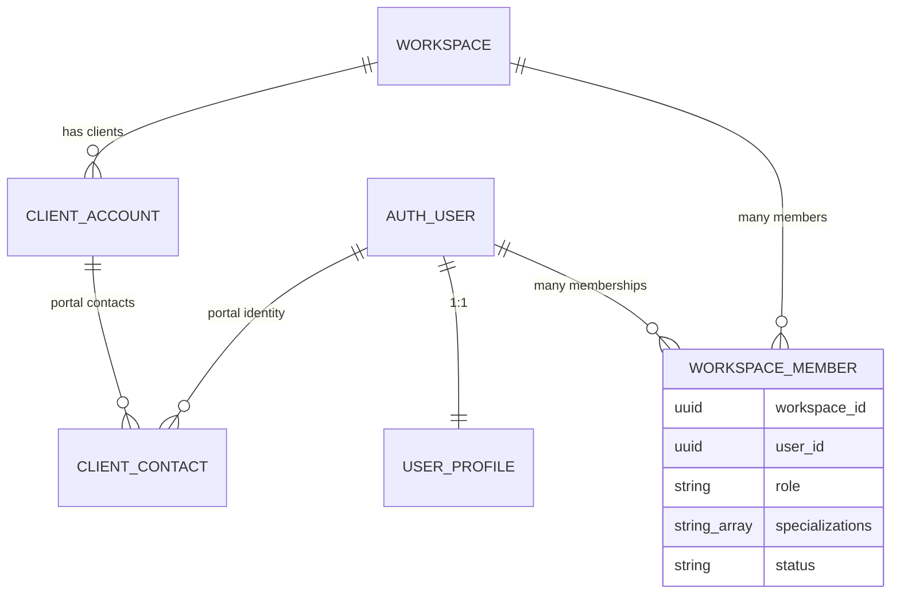
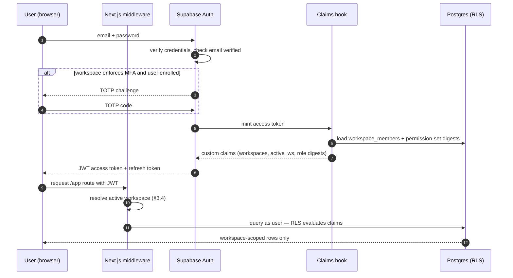
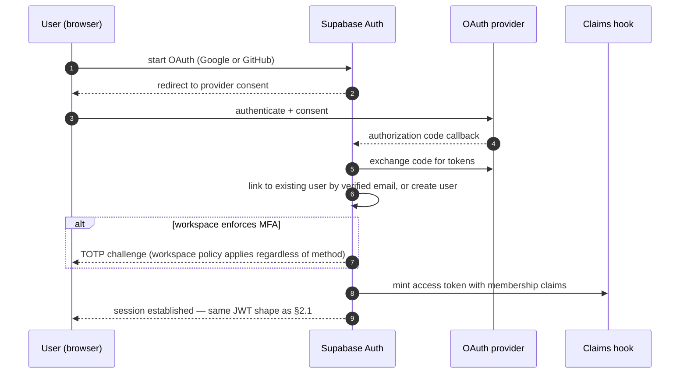
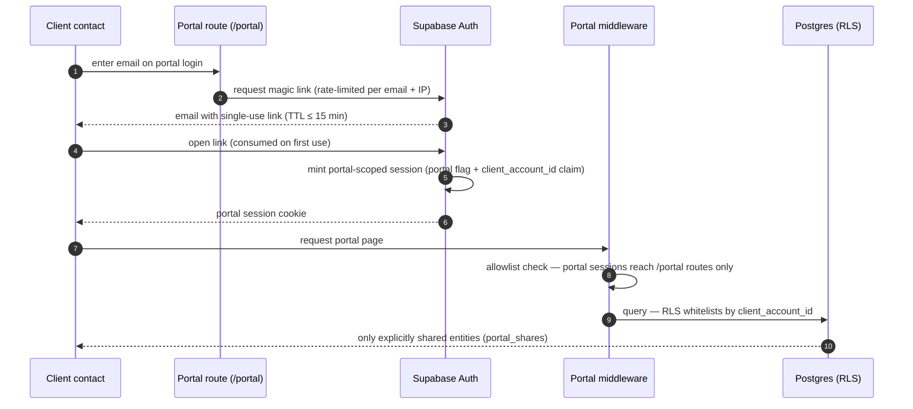
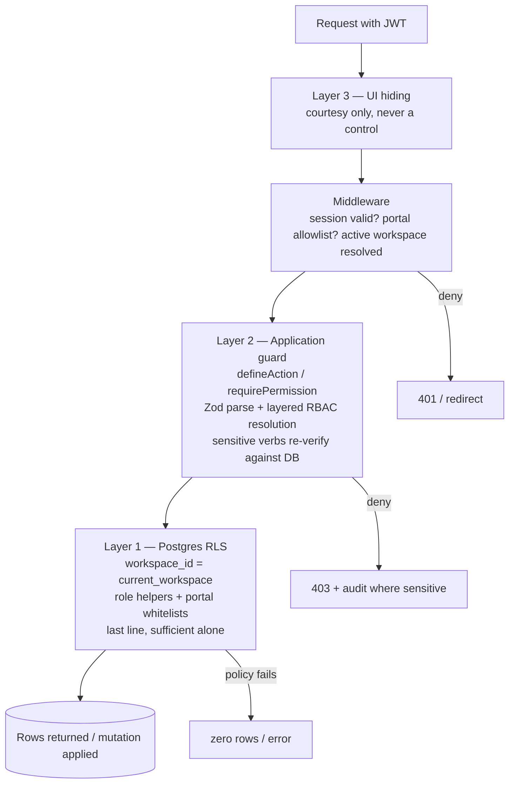

# Authentication & Authorization Architecture

| | |
|---|---|
| **Document** | Authentication & Authorization Architecture — AurexOS |
| **Status** | Approved — Living Document |
| **Version** | 1.0 |
| **Date** | 2026-07-08 |
| **Owner** | Founding CTO, AurexDesigns |
| **Related** | [./Architecture.md](./Architecture.md) · [./SecurityArchitecture.md](./SecurityArchitecture.md) · [./APIStrategy.md](./APIStrategy.md) · [../05_User_Roles.md](../05_User_Roles.md) · [../08_Tech_Stack.md](../08_Tech_Stack.md) |

---

This document specifies how a human, a client, a machine, or Aurex proves *who it is* and *what it may do* in AurexOS. It is the engineering companion to [05_User_Roles.md](../05_User_Roles.md), which remains the canonical RBAC specification — nothing here overrides that document; this one defines the mechanics that make it real. Rules cited as R-* are binding per [12_Project_Rules.md](../12_Project_Rules.md).

---

## 1. Identity Model

**Identity is global; authorization is per-workspace.** There is exactly one Supabase Auth user per human, regardless of how many workspaces they belong to ([05_User_Roles.md](../05_User_Roles.md) §1.1 principle 3). "Organization" in AurexOS *is* the workspace — the root tenant entity of [06_Module_Breakdown.md](../06_Module_Breakdown.md) §21. All role, specialization, and permission data lives in **our** `workspace_members` table, never in the identity provider ([08_Tech_Stack.md](../08_Tech_Stack.md) §3.3).

| Concept | Lives in | Cardinality | Carries |
|---|---|---|---|
| Auth user | Supabase Auth (`auth.users`) | 1 per human, global | credentials, MFA factors, verified email, OAuth links |
| Profile | `user_profiles` (ours) | 1:1 with auth user | display name, avatar, locale, notification defaults |
| Workspace | `workspaces` (ours) | root tenant entity | branding, security policy, AI governance |
| Membership | `workspace_members` (ours) | N per user, 1 per (user, workspace) | role, specializations, status, joined_at |
| Portal contact | `client_contacts` (ours) | N per auth user | client_account_id link, portal role (§7) |



Binding consequences:

1. A user may belong to many workspaces; **switching workspaces is a claims refresh, never a new login** (§4).
2. Cross-workspace access does not exist except through explicit, separate memberships — there is no "parent org" that spans workspaces. Agency groups / partner networks are Phase 5+ future ideas only ([15_Future_Ideas.md](../15_Future_Ideas.md) §9) and require their own ADRs before any schema accommodates them.
3. Deactivation is a membership state, not an account deletion — offboarded users become `deactivated`, preserving authorship and audit integrity ([05_User_Roles.md](../05_User_Roles.md) §11).

---

## 2. Authentication Methods & Flows

Supabase Auth is the identity provider ([08_Tech_Stack.md](../08_Tech_Stack.md) §3.3). WorkOS is added **in front of** Supabase Auth at Phase 5 only, for enterprise SSO/SAML + SCIM (§13).

| Method | Audience | Phase | Notes |
|---|---|---|---|
| Email + password | Internal roles | 0 | Email verification mandatory before first workspace access |
| Google OAuth | Internal roles | 0 | Primary for agencies on Google Workspace |
| GitHub OAuth | Internal roles (developers) | 0 | Account linking to existing verified email |
| Magic link | **Client Portal (primary)**, optional internal recovery | 4 (portal) | Single-use, short TTL (§2.3, §7) |
| TOTP MFA | All internal roles | 1 (opt-in) / 2 (enforceable) | Per-user enrollment; per-workspace enforcement policy |
| SSO/SAML via WorkOS | Enterprise tenants | 5 | §13 |

### 2.1 Standard login → claims minting → RLS

Every successful authentication ends the same way: Supabase mints a JWT, our claims hook enriches it with membership digests, and RLS evaluates those claims via `auth_workspace_ids()` and role-check helpers ([08_Tech_Stack.md](../08_Tech_Stack.md) §3.1).



### 2.2 OAuth login (Google / GitHub)



Rules: provider email must be verified by the provider; unverified provider emails cannot auto-link to an existing account (they create a pending state requiring email verification). OAuth does **not** bypass workspace MFA enforcement.

### 2.3 Portal magic-link login

Magic links are the primary portal method — clients should never manage a password for their agency's portal.



Rules: links are **single-use** and short-TTL; reuse attempts are audited. Sensitive portal views (invoices, contract signing) require re-authentication if the session is older than the portal re-auth window (§3.3). The full boundary is specified in §7.

### 2.4 MFA (TOTP)

- **Enrollment:** any user may enroll a TOTP factor in their account settings from Phase 1; enrollment issues recovery codes (one-time, hashed at rest) and writes `auth.mfa_change` to the audit log.
- **Workspace enforcement (Phase 2):** Owner sets an MFA-required policy in Settings ([06_Module_Breakdown.md](../06_Module_Breakdown.md) §21). Members without an enrolled factor are funneled into enrollment at next login before reaching any workspace data; grace period configurable (default 7 days), after which access is blocked until enrolled.
- **Multi-workspace rule:** MFA enforcement is evaluated per workspace at *claims minting for that workspace* — a user in one MFA-enforcing workspace must satisfy MFA to receive claims for that workspace, even if their other workspaces do not enforce it.

### 2.5 Recovery

- Password reset via verified email, single-use token, sessions revoked on completion.
- TOTP recovery via recovery codes; exhausting codes requires Owner/Admin-verified identity re-proofing for workspace access (support cannot bypass — see §8.2).
- All recovery events are audited (§11).

---

## 3. Session Strategy

### 3.1 JWT lifecycle and the claims-as-cache rule

Sessions are Supabase JWT sessions: a short-lived access token plus a rotating refresh token. JWT claims carry workspace memberships and role/permission-set digests so RLS can evaluate quickly without a join per policy — but **claims are a cache; the database is truth** ([05_User_Roles.md](../05_User_Roles.md) §3.3). Binding rules:

1. Sensitive actions (role changes, permission grants, finance sends, portal shares, deletes) re-verify against `workspace_members` and `permission_overrides` server-side inside the action guard — never from claims alone.
2. Role changes take effect immediately in the database and refresh claims within **60 seconds**; downgrades revoke cached sessions' elevated claims within that window ([05_User_Roles.md](../05_User_Roles.md) §11).
3. Claims never carry the full permission set — only versioned digests (`role:pm@v3`) that RLS helpers resolve against the cached `permission_sets` data.

### 3.2 Conceptual claims shape

Conceptual, not code — the physical claim keys are an implementation detail behind the RLS helper functions:

```json
{
  "sub": "user-uuid",
  "email": "verified@example.com",
  "amr": ["password", "totp"],
  "active_workspace_id": "ws-uuid",
  "workspaces": {
    "ws-uuid": { "role": "pm", "perm_set": "role:pm@v3", "specializations": [] },
    "ws2-uuid": { "role": "owner", "perm_set": "role:owner@v5", "specializations": [] }
  },
  "portal": false,
  "client_account_id": null,
  "impersonation": null,
  "claims_minted_at": 1720000000
}
```

Portal sessions carry `portal: true` + `client_account_id` and **no** `workspaces` entries. Impersonation sessions carry an `impersonation` object (§8.1) that every mutating guard rejects.

### 3.3 Session length, refresh, revocation

| Session class | Access-token TTL | Max session (refresh horizon) | Idle timeout | Re-auth for sensitive views |
|---|---|---|---|---|
| Owner / Admin | 1 h | 7 days | 24 h | Yes — settings, billing, permission changes |
| Internal roles (PM, Team, Sales, Finance, HR) | 1 h | 14 days | 72 h | Finance/HR sensitive surfaces |
| Guest | 1 h | 7 days, never past grant expiry | 24 h | n/a |
| Client Portal | 30 min | 24 h | 4 h | Yes — invoices, signing |
| Impersonation | 30 min hard timebox, no refresh | — | — | n/a (read-only) |

Session length maxima are workspace security policy, configurable downward (never upward) by the Owner in Settings ([06_Module_Breakdown.md](../06_Module_Breakdown.md) §21). Revocation paths: explicit logout, refresh-token revocation on offboarding (§12), password reset, Owner "revoke all sessions", and the 60-second claims refresh on role change.

**Device & session management (Phase 2):** users see their active sessions (device, IP, last-active) and revoke any of them; Owner/Admin can revoke any member's sessions. Every revocation is audited.

### 3.4 Middleware resolution of the active workspace

Next.js middleware resolves the active workspace on every `/app` request, in order: (1) workspace slug in the URL path, (2) `active_workspace_id` claim, (3) user's default workspace, (4) redirect to workspace picker. The resolved `workspace_id` is what `current_workspace()` returns to RLS and what every server action receives — a URL slug the user has no membership claim for is a hard 404 (not 403; existence is not disclosed).

---

## 4. Workspace Switching

Switching is a **claims refresh, not a new login** — the switcher UX contract is:

1. User invokes the workspace switcher (⌘K or sidebar); memberships render from claims instantly.
2. Selecting a workspace calls a server action that (a) re-verifies the membership against `workspace_members` (claims-as-cache rule), (b) mints a fresh token with `active_workspace_id` updated, (c) redirects to that workspace's role-appropriate dashboard ([05_User_Roles.md](../05_User_Roles.md) §4).
3. Target: switch completes in under 2 seconds; no re-entry of credentials; MFA is re-challenged only if the target workspace enforces MFA and the current session's `amr` lacks `totp`.

**Default workspace:** last-active workspace, persisted per user; overridable in profile settings. (This closes the "multi-workspace default UX" open question of [06_Module_Breakdown.md](../06_Module_Breakdown.md) §21 at the mechanism level; the picker design remains a product decision.)

**Invariants — no cross-workspace state bleed:**

- Every TanStack Query cache key **leads with `workspaceId`** (`[workspaceId, module, entity]` per [08_Tech_Stack.md](../08_Tech_Stack.md) §2.5); a switch changes the leading key so no stale rows from the previous workspace can render. On switch, the previous workspace's queries are dropped from the cache, not merely stale.
- Zustand stores holding workspace-scoped UI state reset on switch; Realtime channels (`ws:{workspace_id}:{module}`) for the previous workspace are unsubscribed.
- Server-side, the fresh token means RLS re-evaluates from zero — there is no server state to bleed.

---

## 5. Authorization: RBAC

The permission model is specified in [05_User_Roles.md](../05_User_Roles.md) §§2–6 and is restated here only to bind the mechanics.

### 5.1 Layered resolution

```
Effective permission =
    base role permission set        (versioned data: role:pm@v3)
  ± workspace role customization    (Owner/Admin tuning per workspace)
  ± user-level overrides            (allow|deny, scope, expires_at, reason — reason mandatory)
  ± resource-level grants/denies    (project membership, doc shares, KB spaces, private deals)
  where explicit DENY always wins at the same or lower layer.
```

- **Permission sets are versioned data, not code** — stored in `permission_sets`, seeded from the exported matrix constant of [05_User_Roles.md](../05_User_Roles.md) §6, cached, invalidated on change; version bumps are audited (`permission_set.modified`).
- **Atomic permissions** follow `module.resource.action` (`finance.invoice.send`, `crm.deal.change_stage`); verbs are the canonical list of [05_User_Roles.md](../05_User_Roles.md) §3.1. New modules ship with all roles at `None` until the matrix is updated first (deny by default).

### 5.2 The guard: requirePermission / defineAction

Every server action, route handler, and Edge Function declares its required permission through the shared wrapper ([12_Project_Rules.md](../12_Project_Rules.md) R-S1, R-A3):

- `defineAction` requires an input Zod schema **and** a permission declaration; it runs the invariant sequence *validate → authorize → execute → emit domain event → write audit log*.
- `requirePermission("finance.invoice.send")` performs the full layered resolution of §5.1 against the database (not claims) for sensitive verbs, and against claims digests for cheap read checks.
- **CI enforcement:** a mutation path not declared through `defineAction`, or a route without a declared guard, fails lint/CI ([05_User_Roles.md](../05_User_Roles.md) §3.3, R-S1). This makes "RBAC on every route" mechanical, not aspirational.

### 5.3 Resource-level ACLs

Per [05_User_Roles.md](../05_User_Roles.md) §3.2:

| Resource | Access model |
|---|---|
| Project | Membership list (PM/lead, members, watchers); private projects invisible to non-members |
| Document | Inherits container; per-document shares (user, role, portal, expiring public link) |
| KB space | Workspace-public, role-restricted, or member-list |
| CRM record | Sales/Admin/Owner by default; "private deal" flag restricts to deal team |
| Email thread | Mailbox owner + explicit shares + linked-project PMs (configurable); narrowest default |

### 5.4 Field-level permissions

A small fixed set, not a general engine ([05_User_Roles.md](../05_User_Roles.md) §3.4): `hr.compensation.*` (Owner/HR/Finance only), `finance.invoice.margin` (hidden from Sales and Team Members), `crm.deal.value` (hidden from Team Member by default). Mechanics: column-omitting views + application DTO shaping, with sensitive columns additionally behind security-definer accessor functions. DTOs are the only shape the UI and Aurex ever receive — a field the caller cannot see never leaves the data layer.

---

## 6. Enforcement Stack

Three layers, always — each assumes the others failed ([05_User_Roles.md](../05_User_Roles.md) §1.1, R-S1):



A single mutating request end-to-end: middleware authenticates the session and resolves the workspace → `defineAction` parses input (R-T3), resolves the effective permission (§5.1), re-verifies sensitive claims against the database → the query executes under the user's row-level context where RLS is evaluated again independently → the domain event and audit row are written in the same transaction. Adversarial tests prove the deny paths for every new permission surface (R-S7); RLS policies are tested as code with deny-by-default assertions ([08_Tech_Stack.md](../08_Tech_Stack.md) §8).

---

## 7. Client Portal Auth Boundary

The portal is a **hard boundary, not a filtered view** ([05_User_Roles.md](../05_User_Roles.md) §7): separate route tree (`/portal`), separate navigation, separate session context.

Enforcement rules:

1. **Allowlist middleware:** portal sessions (`portal: true` claim) can reach `/portal` routes only; any other path is rejected at middleware before any application code runs. Internal sessions never render portal chrome except via audited impersonation preview (§8.1).
2. **RLS whitelists:** portal policies whitelist by `client_account_id` — nothing is portal-visible without an explicit `portal_shares` record (except `client_visible` tasks inside a shared project). Cross-client enumeration is impossible even with a tampered request.
3. **Per-contact portal roles:** within a client account, contacts carry a portal role — **viewer** (read shared items), **approver** (viewer + approve deliverables, accept proposals, sign contracts), **billing** (viewer + view/pay invoices and payment history). Portal roles are resource-scoped capabilities under the Client row of the matrix ([05_User_Roles.md](../05_User_Roles.md) §6); they never grant anything in §7.2's "never" list.
4. Magic links are single-use, short-TTL (§2.3); portal sessions are the shortest class (§3.3); invoice and signing views require re-auth past the re-auth window.
5. Portal shares and boundary crossings are audited (§11); portal Aurex, if enabled (Phase 4 opt-in), answers only from portal-visible data with a restricted tool registry ([07_AI_Strategy.md](../07_AI_Strategy.md)).

---

## 8. Impersonation & Support Access

### 8.1 Internal "View as"

Per [05_User_Roles.md](../05_User_Roles.md) §9.1 — binding mechanics: Owner/Admin only; **read-only enforced server-side** via the `impersonation` claim (§3.2), which every mutating guard (`defineAction`) rejects unconditionally — no writes as another user, ever. 30-minute hard timebox, non-refreshable; persistent banner; every impersonated page view audited with impersonator, target, and resources viewed. **Email Center is excluded** — private mailboxes are never viewable via View-as.

### 8.2 Vendor/support access (Phase 5)

AurexDesigns support holds **zero standing access** to customer workspaces. Access requires a customer-granted support session: scoped to named modules, duration ≤ 72 h, read-only by default, engineer identity verified, fully audited and visible in the customer's own audit log, auto-expiring with one-click revocation. **Break-glass** (legal/incident) requires two-person authorization inside AurexDesigns, immutable logging, and customer notification per policy ([05_User_Roles.md](../05_User_Roles.md) §9.2).

---

## 9. AI & Automation Identity

Aurex is a system principal for **attribution, not authority** ([05_User_Roles.md](../05_User_Roles.md) §2.10, §8):

1. **Invoker's permissions, never more.** Every tool call executes with the invoking user's effective permission context — same guards, same RLS, no bypass credentials, no AI service role visible to users.
2. **Attribution:** AI mutations are recorded as `actor_user_id + via_ai: true + ai_run_id`, linking to the full AI audit trail (prompt version, tools, model, approval record — R-AI2).
3. **Autonomy ceiling:** effective autonomy = min(workspace ceiling, action-category level, tool floor, the user's own permission to do it manually). A user who cannot send invoices cannot have Aurex send one at any level.
4. **Automation runs** (Automation Studio) execute under their **creator's** permissions, re-validated per run against the database — a creator's downgrade or offboarding disables their automations pending reassignment, rather than running with fossilized authority.
5. **Scheduled/proactive AI** (digests, delay predictions) runs under a per-workspace service context whose profile is explicitly Owner-configured and defaults to read-only; outputs are filtered per recipient's permissions.

---

## 10. API Authentication (Phase 5)

Public API access arrives with Phase 5 ([06_Module_Breakdown.md](../06_Module_Breakdown.md) §21 `ApiToken`): workspace-scoped tokens, **hashed at rest** (secret shown once), scoped to named permissions no broader than the creating user's grants, mandatory expiry, `last_used` tracking, creation and revocation audited (`auth.api_key_created`). Outbound webhooks are HMAC-signed with per-endpoint secrets and replay protection. Token formats, rotation policy, rate limits, and the webhook signature scheme are specified in [./APIStrategy.md](./APIStrategy.md); tokens obey R-S6 (least privilege, minimal scope, encrypted at rest).

---

## 11. Security Logging

All events land in the append-only `audit_log` — insert-only at the Postgres privilege level ([06_Module_Breakdown.md](../06_Module_Breakdown.md) §24, R-D4). The auth-relevant catalog, extending [05_User_Roles.md](../05_User_Roles.md) §10:

| Event | Payload highlights |
|---|---|
| `auth.login / login_failed` | method (password/oauth/magic_link), device, IP, MFA used |
| `auth.mfa_enrolled / mfa_change / recovery_used` | factor type, initiator |
| `auth.session_revoked / password_reset` | scope (one/all), initiator |
| `auth.api_key_created / revoked` | scopes, expiry, creator |
| `member.invited / joined / removed / offboarded` | role, inviter, Guest expiry |
| `member.role_changed` | old role, new role, changed_by, reason |
| `permission.override_granted / revoked` | permission, effect, scope, expiry, reason |
| `permission_set.modified` | atomic-permission diff, version bump |
| `portal.share_created / revoked` · `portal.magic_link_issued / reused` | entity, client account, shared_by |
| `impersonation.started / ended` | impersonator, target, duration, pages viewed |
| `support_session.granted / used / expired` | grantor, scope, actions |
| `ai.action_executed` | actor, ai_run_id, tool, autonomy level, approval ref |

Retention: 7 years for finance/contract events, 2 years otherwise — configurable upward, never below floor; audit reads are themselves audited ([05_User_Roles.md](../05_User_Roles.md) §10).

---

## 12. Identity Lifecycle

| Stage | Mechanics |
|---|---|
| **Invite** | Invite carries role + optional overrides; Guest invites require expiry (default 30 days, max 180). Accepting creates the membership; first login follows §2. |
| **Role change** | Immediate in DB; claims refresh + realtime session revalidation within 60 s; downgrades revoke elevated cached claims (§3.1). Audited with reason. |
| **Offboarding** | HR-initiated ([05_User_Roles.md](../05_User_Roles.md) §11), consumed by Settings via `hr.offboarding.initiated`: disable login → revoke all sessions and refresh tokens → revoke API tokens → disable owned automations pending reassignment (§9) → reassign owned resources via wizard → membership becomes `deactivated`; the global auth user and authorship attribution survive. |
| **Dormancy** | Memberships inactive 90+ days are flagged into the auto-generated quarterly access-review checklist (Owner/Admin task). |
| **Guest expiry** | Grants auto-expire; expiry revokes sessions scoped to that workspace; renewal is a fresh audited grant. |

---

## 13. Future: Enterprise SSO & Custom Roles (Phase 5)

- **WorkOS in front of Supabase Auth** for SSO/SAML and SCIM directory sync — WorkOS handles the enterprise handshake; the Supabase user remains the single global identity, and roles remain in `workspace_members` ([08_Tech_Stack.md](../08_Tech_Stack.md) §3.3). SCIM deprovisioning feeds the same offboarding revocation flow as §12. Per-workspace policy may require SSO and disable password login for that workspace's members.
- **Custom roles** follow the guardrails of [05_User_Roles.md](../05_User_Roles.md) §12: cloned from immutable built-in sets, never exceeding Admin, never crossing the portal boundary (a role is internal or portal-side, never both), and `settings.permissions.manage` only with the "administrative" flag surfaced in access reviews. Custom roles slot into §5.1 as workspace-owned versioned permission sets — no new resolution machinery.
- Agency groups / partner networks ([15_Future_Ideas.md](../15_Future_Ideas.md) §9) would introduce cross-workspace grants and are explicitly **out of scope** for this architecture until their shared-object ADRs exist.

---

## 14. Open questions

1. Should the 60-second claims-refresh window tighten to immediate token invalidation (deny-list check per request) for Owner/Admin downgrades specifically? *Lean: yes for role ≥ Admin; measure latency cost first.*
2. Portal re-auth window for signing/invoice views — fixed product constant or workspace security policy? *Lean: policy, floor at 15 minutes.*
3. Do internal users who are also portal contacts elsewhere (an agency that is a client of another agency) need explicit dual-context UX beyond the portal/internal session split? Relates to [15_Future_Ideas.md](../15_Future_Ideas.md) §9.
4. Session-length policy per role (§3.3) — should Finance get the Owner/Admin (shorter) profile given money-movement powers? *Lean: yes at Phase 2 when Finance module ships.*
5. WorkOS SCIM: do SCIM-driven role mappings override workspace-local role edits, or flag conflicts for Admin review? *Must be answered in the Phase 5 SSO ADR.*
