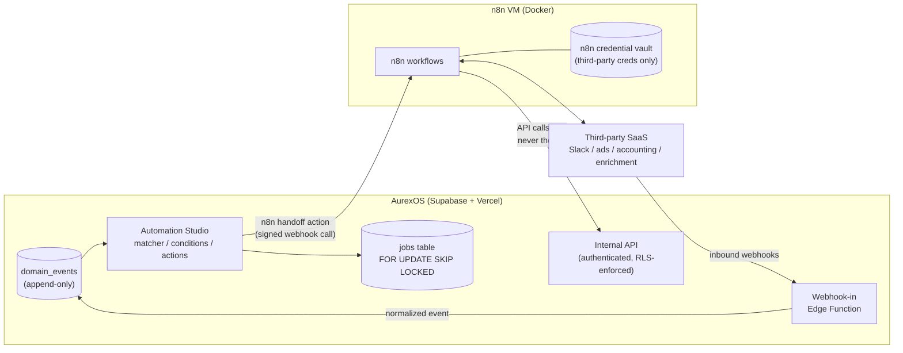
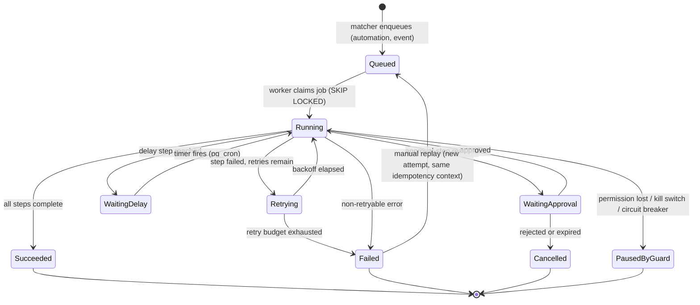

# Automation Architecture — AurexOS

| | |
|---|---|
| **Document** | Automation Architecture — AurexOS |
| **Status** | Approved — Living Document |
| **Version** | 1.0 |
| **Date** | 2026-07-08 |
| **Owner** | Founding CTO, AurexDesigns |
| **Related** | [./Architecture.md](./Architecture.md) · [./AIArchitecture.md](./AIArchitecture.md) · [./NotificationsArchitecture.md](./NotificationsArchitecture.md) · [./APIStrategy.md](./APIStrategy.md) · [../06_Module_Breakdown.md](../06_Module_Breakdown.md) · [../08_Tech_Stack.md](../08_Tech_Stack.md) · [../07_AI_Strategy.md](../07_AI_Strategy.md) |

---

This document is the binding architecture for automation in AurexOS: the internal **Automation Studio** ([../06_Module_Breakdown.md](../06_Module_Breakdown.md) §17, the Phase 3 flagship) and the external **n8n** integration layer ([../08_Tech_Stack.md](../08_Tech_Stack.md) §5.1). It specifies how automations are stored, triggered, evaluated, executed, protected against runaway behavior, and evolved toward the Phase 5 marketplace. Anything automation-shaped that cannot be expressed within this architecture changes this document first or does not ship.

---

## 1. Two-Engine Architecture

AurexOS deliberately runs **two automation engines with a hard boundary between them**:

| | Engine 1 — Automation Studio (internal) | Engine 2 — n8n (external) |
|---|---|---|
| **Purpose** | Automate AurexOS's own domain: "when a deal is won, create the project" | Glue to third-party SaaS: Slack, ads platforms, accounting, enrichment |
| **Substrate** | Append-only `domain_events` table ([../08_Tech_Stack.md](../08_Tech_Stack.md) §5.2) + Postgres jobs | Self-hosted n8n (Docker, small VM) |
| **Data access** | In-process, under RLS + RBAC | **Authenticated internal API endpoints only — never the database** |
| **Identity** | Automation creator's permissions, re-validated per run (§5.2) | Scoped service credentials per binding (§10.2) |
| **Availability coupling** | None on n8n — internal automations run even if n8n is down | None on Studio — n8n workflows are independently schedulable |
| **Owner of truth** | Automations are rows in our database (automations-as-data, §2.2) | Workflow exports versioned in `infra/n8n` (§10.3) |

### 1.1 The boundary rule (binding)

1. **Internal automations never depend on n8n availability.** Every automation whose triggers and actions are all internal executes entirely on the events table and the jobs substrate. n8n being down degrades external integrations only.
2. **n8n never touches the database.** It calls authenticated internal API endpoints ([./APIStrategy.md](./APIStrategy.md)) so that RLS, RBAC, rate limiting, and the audit log remain the single enforcement path — exactly the rule in [../08_Tech_Stack.md](../08_Tech_Stack.md) §5.1.
3. **The only bridge is explicit.** An automation reaches n8n solely through an `n8n handoff` action bound by an `N8nBinding` record (§2.1); n8n reaches AurexOS solely through the internal API and the inbound-webhook Edge Function (§9.1). There is no shared queue, shared credential store, or shared database session.

### 1.2 Failure-isolation guarantees

- **n8n VM down:** internal automations unaffected; `n8n handoff` actions fail their step, retry with backoff (§6.3), and alert via Notifications after the retry budget. The health check (§10.4) raises an ops alert independently.
- **Studio paused (kill switch, §7.4):** n8n's own scheduled/external workflows continue; only handoffs from Studio stop.
- **Database is the only stateful dependency of the internal engine.** If Postgres is up, internal automation is up — the same availability class as the OS itself.
- **Blast radius of a bad n8n workflow** is capped by its API credential's scopes and rate limits ([./APIStrategy.md](./APIStrategy.md)); it can never bypass RLS because it never holds a database connection.

---

## 2. Automation Data Model

### 2.1 Entities

Per [../06_Module_Breakdown.md](../06_Module_Breakdown.md) §17, all tenant-scoped (`workspace_id` + RLS, UUIDv7 keys, soft delete — [../08_Tech_Stack.md](../08_Tech_Stack.md) §3.2):

| Entity | Key fields | Notes |
|---|---|---|
| **Automation** | name, status (draft/active/paused), trigger (event type + filter), condition graph, action list, error policy, owner, scope (workspace/project/module), version | Versioned: activating an edit snapshots a new version; runs record the version they executed |
| **AutomationRun** | automation ref + version, trigger event ref, per-step results, status, duration, error detail, idempotency context | Replayable (§6.5); feeds monitoring and the run log UI |
| **ActionDefinition** (registry) | type key (`module.action_name`), module owner, Zod input schema, required permission, autonomy classification, side-effect events, idempotency support | Registered by modules; shared with the AI tool registry and command palette (§5.1) |
| **N8nBinding** | automation ref, n8n workflow id, credential ref, direction (outbound/inbound) | The only sanctioned Studio↔n8n coupling |
| **RecipeTemplate** | packaged trigger + conditions + actions, setup wizard config, required permissions manifest | Recipe gallery; Phase 5 marketplace seed (§12.3) |

### 2.2 Automations-as-data (binding principle)

An automation is **a row, not code**: trigger, condition graph, and action list are declarative, schema-validated documents referencing registry keys — never inline logic. Consequences:

- **Portability:** a RecipeTemplate is an Automation minus workspace bindings; installing a recipe is data insertion plus a permission-manifest review — the same install contract as marketplace agents ([../07_AI_Strategy.md](../07_AI_Strategy.md) §12).
- **Versioning and audit:** every activation snapshots the definition; every run pins the version. "What did this automation do on March 3rd" is always answerable.
- **Upgradability:** engine improvements (new substrate, §12.1) change how definitions are executed, never the definitions themselves.
- **AI-legibility:** the NL builder (§11.1) drafts the same declarative document a human builds visually — one format, one validator.

---

## 3. Trigger Architecture

Four trigger types, one convergence point: **everything becomes a row in `domain_events` before the matcher sees it.**

| Trigger type | Path into the engine | Notes |
|---|---|---|
| **Domain event** | Written transactionally with the state change ([../08_Tech_Stack.md](../08_Tech_Stack.md) §5.2) | Primary type. Filter = typed predicate over payload fields (e.g. `deal.stage_changed` where `to_stage = "won"`) |
| **Scheduled / cron** | `pg_cron` emits a synthetic `automation.schedule.fired` event scoped to the automation | §8; timezone-resolved per workspace |
| **Inbound webhook** | Edge Function receives, authenticates, normalizes to a domain event (§9.1) | External payloads never enter the matcher raw |
| **Manual run** | User action emits `automation.manual.triggered` with an entity anchor | Also powers test-runs against sampled historical events ([../06_Module_Breakdown.md](../06_Module_Breakdown.md) §17 key flows) |

### 3.1 The matcher

A single consumer of the events stream: for each new event, it selects active automations in the event's workspace whose trigger type matches and whose trigger filter passes, then enqueues one job per (automation, event) pair — transactionally, in the same substrate as the event insert (no dual-write, [../09_Scaling_Strategy.md](../09_Scaling_Strategy.md) §4.3). Matching is indexed on (workspace_id, trigger event type); filters evaluate in-process.

### 3.2 The event registry powers the trigger picker

The versioned event registry ([../06_Module_Breakdown.md](../06_Module_Breakdown.md) Appendix A) — name, payload schema, emitting module, PII classification — is the trigger picker's data source. The builder UI lists event types by module, renders filter fields from the payload schema (typed operators per field type), and marks deprecated versions. A trigger can therefore never reference an unregistered event or a nonexistent payload field; CI already validates emitters against the same registry.

---

## 4. Condition Engine

Conditions are a **typed predicate graph**, not an expression language:

- **Nodes:** predicates (`field op value`, with operators typed per field: equality, comparison, contains, in-set, is-empty, date-window), boolean combinators (all/any/not), and branch points.
- **Inputs:** the trigger event payload (schema-known, §3.2) **plus entity lookups via read tools** — the same shaped-DTO read tools from the AI tool registry ([../07_AI_Strategy.md](../07_AI_Strategy.md) §2.3). A condition on `invoice.paid` may look up the client's account tier; the lookup runs under the creator's permissions and returns DTOs, never raw rows, so field-level restrictions hold inside automations exactly as they do for Aurex.
- **Branch semantics:** branches are exclusive-first-match by default (evaluated in authored order; first passing branch's action list runs), with an explicit else branch. A "run all matching branches" mode is opt-in per branch point and visually distinguished in the builder. Every run records which predicates evaluated to what — condition results are per-step results in the AutomationRun (§6.4).
- **Determinism rule:** predicates are pure — no side effects, no writes, bounded lookups (per-run lookup budget). AI-evaluated conditions are not predicates; they are AI steps whose output gates a subsequent branch (§5.4), so the nondeterministic part is an auditable step, not a hidden condition.

---

## 5. Action Architecture

### 5.1 One registry, three consumers

The **ActionDefinition registry** is the same contract surface as the AI tool registry: type key, owning module, Zod input schema (the single-schema spine, [../08_Tech_Stack.md](../08_Tech_Stack.md) §2.7), required permission, autonomy/risk classification, declared side-effect events, idempotency support. Three consumers, one definition:

| Consumer | Use |
|---|---|
| Automation Studio | Actions in flows — the builder renders input forms from the Zod schema |
| Aurex tool registry | The same typed action invoked by the assistant ([../07_AI_Strategy.md](../07_AI_Strategy.md) §2.3) |
| Command palette | Human-invoked quick actions |

A module that registers an action once gets all three surfaces. Divergence between "what Aurex can do" and "what automations can do" is a bug class this design removes.

Action kinds available in a flow: **registry actions** from modules, **delays**, **approval-steps** (§5.3), **AI steps** (§5.4), **n8n handoff** (§10), and **notification send** (via the Notifications engine, [./NotificationsArchitecture.md](./NotificationsArchitecture.md)).

### 5.2 Permission model: the creator's permissions, re-validated per run

Per [../06_Module_Breakdown.md](../06_Module_Breakdown.md) §17 and [../07_AI_Strategy.md](../07_AI_Strategy.md) §3:

- Every run executes under the **creator's** identity: each action's `required_permission` is checked against the creator's *current* effective permissions at run time, and handlers run under the creator's RLS context — defense in depth on top of RLS, never instead of it.
- **Permission loss ⇒ pause, not silent failure:** if the creator no longer holds a required permission, the automation transitions to paused and the creator + workspace admins are notified. No orphaned-privilege execution, ever.
- **Admin re-own:** an Admin can transfer ownership; the automation then runs under the new owner's permissions (audited as an ownership change).
- Scope (workspace/project/module) further narrows what an automation may touch regardless of the creator's broader permissions.

### 5.3 Idempotency and approval-steps

- **Idempotency keys on every action:** derived deterministically from (run id, step id, attempt-independent input digest). Retries (§6.3) and replays (§6.5) re-invoke with the same key; action handlers declaring idempotency support deduplicate, others are wrapped in an executed-step ledger check. A retried "create task" never creates two tasks.
- **Approval-steps are first-class pauses:** the run suspends, an approval request is emitted into the Notifications engine (mandatory, unmutable category), and the run resumes on decision or cancels on expiry. The approver must hold the permission the gated action exercises — the same rule as AI approvals ([../07_AI_Strategy.md](../07_AI_Strategy.md) §8.1).

### 5.4 AI steps and autonomy inheritance

AI steps (classify / summarize / draft / extract) run through the AI Gateway and orchestrator like any Aurex invocation, and their outputs can gate branches. **Binding rule:** AI steps inherit the autonomy architecture of [../07_AI_Strategy.md](../07_AI_Strategy.md) §7 *regardless of automation ownership* — an outbound or destructive AI-proposed action inside an automation still floors at L2 (approval-step inserted automatically), the workspace autonomy ceiling applies, and every AI step produces an AIRun linked from the AutomationRun. Wrapping an AI action in an automation is never an autonomy escalation path.

---

## 6. Execution Engine

### 6.1 Run lifecycle

### 6.2 Jobs substrate

Per [../09_Scaling_Strategy.md](../09_Scaling_Strategy.md) §4.3: a Postgres `jobs` table with `FOR UPDATE SKIP LOCKED` workers (Edge Functions on a `pg_cron` heartbeat) carries Phases 1–3. Enqueue is transactional with the event insert. A durable queue platform (Trigger.dev / Inngest / Temporal — evaluated then) is adopted **behind the `enqueue()` interface only** when a named trigger fires: sustained >10–20 jobs/sec, executions >15 min, or job-latency SLO breach from polling granularity. Automation definitions and callers never change (§12.1).

### 6.3 Retries, backoff, circuit breaker

- **Per-step retries with exponential backoff + jitter**, budget set by the automation's error policy (default: 3 attempts). Non-retryable errors (validation failure, permission denial) fail immediately — permission denial routes to the pause path (§5.2).
- **Error policy options:** halt-on-error (default), skip-and-continue (per step, opt-in), compensating notification.
- **Circuit breaker:** N consecutive *run* failures (default 5) auto-pauses the automation, emits `automation.circuit_broken`, and alerts the owner. Reactivation is a human action, optionally after a test-run.

### 6.4 Observability

Every run stores per-step results: inputs digest, output digest, duration, permission check outcome, retry count, emitted events, linked AIRun ids. Surfaces: the Studio run log (filter by status/automation/entity), `automation.run.started/completed/failed` events feeding Analytics read models, Sentry for engine-level errors (workspace-tagged, [../08_Tech_Stack.md](../08_Tech_Stack.md) §7), and **failure alerting through the Notifications engine** — automation failures are a notification type routed per preference, with circuit-break and permission-pause as mandatory categories.

### 6.5 Replay

Any run is replayable from the run log: same trigger event, same automation version, same idempotency context — so idempotent actions no-op where they already succeeded and only failed steps re-execute. Replays are marked as such in the run history and audit log. Test-runs (against a sampled historical event, pre-activation) use the same machinery with mutating actions executed in dry-run mode (validated, not committed).

---

## 7. Safety & Loop Protection

| Guard | Rule |
|---|---|
| **Chain-depth limit** | Automations cannot trigger on `automation.*` events beyond **depth 3** ([../06_Module_Breakdown.md](../06_Module_Breakdown.md) §17). Every event carries a causation chain (originating event id + depth); the matcher enforces the cutoff and logs suppressions. |
| **AI-origin guard** | Events originating from AI actions do not trigger AI actions by default (risk A2, [../14_Risk_Assessment.md](../14_Risk_Assessment.md)) — an explicit, audited per-automation override is required. Prevents model-to-model feedback loops. |
| **Same-entity throttle** | Per (automation, entity) execution cap within a sliding window; excess matches are coalesced or dropped with a run-log record. Stops ping-pong loops two automations create by editing the same entity. |
| **Kill switches** | Per-workspace switch (Owner/Admin: pauses all automations in the workspace, in-flight runs finish their current step then park as PausedByGuard) and a **global engine flag** (PostHog feature flag, [../08_Tech_Stack.md](../08_Tech_Stack.md) §7) for platform-wide incident response. Both leave n8n's independent workflows untouched (§1.2). |
| **Quotas (Phase 5)** | Per-workspace automation rate limits and monthly run quotas — noisy-tenant protection per [../09_Scaling_Strategy.md](../09_Scaling_Strategy.md) §2.4, becoming plan dimensions at commercialization. Soft limit warns; hard limit queues with backpressure rather than dropping. |

Autonomy floors (§5.4), the creator-permission model (§5.2), and the circuit breaker (§6.3) complete the safety posture: no automation can do what its creator cannot, no AI step can exceed the workspace's AI governance, and no failure mode runs unattended indefinitely.

---

## 8. Scheduling

- **Mechanism:** `pg_cron` evaluates due schedules and emits synthetic `automation.schedule.fired` events into `domain_events` — scheduled automations then flow through the identical matcher → conditions → actions pipeline. One engine, no parallel scheduler code path.
- **Timezone handling:** schedules are stored as cron expressions + an explicit IANA timezone (default: workspace timezone; per-automation override). Materialization to UTC happens at evaluation time, so DST transitions are handled by the timezone database, not by us. "9:00 every Monday" means 9:00 in the workspace's Monday.
- **Retainer rhythms:** recurring agency operations — monthly retainer kickoffs, weekly client report drafts, renewal-radar sweeps — are scheduled automations composing ordinary registry actions and AI draft steps (L1, per §5.4).
- **Overdue sweeps:** the Phase 1–2 hardcoded system automations (invoice/task overdue sweeps, deal-won kickoff bundle) run on this same substrate from day one; at Phase 3 they are migrated into **visible Studio recipes** ([../06_Module_Breakdown.md](../06_Module_Breakdown.md) §17) so agencies can see, tune, or disable what was previously invisible platform behavior. Hardcoded and recipe forms never run concurrently for the same sweep — migration is a cutover per workspace.
- **Missed-schedule policy:** if the scheduler was down across a due time, at most one catch-up event fires per schedule (no burst replay of missed intervals).

---

## 9. Webhooks

### 9.1 Inbound: normalize to events

External systems reach the trigger pipeline through a dedicated Edge Function receiver ([../08_Tech_Stack.md](../08_Tech_Stack.md) §3.4 — webhooks stay off the Next.js app):

1. Authenticate (per-source shared secret / signature verification) and resolve the target workspace.
2. Validate and **normalize the payload into a registered domain event** (`webhook.{source}.received` with a schema-validated envelope) — external payloads are data, never trusted structure, consistent with the trust-tiering posture of [../07_AI_Strategy.md](../07_AI_Strategy.md) §8.3.
3. Insert into `domain_events`; the matcher takes it from there like any other event.

Raw inbound payloads are retained short-term for debugging, PII-classified per the event registry rules ([../06_Module_Breakdown.md](../06_Module_Breakdown.md) Appendix A).

### 9.2 Outbound: n8n now, signed public webhooks Phase 5

- **Now (Phases 2–4):** outbound delivery to third parties is an n8n concern — Studio hands off (§10.5), n8n handles the connector, its retries, and its rate limits.
- **Phase 5:** first-party **signed public webhooks** — customer-registered endpoints, HMAC-signed deliveries, per-event-type subscriptions, delivery logs and redelivery — as part of the public API surface ([./APIStrategy.md](./APIStrategy.md)). The events table was designed as this integration spine from day one ([../06_Module_Breakdown.md](../06_Module_Breakdown.md) Appendix A: payloads written as if external customers will read them).

---

## 10. n8n Integration Deep-Dive

### 10.1 Deployment

Self-hosted n8n via Docker Compose (in-repo under `infra/n8n`), deployed on a small VM/Fly with its own Postgres container ([../08_Tech_Stack.md](../08_Tech_Stack.md) §5.1, §7). Sized deliberately small: n8n is a connector runtime, not a data plane. It sits on a private network with egress to third-party SaaS and ingress only from AurexOS (signed handoff webhooks) and registered external webhook sources.

### 10.2 Credential confinement

- **Third-party credentials live only in n8n's encrypted credential vault** — never in AurexOS tables, never in automation definitions. `N8nBinding.credential_ref` is an opaque reference, not a secret.
- **AurexOS-side credentials for n8n are scoped API keys** ([./APIStrategy.md](./APIStrategy.md)): per-workspace or per-integration service identities with least-privilege scopes and standard rate limits, rotatable without touching workflows. n8n holds no database credentials by construction (§1.1).

### 10.3 Workflow-export versioning

Every production n8n workflow is exported (JSON, credentials stripped) into `infra/n8n/workflows/` and reviewed in PRs like code. The export is the source of truth; the running instance is a deployment target. Drift between instance and repo is checked in CI-adjacent tooling and flagged. Disaster recovery = re-import from repo + re-enter credentials.

### 10.4 Health checks

The n8n instance exposes a health endpoint polled by a scheduled internal job; consecutive failures raise an ops notification and flip a status flag the Studio UI reads — `n8n handoff` steps then fail fast with a clear reason instead of burning their retry budget against a dead host. n8n execution failures on bound workflows report back via an authenticated callback endpoint, landing in the linked AutomationRun's step results.

### 10.5 What belongs where (decision table)

| Question | Studio (internal) | n8n (external) |
|---|---|---|
| Does it read/write AurexOS entities as its main job? | ✅ | Only via internal API, as a side step |
| Does it need a third-party connector (Slack, ads, accounting, enrichment)? | Only via n8n handoff | ✅ |
| Must it respect per-user permissions and appear in the workspace audit trail as first-class? | ✅ | API-level audit only |
| Does it need AI steps under AurexOS autonomy governance? | ✅ | ❌ never — AI steps run only in Studio (§5.4) |
| Is it agency-user-facing (built, monitored, and owned by workspace users)? | ✅ | ❌ ops/engineering-owned |
| Is it ops glue for AurexDesigns itself (deploy notifications, internal syncs)? | ❌ | ✅ |
| Example | "Deal won → create project from template, kickoff doc, notify team" | "Invoice paid → post to accounting SaaS ledger" |

Rule of thumb: **domain logic in Studio, connectors in n8n.** If a flow needs both, it is a Studio automation with an `n8n handoff` step — never an n8n workflow that orchestrates AurexOS domain logic through chained API calls.

---

## 11. AI-Assisted Automation

Per [../06_Module_Breakdown.md](../06_Module_Breakdown.md) §17 and [../07_AI_Strategy.md](../07_AI_Strategy.md) §11 — see [./AIArchitecture.md](./AIArchitecture.md) for the orchestrator these run on:

| Capability | Mechanism | Autonomy |
|---|---|---|
| **NL automation building** | "When an invoice is 7 days overdue, draft a polite reminder and ask Finance to approve it" → Aurex composes a complete declarative automation (trigger + filter from the event registry, condition graph, registry actions) for review in the visual builder. Validated against the same schemas as hand-built automations; unresolvable intents produce partial drafts with explicit gaps. **Never auto-activated** — activation is always a human decision, after an offered test-run. | L1 |
| **Repetition-detection suggestions** | Proactive AI pattern detection over the event stream ([../07_AI_Strategy.md](../07_AI_Strategy.md) §6): repeated manual sequences ("these 4 steps after every deal-won") surface as suggested recipes, pre-filled from the observed pattern. | L0 |
| **Failure diagnosis** | On failed runs: plain-language explanation from the step results + trigger payload ("step 3 failed because the client has no email on file"), with a proposed fix (edit condition, add fallback branch) as a draft edit. | L1 |

All three operate on the declarative automation format (§2.2) — the NL builder emits it, suggestions instantiate RecipeTemplates in it, diagnosis proposes diffs to it. No AI capability gets a private path around the validator, the permission manifest, or the activation gate.

---

## 12. Future: Durable Execution & the Marketplace

### 12.1 Durable execution semantics (Phase 5 evaluation)

The internal engine's documented evolution is toward **durable execution**: long-running automations, multi-day waits, and human-approval steps as first-class pauses with exactly-once step semantics — today implemented via run-state rows + `pg_cron` timers (§6.1), tomorrow potentially via a Temporal-class substrate ([../08_Tech_Stack.md](../08_Tech_Stack.md) §4.3 noted Temporal as the possible Phase 5 substrate). Evaluation criteria, assessed only when the §6.2 triggers fire or wait-heavy recipes strain the timer model:

1. Sustained job throughput or execution-duration limits breached on the pg substrate ([../09_Scaling_Strategy.md](../09_Scaling_Strategy.md) §4.3 triggers).
2. Wait-heavy workloads (thousands of concurrently parked multi-day runs) making timer-wakeup polling the bottleneck.
3. Operational cost of hand-rolled replay/resume exceeding the cost of running the platform.
4. The candidate preserves: Postgres as source of truth for definitions and run history, workspace-tagged multi-tenancy, and the audit contract of §6.4.

**Migration path is pre-committed:** the substrate swap happens behind `enqueue()` and the run abstractions — automation definitions, recipes, and the builder do not change. This is the same abstraction-first discipline as the pgvector and gateway exit paths ([../08_Tech_Stack.md](../08_Tech_Stack.md) §4.4, [../07_AI_Strategy.md](../07_AI_Strategy.md) §4).

### 12.2 Per-workspace quotas

Phase 5 commercialization makes §7's quotas plan dimensions: included runs per month, burst rate limits, and overage handling — enforced at the matcher (backpressure, not drops) and surfaced in workspace usage analytics.

### 12.3 Marketplace recipes

RecipeTemplates become **marketplace-distributable data**: packaged declarative automations with a permission manifest (install shows the diff, like the agent install contract in [../07_AI_Strategy.md](../07_AI_Strategy.md) §12), setup wizard, versioning, and the same safety review pipeline. Because automations were data from day one (§2.2), the marketplace is a distribution and review problem, not an engine rewrite.

---

## 13. Open Questions

1. **Project-scoped automation authorship** — open creation to Team Members, or keep PM+ (inherited from [../06_Module_Breakdown.md](../06_Module_Breakdown.md) §17)? Lean: PM+ until Phase 4, revisit with run-quality data.
2. **AI-origin guard override granularity** — per-automation override (§7) vs. per-step; and should overrides require Admin rather than the creator?
3. **Same-entity throttle defaults** — window and cap values need tuning against real Phase 3 traffic before being frozen into workspace-visible settings.
4. **Dry-run fidelity** — how far can test-runs simulate mutating actions (validate-only today) without a full shadow-write mechanism? Bounded investigation in Phase 3.
5. **n8n multi-tenancy at SaaS scale** — one shared instance with per-workspace credentials vs. per-tenant instances for large customers; decide alongside the Phase 5 cells decision ([../09_Scaling_Strategy.md](../09_Scaling_Strategy.md) §2.5).
6. **Missed-schedule catch-up policy** (§8) — single catch-up event is the default; some retainer rhythms may want skip-entirely semantics. Make it a per-schedule option?
