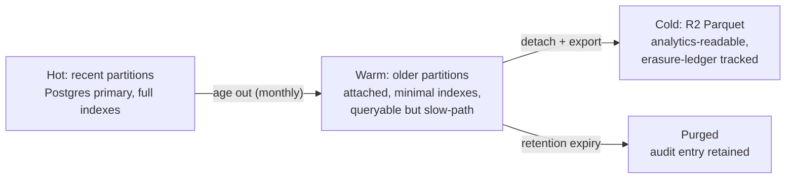
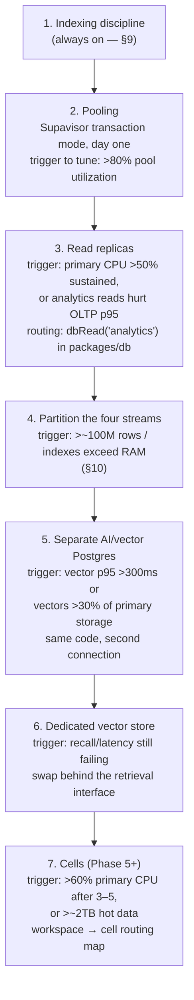
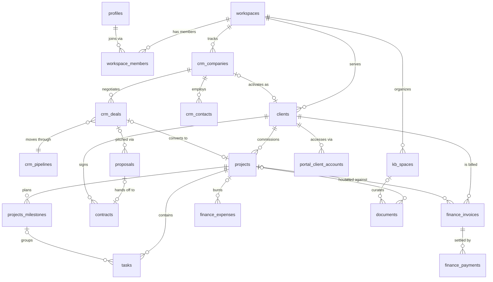

# Database Architecture

| | |
|---|---|
| **Document** | Database Architecture — AurexOS |
| **Status** | Approved — Living Document |
| **Version** | 1.0 |
| **Date** | 2026-07-08 |
| **Owner** | Founding CTO, AurexDesigns |
| **Related** | [./Architecture.md](./Architecture.md) · [./SecurityArchitecture.md](./SecurityArchitecture.md) · [./SearchArchitecture.md](./SearchArchitecture.md) · [../08_Tech_Stack.md](../08_Tech_Stack.md) · [../09_Scaling_Strategy.md](../09_Scaling_Strategy.md) · [../12_Project_Rules.md](../12_Project_Rules.md) |

This document defines how the AurexOS database is **organized** — table taxonomy, naming, relationship discipline, tenancy enforcement, lifecycle, and growth path. It is deliberately conceptual: physical column-level schema lives in `supabase/migrations/` and per-module docs ([../06_Module_Breakdown.md](../06_Module_Breakdown.md)). Where this document and [../12_Project_Rules.md](../12_Project_Rules.md) §3 (R-D rules) overlap, the rules there are the enforcement authority; this document explains the architecture those rules protect. The tone is binding: "must" means CI or the database itself refuses.

---

## 1. Organizing Principles

**One database. One schema. Twenty-plus modules.**

1. **Single shared-schema Postgres (Supabase), `public` schema only.** All tenant data lives in one Postgres database in one schema, per the tenancy decision in [../08_Tech_Stack.md](../08_Tech_Stack.md) §3.1 and the comparison table in [../09_Scaling_Strategy.md](../09_Scaling_Strategy.md) §2.2. There is no schema-per-tenant and no schema-per-module.
2. **Module ownership is expressed by naming and by migration ownership, not by Postgres schemas.** Every table is owned by exactly one module. Ownership is visible two ways:
   - **Table-name prefixes:** `crm_contacts`, `crm_deals`, `finance_invoices`, `projects_milestones`, `portal_shares`, `ai_usage`. A module's namesake canonical entity may claim the bare plural name (`projects`, `tasks`, `clients`, `documents`, `contracts`, `proposals`, `notifications`); everything else the module owns carries its prefix.
   - **Migration ownership:** the migration files that create and evolve a table belong to the owning module's stream (see `supabase/migrations/0003_clients_and_crm.sql`, `0004_projects_and_tasks.sql`). A PR from module A that alters module B's table is a boundary violation flagged in review (R-A1 analogue at the data layer).
3. **Why not Postgres schemas-per-module.** We considered `crm.*`, `finance.*`, etc. and rejected it:
   - Cross-module foreign keys are the norm here, not the exception (invoices → projects → clients → crm companies). Cross-schema FKs work but make `search_path` a new bug class and complicate generated types.
   - The RLS helper functions (§5) are reused verbatim by every policy on every table; one schema keeps helper resolution, grants, and the migration linter trivially uniform.
   - Supabase tooling (type generation into `packages/db`, Realtime, PostgREST) is materially simpler against `public`.
   - **Revisit trigger:** if a compliance boundary ever requires physically separating a module's data (the Finance data-residency case in [../09_Scaling_Strategy.md](../09_Scaling_Strategy.md) §5), that module leaves for its own database entirely — schemas-per-module is the worst of both worlds and stays off the table.
4. **The workspace is the root of everything.** Every tenant-scoped table hangs off `workspaces` via a `workspace_id uuid NOT NULL` FK (R-D2). The handful of genuinely global tables (plan catalogs, model-tier config, the event registry) require an ADR per R-D2 and still get RLS.
5. **Append-only streams are architecture, not logging.** `domain_events` is the substrate for Automation Studio, Notifications, Analytics, and Aurex's situational awareness ([../08_Tech_Stack.md](../08_Tech_Stack.md) §5.2). `audit_log` is the accountability record (R-D4). They are designed as first-class citizens with their own lifecycle (§10), not as afterthought log tables.

---

## 2. Table Taxonomy

Every table in the database belongs to exactly one of five classes. The class determines its policy template (§5.4), index pattern (§9), and lifecycle (§10). A migration introducing a table must be classifiable at review time; "it's kind of both" is a design smell to resolve before merge.

| Class | Examples | Defining rules |
|---|---|---|
| **1. Canonical entities** | `workspaces`, `clients`, `crm_deals`, `projects`, `tasks`, `finance_invoices`, `documents`, `contracts` | The single source of truth for a business object. Full convention set: UUIDv7 PK, `workspace_id`, timestamps, `deleted_at` soft delete, trigger-maintained `updated_at`, audit on every mutation, domain event on every meaningful state change. Read-write via RLS policies for members. |
| **2. Join / link tables** | `workspace_members`, `project_members`, `crm_deal_contacts`, `portal_shares`, `permission_overrides` | Express many-to-many or scoped-grant relationships. Named `<singular_parent>_<plural_children>`. Carry `workspace_id` themselves (never inferred through the join) so RLS is evaluable without traversal. Soft delete applies; membership/grant changes are audited (see [../05_User_Roles.md](../05_User_Roles.md) §10). |
| **3. Append-only streams** | `domain_events`, `audit_log`, `notifications`, `ai_usage` | INSERT and SELECT only — **no UPDATE/DELETE grants for any application role** (`notifications` is the partial exception: recipients may update their own `read_at`). No `updated_at`/`deleted_at`; immutability replaces soft delete. Never joined in hot OLTP paths. Partition-ready by construction: every row carries `workspace_id` + `created_at` (§10). |
| **4. Read models / materialized aggregates** | `dashboard_rollups`, `analytics_project_metrics`, account-health snapshots | Derived entirely from canonical entities and the event stream ([../09_Scaling_Strategy.md](../09_Scaling_Strategy.md) §4.2). **Must be rebuildable from scratch** and must declare their rebuild procedure in the owning module's doc. Losing one is an inconvenience, never data loss. Refreshed by jobs, read by dashboards/widgets; the app never writes them directly. |
| **5. Configuration / registry tables** | `permission_sets`, `feature_flags` (tenant overrides), `event_registry`, `automation_action_definitions`, `workspace_limits` | Small, hot, cache-friendly. Seeded by migrations where they mirror a doc (the [../05_User_Roles.md](../05_User_Roles.md) §6 matrix seeds `permission_sets`). Changes are audited and versioned in-row (`role:pm@v3` style) rather than mutated in place where history matters. Global registry tables need the R-D2 ADR exemption. |

**The event registry** (class 5) is the catalog of every `module.entity.verb` event type with its current payload schema version (§8.3). An event type not present in the registry fails the emit path in `defineAction` — this is what keeps the stream queryable years later.

---

## 3. Naming & Conventions (Normative)

Consolidation of the R-D rules ([../12_Project_Rules.md](../12_Project_Rules.md) §3) plus the conventions table in [../08_Tech_Stack.md](../08_Tech_Stack.md) §3.2, as they apply to database organization. This table is what the migration linter enforces.

| # | Convention | Rule | Source |
|---|---|---|---|
| C1 | Identifiers | `snake_case` for tables, columns, functions, indexes, policies. Tables are plural nouns. camelCase mapping happens once, in `packages/db`. | R-D6 |
| C2 | Module ownership | Owning-module prefix on all tables except the module's namesake entity (§1.2). Join tables: `<singular_parent>_<plural_children>`. | this doc |
| C3 | Primary keys | `id uuid` generated by the UUIDv7 function (`public.uuid_v7()` until native PG18 support). No serials, no UUIDv4 on new tables. | R-D5 |
| C4 | Timestamps | `created_at`, `updated_at`, `deleted_at`, all `timestamptz`. `updated_at` maintained by the shared trigger (`public.set_updated_at()`), never set by the app. Streams (class 3) omit `updated_at`/`deleted_at`. | R-D3 / [../08_Tech_Stack.md](../08_Tech_Stack.md) §3.2 |
| C5 | Tenancy | `workspace_id uuid NOT NULL REFERENCES workspaces(id)` on every tenant-scoped table; referenced by that table's RLS policies; leads every composite index (§9). | R-D2 |
| C6 | Soft delete | `deleted_at` on every user-facing entity; default read paths exclude it; hard deletes only via retention purges and GDPR erasure (§6). | R-D3 |
| C7 | Money | Integer minor units + explicit `currency` column (`amount_cents bigint`, `currency char(3)`). Never float, never implied currency. | R-D8 |
| C8 | RLS | Enabled on every table at creation, with explicit policies, deny-by-default. A table without policies returns zero rows. | R-D1 |
| C9 | Migrations | Schema changes exist only as versioned migration files; merged migrations are immutable; mistakes fix forward (§8). | R-D7 |
| C10 | Events & audit | Every mutation path emits a domain event and writes an audit row via `defineAction` (R-A3); both tables are append-only at the grants level. | R-D4 / R-A6 |
| C11 | Enums | Postgres `text` + `CHECK` constraint (or lookup/registry table) rather than native enums — native enum alteration fights the expand/contract protocol (§8.1). | this doc |
| C12 | JSONB | Allowed for genuinely schemaless payloads (event payloads, widget config, block content). Forbidden as an escape hatch for columns we were too lazy to model — anything filtered or joined on becomes a real column. | this doc |

---

## 4. Relationships

### 4.1 Single source of truth, reference-never-copy

Every fact lives in exactly one table (its canonical entity, class 1) and is **referenced by FK, never copied**. An invoice references its `client_id`; it does not carry a copy of the client's name. The two sanctioned exceptions:

- **Immutability snapshots:** legally significant documents freeze their inputs at signing/sending time (accepted proposal PDF, sent invoice line items, contract evidence bundles — see the Finance immutability rule in [../06_Module_Breakdown.md](../06_Module_Breakdown.md) §9). These are archives of a moment, not live duplicates.
- **Read models (class 4):** denormalized by definition, rebuildable by rule.

### 4.2 Cross-module foreign keys

Cross-module FKs are **allowed and encouraged at the database layer** — `finance_invoices.project_id → projects.id` is real referential integrity we refuse to give up. The module boundary is an *application-layer* rule: module A's code reaches module B only through B's public surface or by consuming B's domain events (R-A1, R-A6). The database enforces integrity; the import graph enforces decoupling. These are different layers solving different problems, and conflating them (dropping FKs "for modularity") buys nothing but orphaned rows.

FK hygiene: `ON DELETE` behavior is chosen deliberately per relationship (`CASCADE` only within a strict ownership hierarchy, e.g. workspace → everything; `RESTRICT`/`SET NULL` across modules), and every FK column is indexed.

### 4.3 The polymorphic reference pattern

A small set of genuinely cross-cutting tables reference "any entity" via the pair `entity_type text + entity_id uuid`, with a `CHECK` constraint restricting `entity_type` to the registered list:

**Allowed users of the pattern (closed list):** `comments`, `files` (attachments), `crm_activities` (timeline glue), `notifications`, `domain_events`/`audit_log` (entity refs), `portal_shares`. Adding a table to this list requires an ADR.

**Trade-offs, stated honestly:** we lose real FK integrity on the polymorphic edge (no `REFERENCES` across a type union), so we compensate with (a) the `CHECK`-constrained type list, (b) application-layer resolution through one shared `entityRef` helper in `packages/core`, and (c) orphan-sweep verification in the nightly integrity job. What we gain is one commenting system, one attachment system, and one activity timeline instead of `task_comments` + `doc_comments` + `deal_comments` diverging for years. For the streams (class 3) the loss is theoretical anyway — events legitimately outlive the entities they describe.

Everywhere else, polymorphism is forbidden: a relationship between two known entities is a real FK, full stop.

---

## 5. Multi-Tenancy Deep-Dive

The tenancy model itself (shared schema, why, isolation guarantees) is normative in [../09_Scaling_Strategy.md](../09_Scaling_Strategy.md) §2; the role model in [../05_User_Roles.md](../05_User_Roles.md). This section defines how it is *organized in the database*. Full threat model in [./SecurityArchitecture.md](./SecurityArchitecture.md).

### 5.1 Policy architecture: a few reviewed helpers, many generated policies

RLS policies are **not** hand-written per table. They are instantiated from templates that call a small, intensively reviewed set of helper functions:

```sql
-- Shape, not full DDL. STABLE + SECURITY DEFINER so the planner caches
-- the result per statement and the helper can read membership tables
-- without recursive RLS evaluation.
create function public.auth_workspace_ids() returns setof uuid
  language sql stable security definer set search_path = public ...;

create function public.is_workspace_member(ws uuid) returns boolean ...;
create function public.workspace_role_of(ws uuid) returns text ...;
create function public.has_permission(ws uuid, perm text) returns boolean ...;
```

Rules:

- Helpers are `STABLE` (planner caching; called once per statement, not per row) and `SECURITY DEFINER` with a pinned `search_path` (they must read `workspace_members` without triggering that table's own RLS recursively).
- The helper set is deliberately tiny and each addition is CTO-reviewed — these functions *are* the tenant boundary.
- Policies reference helpers only; a policy containing inline membership SQL fails migration review.

### 5.2 Policy templates per table class

| Table class | SELECT | INSERT | UPDATE | DELETE |
|---|---|---|---|---|
| Canonical entity | member of workspace ∧ `deleted_at IS NULL` (+ role/resource predicates per [../05_User_Roles.md](../05_User_Roles.md) §3) | member ∧ permission check | member ∧ permission check | no policy — soft delete is an UPDATE of `deleted_at`; see §6 |
| Join / grant table | member (often role-restricted) | granting role only | granting role only | soft delete as above |
| Append-only stream | member (audit: Owner/Admin + scoped views) | member, `actor_id = auth.uid()` | **none** (exception: own-row `read_at` on `notifications`) | **none** |
| Read model | member (viewer-permission-filtered) | job role only | job role only | job role only |
| Config / registry | member (or public for global catalogs) | Owner/Admin | Owner/Admin | soft delete / versioned rows |

Deny-by-default means the absent cells are not "TODO" — they are the design. `domain_events` and `audit_log` having no UPDATE/DELETE policies *and* no grants is what makes R-D4 a runtime guarantee rather than a code-review hope.

### 5.3 JWT claims flow — claims are a cache, the database is truth

1. Sign-in → Supabase Auth issues a JWT; a claims hook stamps workspace memberships and a role/permission-set digest into custom claims.
2. Every pooled request (Supavisor transaction mode — **no session state**, [../09_Scaling_Strategy.md](../09_Scaling_Strategy.md) §3.4) carries the JWT; helpers read claims for the fast path.
3. Membership or role changes refresh claims and revalidate live sessions within 60 seconds ([../05_User_Roles.md](../05_User_Roles.md) §11).
4. **Sensitive actions re-verify against `workspace_members` / `permission_overrides` in the database** — a stale claim can never authorize a role change, a hard delete, a portal share, or a billing action.

### 5.4 Service-role discipline

The `service_role` key bypasses RLS and is therefore treated as radioactive:

- It exists **only** inside Supabase Edge Functions; it never reaches the Next.js app or any client bundle (R-S6).
- All service-role access goes through the `packages/db` admin wrapper whose API makes `workspace_id` a **mandatory parameter** — there is no "query all workspaces" call surface. Cross-workspace maintenance jobs use an explicitly named, allowlisted escape hatch that logs its own usage to `audit_log`.
- Each Edge Function documents which allowlisted service-role operations it performs ([../09_Scaling_Strategy.md](../09_Scaling_Strategy.md) §2.3).

### 5.5 Tenancy test pyramid

| Layer | Check | When |
|---|---|---|
| **CI schema lint** | Every table has RLS enabled + policies + `workspace_id` (or a recorded ADR exemption); composite indexes lead with `workspace_id`; naming conventions (§3) | every PR |
| **pgTAP-style RLS tests** | Per table, shipped **in the same migration** that creates or alters policies: deny-by-default assertions, "workspace A member gets 0 rows from workspace B", role-predicate cases, soft-delete exclusion | every PR |
| **Two-tenant Playwright E2E** | Cross-tenant probes through the real UI/API with two seeded workspaces; portal-boundary probes per [../05_User_Roles.md](../05_User_Roles.md) §7 | every PR (smoke) + nightly (full) |

Any cross-tenant leak found by any layer is a SEV-1 ([../09_Scaling_Strategy.md](../09_Scaling_Strategy.md) §6).

---

## 6. Soft Deletes & Trash

### 6.1 Semantics

`deleted_at IS NULL` = live. `deleted_at NOT NULL` = in the trash: invisible to default read paths, restorable, retained until purge. Soft delete is an **UPDATE**, executed through `defineAction` like any mutation — it emits `module.entity.deleted`, writes audit, and cascades *logically* (deleting a project trashes its tasks by policy, not by FK cascade, so restore can reverse it).

### 6.2 RLS integration

- Default SELECT policies include `deleted_at IS NULL` (§5.2), so trashed rows vanish from every query path — app code, PostgREST, Realtime, RAG retrieval — without any WHERE-clause discipline required.
- Trash views (`*_trash` or a policy variant gated on a trash-view permission) expose a workspace's trashed rows to Owner/Admin for the restore UI.
- Partial indexes mirror the predicate (`WHERE deleted_at IS NULL`, §9) so tombstones stop costing index space the moment they die.

### 6.3 Restore

Restore clears `deleted_at` (audited, evented as `module.entity.restored`) and re-applies logical cascade downward. Name-uniqueness collisions on restore resolve by suffixing, never by silently overwriting a live row.

### 6.4 Retention purge

Hard deletes happen in exactly two places, both server-side scheduled jobs — never feature code (R-D3):

1. **Trash purge:** rows trashed longer than the workspace's trash window (default 30 days) are hard-deleted by a nightly job, workspace-batched and throttled. Early permanent deletion requires Owner approval ([../05_User_Roles.md](../05_User_Roles.md) §2.1). Every purge writes an `audit_log` entry (entity ref + count — the audit row outlives the data).
2. **Class-level retention:** stream pruning/archival per the §10.4 retention table.

### 6.5 GDPR hard-erasure cascade

Erasure requests (data-subject or workspace offboarding) run a dedicated, tested cascade that reaches **everything derived from the data, not just the canonical rows**:

| Surface | Action |
|---|---|
| Canonical rows + join rows | hard delete (or anonymize where audit integrity requires the row skeleton — actor refs become `deactivated` tombstones per [../05_User_Roles.md](../05_User_Roles.md) §11) |
| `domain_events` / `audit_log` payloads | PII fields redacted in place via a security-definer redaction function — the only sanctioned write to these tables, itself audited; row skeletons and hashes remain for integrity |
| **Vectors** | embeddings derived from erased content deleted from pgvector tables (and from the dedicated vector store, once split — the retrieval interface owns this) |
| **AI memory** | `MemoryItem` rows and AIRun traces referencing the subject purged/redacted |
| Files | Supabase Storage / R2 objects under the erased entities' keys deleted |
| **Caches & read models** | affected read models re-derived; TanStack/Redis caches invalidated by workspace key |
| Cold archives | R2 Parquet archives (§10.3) tracked in an erasure ledger; affected partitions rewritten on the erasure job's schedule |

Erasure completion is verified (count assertions per surface) and certified in `audit_log`.

---

## 7. Audit & Events — Two Spines, Not One

`domain_events` and `audit_log` look similar (append-only, workspace-scoped, actor-stamped) and are deliberately **not merged**:

| | `domain_events` | `audit_log` |
|---|---|---|
| Purpose | **Powers features:** Automation Studio triggers, notifications, analytics rollups, AI context/memory, outbound webhooks | **Powers accountability:** who did what, before/after diffs, compliance, "Aurex did this" attribution (R-AI2) |
| Consumers | Machines, constantly | Humans and auditors, occasionally |
| Payload | Versioned business payload (§8.3), designed for consumption | Before/after diff + actor + request id, designed for evidence |
| Emission rule | *Meaningful state changes* — an event another module could plausibly react to | **Every mutation, no exceptions** (R-D4) |
| Retention | 12 months hot, then R2 Parquet (§10) | Compliance floor: 7y finance/contract events, 2y default ([../05_User_Roles.md](../05_User_Roles.md) §10) |

**Write path:** both rows are written by the `defineAction` wrapper (R-A3) **in the same transaction as the state change** — the event insert doubles as the outbox record if services are ever extracted ([../09_Scaling_Strategy.md](../09_Scaling_Strategy.md) §5). Triggers additionally guarantee audit coverage for the rare paths that bypass the wrapper (migrations' backfills, purge jobs).

**Immutability enforcement is structural:** no UPDATE/DELETE grants for any application role, no UPDATE/DELETE RLS policies (see `supabase/migrations/0005_platform_events_audit_notifications.sql`). Tampering is not detected — it is impossible at the Postgres privilege layer. The sole exception is the audited GDPR redaction function (§6.5).

---

## 8. Versioning

### 8.1 Migration protocol — expand → migrate → contract

Normative in [../09_Scaling_Strategy.md](../09_Scaling_Strategy.md) §7; the database-side obligations:

1. **Expand:** additive only — new nullable/defaulted columns, new tables, `CREATE INDEX CONCURRENTLY`. Old code keeps working against the expanded schema.
2. **Migrate:** batched, workspace-by-workspace backfills as jobs (never one giant UPDATE); verified by count assertions.
3. **Contract:** destructive DDL only after a soak period, with a tested rollback script. No in-place renames, ever — add, backfill, drop.

### 8.2 CI gates

- **Shadow-DB dry run:** every migration executes in CI against a production-shaped shadow database (schema + representative data volume) — lock behavior, duration, and failure states are observed before merge ([../08_Tech_Stack.md](../08_Tech_Stack.md) §7).
- **Immutability:** merged migration files are never edited; CI fails a PR that modifies an existing migration. Fix forward with a new one (R-D7).
- **Nightly schema drift:** production schema is diffed against the migration chain; any drift is a P1 (someone had DDL access they shouldn't).
- **RLS tests travel with the migration:** a migration touching tables or policies ships its pgTAP assertions in the same PR (§5.5).

### 8.3 Event payload versioning

Event payloads in `domain_events` are contracts with future consumers (including replays years later):

- Every event type's payload has a Zod schema in `packages/core`, registered in the event registry (§2) with a version.
- **Additive changes** (new optional fields) do not bump the version.
- **Breaking changes** mint a new event type with a `_v2` suffix (`finance.invoice.paid_v2`); the old type keeps emitting during a deprecation window, and consumers declare which versions they accept. Old rows are never rewritten.

### 8.4 Generated types freshness

DB types are generated from the live schema into `packages/db` (R-T4). CI regenerates and diffs on every migration PR — a schema change whose generated types weren't committed fails the build. Application code never hand-writes a table type.

---

## 9. Indexing Discipline

Rules from [../09_Scaling_Strategy.md](../09_Scaling_Strategy.md) §3.1, made concrete per table class:

| Rule | Detail |
|---|---|
| **Composite, workspace first** | Every tenant-table index leads with `workspace_id`: `(workspace_id, status)`, `(workspace_id, assignee_id, due_date)`. Single-tenant queries are the only queries; an index that can't serve them workspace-first is dead weight. |
| **Partial, excluding tombstones** | Hot-path indexes carry `WHERE deleted_at IS NULL`, matching the RLS predicate (§6.2) — indexes stay small as trash accumulates. |
| **Covering indexes for feeds** | High-read list surfaces (My Work, notification badge counts, activity timelines) get covering indexes (`INCLUDE` payload columns) shaped by their real query, e.g. `notifications (user_id, read_at, created_at DESC)`. |
| **UUIDv7 locality** | Time-ordered PKs keep insert-heavy B-trees right-leaning (R-D5) — this is why the streams can absorb Phase-5 write rates without index thrash. |
| **HNSW for vectors** | pgvector embedding tables use HNSW indexes; the `workspace_id` RLS predicate rides on the same row, so vector search is tenant-filtered like everything else (R-AI4). Recall/latency triggers for splitting the store: [../09_Scaling_Strategy.md](../09_Scaling_Strategy.md) §3.5. |
| **EXPLAIN gate on hot paths** | Queries on declared hot paths (dashboard widgets, My Work, pipeline board, notification count) require an `EXPLAIN` check in review when their query shape changes; a seq scan on a tenant table in a hot path blocks merge. |
| **Quarterly unused-index audit** | `pg_stat_user_indexes` review each quarter; unused indexes are dropped by migration (they cost every write). Index additions go through migration review like any DDL. |

---

## 10. Partitioning & Data Lifecycle

### 10.1 The four unbounded tables

`domain_events`, `audit_log`, `notifications`, `ai_usage` grow without bound ([../09_Scaling_Strategy.md](../09_Scaling_Strategy.md) §3.2, §8: ~1M events/day at Phase 4, 10–50M/day at Phase 5). All four are partition-ready **by construction**: append-only, keyed by `workspace_id` + `created_at`, never joined in hot OLTP paths.

### 10.2 Trigger and mechanism

- **Trigger:** any of the four exceeds ~100M rows, or its indexes stop fitting comfortably in memory (watched on the capacity dashboard, [../09_Scaling_Strategy.md](../09_Scaling_Strategy.md) §6).
- **Action:** native range partitioning by month on `created_at`:

```sql
-- Shape only. Executed via the expand/contract protocol:
-- new partitioned table alongside, backfill, swap.
create table domain_events (like ...) partition by range (created_at);
create table domain_events_2027_01
  partition of domain_events
  for values from ('2027-01-01') to ('2027-02-01');
-- partition creation automated by a scheduled job, N months ahead
```

`workspace_id` joins the partition key only if a cell split (§11) hasn't already made it moot. Detaching a partition is the archival primitive: near-instant, no delete storm, no bloat.

### 10.3 Archival tiers



### 10.4 Retention per data class

| Data class | Hot | Warm | Cold / end state |
|---|---|---|---|
| `domain_events` | 12 months | — | R2 Parquet after 12 months; analytics reads continue against Parquet |
| `audit_log` | 24 months | to compliance floor | **7 years** finance/contract events, **2 years** default (configurable upward, never below floor — [../05_User_Roles.md](../05_User_Roles.md) §10); cold export → detach |
| `notifications` | 90 days | — | pruned at 90 days (delivered state lives in the event stream if ever needed) |
| `ai_usage` | 13 months raw (billing disputes) | — | aggregated monthly rollups retained; raw rows purged |
| Trashed entity rows | 30-day trash window (§6.4) | — | purged with audit entry |
| Recordings / transcripts (R2) | per module policy ([../06_Module_Breakdown.md](../06_Module_Breakdown.md) §7) | — | default 12 months, workspace-configurable |

Every class's retention is data in a config table (class 5), not a constant in code (R-S4).

---

## 11. Scalability

### 11.1 The ladder

Each rung has a named trigger ([../09_Scaling_Strategy.md](../09_Scaling_Strategy.md) §3, §10); we climb only when the dashboard says so.



- **Replica routing** is explicit, not magic: consumers opt in via `dbRead('analytics')` and accept lag by contract. OLTP and read-after-write stay on primary.
- **Vector split** is a connection-string change first (same schema conventions, same RLS), a store swap second — the `retrieval` interface in `packages/ai` exists from day one so both moves touch one package ([../08_Tech_Stack.md](../08_Tech_Stack.md) §4.4).
- **Cells** preserve the invariant that a workspace never spans cells — everything keeps joining locally; only a thin routing layer and a small control-plane DB are global ([../09_Scaling_Strategy.md](../09_Scaling_Strategy.md) §2.5).

### 11.2 The "millions of records" envelope

Back-of-envelope confirming the ladder's ordering against [../09_Scaling_Strategy.md](../09_Scaling_Strategy.md) §8:

- **Phase 4 (~10 workspaces, ~300 users, ~50 GB hot):** ~1M events/day ≈ 365M event rows/year — the partitioning trigger (rung 4) fires for `domain_events` during Phase 4–5, exactly when predicted. Canonical entities remain tiny by comparison (tens of thousands of tasks/invoices per busy workspace ≈ single-digit GB): **a single well-indexed primary with a pooler carries everything through Phase 4.**
- **Phase 5 year 1 (200–1,000 workspaces, 0.3–1.5 TB):** 10–50M events/day forces partitioning + archival to keep hot data small (12-month event window ≈ 3.6–18B rows if unpartitioned — hence Parquet offload); analytics/RAG read volume forces replicas; vectors at ~30% of storage force the AI split. Canonical OLTP data — even at millions of rows per large tenant — stays comfortably inside one primary because every query is workspace-pruned by RLS and workspace-leading indexes. Cells remain a blueprint, not a build, until the >2 TB / >60%-CPU trigger.

The organizing insight: **unbounded growth is concentrated in four append-only tables that are partition-ready by construction, so scaling the database is mostly scaling those four** — the canonical business data grows linearly with real business activity and stays small.

---

## 12. ER Overview — the Core Canonical Spine

The ~15 core canonical entities and their FK spine, workspace at root. Conceptual: join tables, streams, read models, and most columns omitted (see §2; physical schema in `supabase/migrations/`).



Reading of the spine: **workspace → client → project → task** is the ownership backbone; CRM (`crm_companies`/`crm_contacts`/`crm_deals`) feeds it pre-sale and converts into it on win; the commercial chain (**proposal → contract → invoice → payment**) attaches to clients and projects; documents and KB spaces are the knowledge substrate; the portal account is the client-side identity anchor ([../05_User_Roles.md](../05_User_Roles.md) §7). Every entity above also carries `workspace_id` directly (C5) — the diagram shows domain relationships, but tenancy is always enforced on the row itself, never inferred through joins.

---

## 13. Open questions

1. **Comments/files consolidation timing:** `task_comments` exists today (`supabase/migrations/0004`); the polymorphic shared `comments` table (§4.3) is the target. Migrate at Phase 2 when Documents/CRM need commenting, or let `task_comments` live until then? *Lean: migrate when the second consumer arrives, per R-A4's "second use" rule.*
2. **`notifications` read models:** at Phase 5 volumes, do unread-count queries need a per-user counter read model, or does the covering index (§9) hold? *Decide from Phase 4 p95 data.*
3. **`ai_usage` raw retention (13 months)** — is this the right floor once per-tenant billing disputes are real (Phase 5)? Revisit with the billing design.
4. **Partition key at rung 4:** month-only vs. `(workspace_id, month)` composite — depends on whether any Phase-5 cell split has landed first. Decide when the 100M-row trigger fires, via ADR.
5. **Erasure rewrites of cold Parquet archives (§6.5):** batch cadence (monthly?) vs. on-demand — cost/compliance trade-off needs counsel input before the first external GDPR request is plausible (Phase 4).
6. **Trash window default (30 days):** validate against real restore behavior after 3 months of internal use; consider per-module windows (finance longer?).
