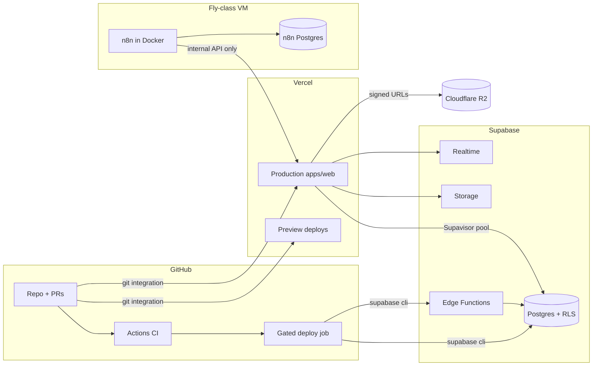
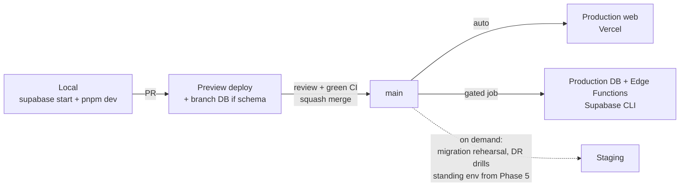
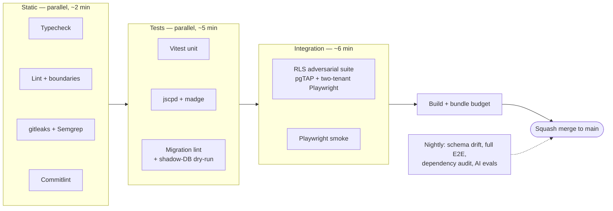
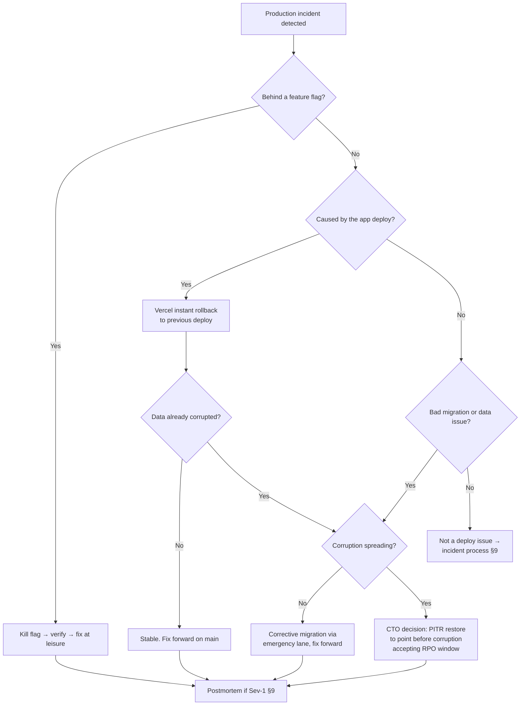

# Deployment Architecture

| | |
|---|---|
| **Document** | Deployment Architecture — AurexOS |
| **Status** | Approved — Living Document |
| **Version** | 1.0 |
| **Date** | 2026-07-08 |
| **Owner** | Founding CTO, AurexDesigns |
| **Related** | [./Architecture.md](./Architecture.md) · [./SecurityArchitecture.md](./SecurityArchitecture.md) · [./DatabaseArchitecture.md](./DatabaseArchitecture.md) · [../08_Tech_Stack.md](../08_Tech_Stack.md) · [../09_Scaling_Strategy.md](../09_Scaling_Strategy.md) · [../12_Project_Rules.md](../12_Project_Rules.md) |

This document defines how AurexOS is **built, verified, shipped, observed, and recovered**: environments, the CI gate, the CD paths for every deployable artifact, database change management, rollback, backups/DR, observability, and incident response. It operationalizes the zero-downtime commitments of [../09_Scaling_Strategy.md](../09_Scaling_Strategy.md) §7 and gives every R-Q5 check ([../12_Project_Rules.md](../12_Project_Rules.md) §6) a concrete pipeline stage. The tone is binding: "must" means the pipeline, branch protection, or a runbook refuses the alternative. The current `.github/workflows/ci.yml` (typecheck + build) is the Phase 0 walking skeleton of the pipeline specified here; §3 is its target state and the checklist for closing the gap.

---

## 1. Deployment Topology

**What runs where.** AurexOS is a modular monolith on managed platforms; the only server we administer is the n8n VM. The application itself is **not containerized** while on Vercel — Docker exists solely for n8n and local dev parity ([../08_Tech_Stack.md](../08_Tech_Stack.md) §7).

| Component | Platform | Deployed how | Trust/network notes |
|---|---|---|---|
| `apps/web` (Next.js) | **Vercel** | Git integration on `main`; immutable deploys; preview deploy per PR | Holds only the anon key + server-side env; **never** the service-role key (R-S6). Public ingress via Vercel edge. |
| Postgres + Auth + Realtime + Storage | **Supabase** | Migrations + config via Supabase CLI in a gated GitHub Actions job | RLS is the isolation boundary (R-D1); direct DB connections reserved for migrations; app traffic through Supavisor ([../09_Scaling_Strategy.md](../09_Scaling_Strategy.md) §3.4). |
| Edge Functions (webhooks, jobs, AI pipelines) | **Supabase** | CLI deploy in the same gated job as migrations | Only place the service-role key lives, behind the allowlist discipline of [../09_Scaling_Strategy.md](../09_Scaling_Strategy.md) §2.3. Webhook ingress isolated from the web app ([../08_Tech_Stack.md](../08_Tech_Stack.md) §3.4). |
| n8n (+ its own Postgres) | **Small VM (Fly-class), Docker Compose** | Workflow definitions exported to `infra/n8n` in-repo; applied deliberately by an operator, never auto-deployed | n8n **never touches our database** — it calls authenticated internal API endpoints only ([../08_Tech_Stack.md](../08_Tech_Stack.md) §5.1). VM firewall: inbound only from webhook sources; outbound to our API + connector SaaS. |
| Large/CDN assets | **Cloudflare R2** | Bucket config as documented settings; objects written by the app's `storage` interface | Keys prefixed `workspace_id/…`; access via short-lived signed URLs minted server-side ([../08_Tech_Stack.md](../08_Tech_Stack.md) §6). Versioning on for immutable artifacts. |
| Source, CI, branch protection | **GitHub + Actions** | — | Holds deploy credentials as encrypted secrets, scoped per environment; no human holds standing DDL access to production (R-D7). |

Single-region through Phase 4 is an **accepted, documented risk**; multi-region is a Phase 5+ decision driven by customer geography (§9.4).

---

## 2. Environments

| Environment | Purpose | Data | Keys | Who deploys | Lifetime |
|---|---|---|---|---|---|
| **Local** | Daily development; full-stack parity | Seeded **demo workspace** (two workspaces, so cross-tenant tests run locally) | Local-only Supabase keys from `supabase start`; **no production keys in dev, ever** (R-S2/R-S6) | Developer: `pnpm dev` boots everything | Per machine, disposable |
| **Preview** | Review every PR against a running deployment | Seed data; **branch database** when the PR touches schema | Per-preview env vars injected by Vercel/CI | Automatic on PR push | Dies with the PR |
| **Staging** | Production-shaped final rehearsal | Anonymized production-derived seed | Dedicated staging project keys | CI on demand | **Thin through Phase 4** — see below |
| **Production** | The product | Real tenant data | Production secrets in platform stores only | CI only (gated job); humans have no standing write path | Permanent |

**Branch databases for schema PRs.** A PR containing a migration gets a Supabase branch database: migrations apply to a fresh branch, seed runs, and the preview deploy points at it. Reviewers exercise the schema change against a live stack without touching any shared database. Non-schema PRs share a static preview database to keep costs flat.

**Staging, honestly.** Through Phase 4, a standing staging environment would be a third copy of the stack maintained for a two-to-four-person team ([../10_Roadmap.md](../10_Roadmap.md) §1) that already gets per-PR previews, branch databases, and a production-shaped shadow-DB dry run (§5.2). That combination covers most of what staging exists for, so "staging" stays thin: an on-demand, production-shaped project used for migration rehearsal and DR drills. A **standing staging environment formalizes in Phase 5**, when external customers make production experiments unacceptable and the anonymized-seed pipeline becomes a maintained artifact.

**Seeded demo workspace.** The seed script ([../10_Roadmap.md](../10_Roadmap.md) Phase 0 deliverables) is a first-class artifact: deterministic, versioned with migrations, and creating *two* workspaces with realistic cross-module data — because every environment must be able to run the adversarial two-tenant suite (R-S7), not just look populated.

---

## 3. CI Pipeline

Every stage below maps to the rule it enforces; the full set is the R-Q5 required suite and is marked **required in branch protection — no admin bypass** (R-Q3). **Wall-time budget: ≤10 minutes** for the blocking path, held by Turborepo remote caching, affected-only test selection, and parallel jobs. A stage that pushes the budget over gets optimized or parallelized — never unrequired. A flaky check is a P1 bug (R-Q5).

| # | Stage | What it does | Enforces | Blocking? |
|---|---|---|---|---|
| 1 | Install + turbo cache | `pnpm install --frozen-lockfile`, restore remote cache | — | Blocking |
| 2 | Typecheck | `tsc` strict across all packages | R-T1, R-T2 | Blocking |
| 3 | Lint | ESLint incl. **import boundaries** (eslint-plugin-boundaries), banned patterns | R-A1, R-A5, R-T5, R-Q1, R-AI1, R-S3 | Blocking |
| 4 | Commitlint | Conventional-commit check on PR title (squash source) | R-Q4 | Blocking |
| 5 | Secret scan | gitleaks on the push | R-S2 | Blocking |
| 6 | Semgrep | Raw SQL, `dangerouslySetInnerHTML`, `.delete()` in feature code, service-key patterns in client bundles | R-S5, R-D3, R-S6 | Blocking |
| 7 | Unit tests | Vitest: `packages/core`, `packages/ai`, services, money math | R-Q2 | Blocking |
| 8 | Duplication + cycles | jscpd on changed files; madge circular-dependency check | R-A4, R-A5 | Blocking |
| 9 | Migration lint | New migrations checked for: RLS enabled + policies, `workspace_id`, soft-delete columns, UUIDv7 PKs, `snake_case`, integer-minor-unit money | R-D1, R-D2, R-D3, R-D5, R-D6, R-D8 | Blocking |
| 10 | Migration dry-run | Apply migrations to a **production-shaped shadow DB** (schema restored from prod, anonymized); fails on lock-timeout breach or error | R-D7, §5.2 | Blocking (schema PRs) |
| 11 | RLS/permission adversarial suite | pgTAP-style deny-by-default assertions per table + **two-tenant Playwright** cross-tenant probes against seeded local Supabase | R-S7, R-D1, R-AI4 | Blocking |
| 12 | Playwright smoke | Golden paths per current phase ([../10_Roadmap.md](../10_Roadmap.md) §9) | R-Q2 | Blocking |
| 13 | Bundle budget | Per-route bundle-size budgets | R-A2 | Blocking |
| 14 | Build | Full `turbo build` | R-Q5 | Blocking |
| N1 | Schema drift | Diff production schema against migrations; any drift pages | R-D7 | **Nightly** |
| N2 | Full Playwright regression | Entire E2E suite, all modules | R-Q2 | **Nightly** |
| N3 | Dependency + license audit | Advisory scan | — | **Nightly** |
| N4 | AI eval harness (Phase 3+) | Golden-set evals; also blocking on PRs that change prompts/models (R-AI5) | R-AI5 | Nightly + conditional |

---

## 4. CD & Release Process

**Trunk-based.** One long-lived branch: `main`. Short-lived feature branches (`type/scope-summary`, R-Q4 naming), squash-merged so `main` reads as a changelog. Every commit on `main` is deployable; there are no release branches, release trains, or code freezes — **feature flags, not branches, hold unfinished work** (PostHog flags, [../08_Tech_Stack.md](../08_Tech_Stack.md) §7).

| Artifact | Trigger | Path | Gate |
|---|---|---|---|
| `apps/web` | Merge to `main` | Vercel git integration → immutable deploy → atomic alias switch | CI green (branch protection); Vercel build must succeed |
| DB migrations | Merge to `main` containing `supabase/migrations/*` | GitHub Actions **gated job**: `supabase db push` via CLI, `lock_timeout` set by the harness | CI green **+ manual environment approval** in Actions — a human confirms the expand/migrate/contract stage (§5) |
| Edge Functions | Merge to `main` touching `supabase/functions/*` | Same gated job, `supabase functions deploy` | Deployed **after** migrations in the same run, so functions never precede their schema |
| n8n workflows | Change to `infra/n8n/*` exports | Operator applies to the n8n instance deliberately (import + smoke-check), then confirms in the PR | Review; never auto-applied — n8n changes can call external systems |

**Ordering rule.** Because web deploys are automatic and migration deploys are gated, code must always be compatible with **both** the pre- and post-migration schema — which is exactly what expand → migrate → contract guarantees (§5.1). The gate is the human confirming stage discipline, not a bottleneck for routine merges.

**Feature flags are the risk decoupler.** Deploy ≠ release. Risky features merge dark behind a module-prefixed kebab-case flag (R naming §8), roll out to internal → pilot → all workspaces, and every flag has an owner and a removal issue. This is what makes "rollback" mostly a flag flip rather than a deploy operation (§6).

**Release tagging.** Every production deploy is tagged into **Sentry as a release** (commit SHA), with source maps uploaded from CI. Errors therefore attribute to the exact deploy, `workspace_id` tags attribute them to tenants (no PII in payloads), and "did the new deploy cause this?" is a filter, not an investigation.

---

## 5. Database Change Management

### 5.1 Expand → migrate → contract (the only protocol)

Per [../09_Scaling_Strategy.md](../09_Scaling_Strategy.md) §7. **Worked example — renaming `crm_deals.stage` to `crm_deals.pipeline_stage`** (no in-place renames, ever):

1. **Expand (PR 1).** Migration adds `pipeline_stage` nullable; a trigger mirrors writes from `stage`. Code reads `stage`, writes both. Shadow-DB dry run proves the migration takes no long lock; `CREATE INDEX CONCURRENTLY` for the new index. Deployed: web auto, migration gated.
2. **Migrate (PR 2).** Batched backfill job copies `stage` → `pipeline_stage` workspace-by-workspace, throttled; counts verified (`WHERE pipeline_stage IS DISTINCT FROM stage` must be zero). No schema change; runs as a background job.
3. **Contract (PR 3, ≥ one release later).** Code switches reads to `pipeline_stage`. After a soak period with zero `stage` reads observed, a final migration sets `NOT NULL`, drops the trigger and the old column — destructive DDL only after soak, with a tested recovery script.

At every intermediate point, the running code works against the current schema — deploys and migrations never need to be simultaneous.

### 5.2 Shadow-DB dry run

Every schema PR applies its migrations in CI against a **production-shaped shadow database**: schema (and anonymized statistics-preserving sample data) restored from production. It fails on error, on `lock_timeout` breach, or on migration-lint violations. This is the stage that catches "works on empty local DB, takes an exclusive lock for 40 seconds on 10M rows."

### 5.3 Drift detection and immutability

- **Nightly drift check** (§3 N1) diffs the production schema against the migration history; any diff pages the on-call and is treated as a possible unauthorized change (R-D7 — no human holds standing DDL access).
- **Merged migrations are immutable.** A wrong migration is corrected by a **new** migration, never by editing history. Local databases reset (`supabase db reset`) rather than hand-patched.
- RLS policy changes ship with their pgTAP tests **in the same migration** — a policy change that lands without its adversarial test cannot merge (§3 stage 9/11).

---

## 6. Rollback Architecture

Three distinct mechanisms, matched to three failure shapes. The unifying principle: **application state rolls back; database state rolls forward.**

| Layer | Mechanism | Time to mitigate | When |
|---|---|---|---|
| Feature | PostHog flag kill-switch | Seconds | Misbehaving feature that shipped behind a flag (the designed-for case) |
| App | Vercel instant rollback to the previous immutable deploy | ~1 minute | Regression not flag-isolated; safe because migrations are expand-first, so deploy N−1 always runs against the current schema |
| Database | **Fix forward** — corrective migration through the full pipeline (emergency lane per [../12_Project_Rules.md](../12_Project_Rules.md) §10.5); **PITR** for data destruction | Minutes–hours | Bad migration or data corruption. PITR restore is the last resort — it trades an RPO window of writes for correctness, and that trade is a CTO decision, made against a runbook |

Runbooks are **required** for every rollback path (flag kill, Vercel rollback, corrective migration, PITR restore) and are rehearsed in the quarterly drills (§7.3). An unrehearsed rollback procedure is treated as nonexistent.

---

## 7. Backups & Disaster Recovery

### 7.1 Backup matrix

| Store | What | Mechanism | Frequency | Restore verified |
|---|---|---|---|---|
| Supabase Postgres | All tenant data | Automated backups; **PITR from Phase 3** | Daily (Phases 1–2) → continuous WAL (Phase 3+) | Quarterly drill |
| Supabase Storage | Standard files | Included in project backups + periodic export of bucket manifests to R2 | Daily | Quarterly drill |
| Cloudflare R2 | Large/CDN assets | **Object versioning** on immutable artifacts; lifecycle rules; cross-bucket copy of critical prefixes | Continuous (versioning) | Spot-restore in drills |
| n8n VM | Workflow definitions + credentials DB | Workflows are **in-repo** (`infra/n8n`) — the VM is rebuildable from repo + secrets store; its Postgres dumped nightly to R2 | Nightly | Rebuild-from-scratch drill annually |
| GitHub | Source, CI config, this document | Git's distributed nature + platform redundancy | Continuous | — |

### 7.2 RPO / RTO by phase

| Phase | RPO | RTO | Basis |
|---|---|---|---|
| 1–2 | ≤ 24 h | ≤ 4 h | Daily backups; internal users only — a lost day is painful, not fatal |
| 3+ | ≤ 1 h | ≤ 4 h | PITR; AI-era data (embeddings rebuild, but source docs don't) justifies the upgrade |
| 5 | ≤ 1 h | ≤ 4 h, reviewed against paying-customer SLAs at the phase gate | Contractual exposure begins |

### 7.3 Drills

- **Quarterly restore drill**: restore the latest backup into a scratch project, run the smoke suite against it, record timing against RTO. *A backup that hasn't been restored is a rumor.*
- **Quarterly full-stack export test**: `pg_dump` + restore onto **vanilla Postgres** (non-Supabase), app boots against it with Auth stubbed. This is the standing verification of the Supabase exit path promised in [../08_Tech_Stack.md](../08_Tech_Stack.md) §3 and `14_Risk_Assessment.md` §T1 — lock-in is measured, not assumed.
- Drill outcomes are recorded; a failed drill is a Sev-2 with a tracked fix.

### 7.4 DR scenarios

| Scenario | Blast radius | Response |
|---|---|---|
| **Supabase region outage** | Full product down (accepted single-region risk through Phase 4) | Status comms; wait out short outages (provider SLA); beyond RTO, restore latest backup into a project in another region, repoint env vars, accept RPO loss. Multi-region posture re-evaluated at Phase 5 gate. |
| **Data corruption** (bad code path, runaway job) | One or more workspaces' rows | Kill the writing path (flag/rollback §6); scope via `audit_log` diffs; repair forward by corrective migration from audit/before-images; PITR only if corruption is broad and pre-corruption point is identifiable. |
| **Bad migration in production** | Schema/lock incident | Should be caught by shadow-DB dry run; if not: locks release via `lock_timeout`, corrective migration through the emergency lane; **never** hand-edit production schema (R-D7). |
| **Vercel incident** | Web unreachable, data intact | Wait out short outages; prolonged: Next.js self-hosts on any Node/Docker target ([../08_Tech_Stack.md](../08_Tech_Stack.md) §7 exit path) — documented, not pre-built. |
| **n8n VM loss** | External automations paused; core product unaffected (by design — n8n is additive) | Rebuild VM from Docker Compose in repo + nightly DB dump; workflows re-import from `infra/n8n`. |
| **Vendor incident (Sentry/PostHog/Resend)** | Observability or email degraded | Product keeps running; flags fall back to code defaults; email queues and retries; incident logged against the vendor's SLA. |

---

## 8. Monitoring & Observability

Implements [../09_Scaling_Strategy.md](../09_Scaling_Strategy.md) §6; summarized here as it binds deployment.

- **Logging**: structured JSON everywhere; every line carries `workspace_id`, `request_id`, `module` (hashed `user_id` where required). Logs without tenant context are lint-flagged.
- **Tracing**: Sentry performance tracing across Next.js → Server Action → DB and through Edge Functions; `request_id` propagated into Postgres `application_name` so slow queries attribute to requests and workspaces; OpenTelemetry-compatible so the backend can be re-pointed later.
- **Errors**: Sentry with **release tagging from CI** (§4) — every error knows its deploy; `workspace_id` as tag, no PII in payloads.

| SLO | Target (Phase 2 → 5) | Alert |
|---|---|---|
| App availability | 99.5% → 99.9% | Uptime probes (external), pages on-call |
| Interactive p95 | < 500 ms → < 300 ms | Sentry perf alert |
| Aurex first-token p95 | < 2.5 s | AI gateway metric |
| Realtime delivery p95 | < 2 s | Synthetic channel probe |
| Job start p95 | < 60 s (standard) | Jobs-table lag metric |
| Cross-tenant leakage | **0 — any occurrence is Sev-1** | Adversarial canaries + audit anomaly detection |

- **Health checks**: per subsystem — web (`/api/health`), DB (pool + replication), Realtime (synthetic subscribe), Edge Functions (heartbeat), n8n (VM probe), R2 (signed-URL mint) — rolled into **per-module health dashboards** ([../10_Roadmap.md](../10_Roadmap.md) §9.7: a dashboard exists before a feature is done).
- **Capacity dashboards**: every scaling trigger in [../09_Scaling_Strategy.md](../09_Scaling_Strategy.md) (primary CPU, pool utilization, table/index sizes, vector-storage share, token spend, realtime connections) is a panel **with its threshold drawn on the chart** — triggers are watched, not remembered. Reviewed monthly.
- **Cost observability**: per-workspace COGS (AI spend from `ai_usage` + storage + compute share) computed monthly; any workspace whose COGS exceeds its plan price is flagged; AI budget alerts at 50/80/100% ([../09_Scaling_Strategy.md](../09_Scaling_Strategy.md) §9).
- **Status page**: public status page ships in **Phase 5** with commercial launch; before that, incident comms are direct (internal team + pilot agencies).

---

## 9. Incident Management

### 9.1 Severity levels

| Sev | Definition | Examples | Response |
|---|---|---|---|
| **Sev-1** | Data breach, cross-tenant leak, full outage, data loss | Any RLS bypass; production down > 15 min; corrupted invoices | Page immediately, all-hands, customer comms; **blameless postmortem within 5 business days** |
| **Sev-2** | Major degradation, single-module outage, failed drill | Realtime down; migrations blocked; backup restore fails | Same-day response; postmortem if novel |
| **Sev-3** | Minor degradation with workaround | Slow dashboard; AI fallback engaged | Next business day; tracked issue |

Cross-tenant leakage is **always Sev-1** regardless of scope, with the disclosure protocol of `14_Risk_Assessment.md` §S1.

### 9.2 On-call, honestly

Through Phase 4 the "rotation" is the founding team, effectively the CTO — the honest description of a 2–4 person company. The design compensates: alerting is tuned to page only on SLO breach (not noise), every alert links a runbook, and the degradation ladders (AI fallback, realtime → polling) buy time. **Risk B2 gate**: a second engineer capable of independently resolving a Sev-1 is a **Phase 5 entry requirement** — we do not take paying external customers on a bus factor of one (`14_Risk_Assessment.md` §B2).

### 9.3 Postmortems

Blameless, written, stored in the repo alongside ADRs; required for every Sev-1 (≤ 5 business days) and every novel Sev-2. Each produces tracked prevention items — a postmortem without follow-up issues is not done. Rule bypasses during the incident are recorded per [../12_Project_Rules.md](../12_Project_Rules.md) §10.5.

### 9.4 Single-region posture

Single-region through Phase 4 is an accepted risk, revisited at the Phase 5 gate against customer geography and contractual demands. Nothing in Phases 0–4 may *depend* on single-region assumptions in a way that blocks a later multi-region move (stateless compute per [../09_Scaling_Strategy.md](../09_Scaling_Strategy.md) §4.1 already guarantees the app tier).

---

## 10. Docker & Local Development

**What is containerized: almost nothing — deliberately.**

| Containerized | Why |
|---|---|
| n8n + its Postgres (VM + local) | Self-hosted by decision ([../08_Tech_Stack.md](../08_Tech_Stack.md) §5.1); Docker Compose in `infra/n8n` is both the prod definition and local parity |
| Local Supabase (`supabase start`) | Dev parity with the managed platform — Postgres, Auth, Realtime, Storage, Edge Functions locally |
| **Not** `apps/web` | Vercel runs it natively; a Dockerfile would be an unexercised artifact. The documented exit path (self-host Next.js on any Node/Docker target) is written down, not maintained as live infrastructure |

Every container we don't run is operational surface we don't pay for ([../08_Tech_Stack.md](../08_Tech_Stack.md) §1.1).

**Fresh clone to running stack: ≤ 15 minutes** (engineering goal; comfortably inside the 30-minute Phase 0 exit criterion of [../10_Roadmap.md](../10_Roadmap.md) §3):

1. `git clone` + `pnpm install` (~3 min)
2. `cp .env.example .env.local` — Zod validation at boot names anything missing (R-S3)
3. `supabase start` — local platform up, migrations applied, **two-workspace demo seed** loaded (~5 min first pull)
4. `pnpm dev` — Turborepo boots everything

The seed makes local adversarial testing possible from minute one; local pre-commit hooks (lint, typecheck, secret scan) mirror CI's fast stages so most failures never leave the laptop ([../12_Project_Rules.md](../12_Project_Rules.md) §9).

---

## Open questions

1. **Shadow-DB data policy** — schema-only restore vs. anonymized sampled data: what anonymization pipeline is acceptable before Phase 4 client data exists, and who owns refreshing the shape monthly?
2. **Migration gate ergonomics** — at what merge frequency does the manual environment-approval on the migration job become friction worth automating (e.g., auto-approve pure-expand migrations that pass extra static checks)?
3. **Preview-database costs** — Supabase branch databases per schema PR: at what PR volume do we pool/TTL them, and what's the budget line?
4. **PITR restore rehearsal realism** — quarterly drills restore full backups; should one drill per year rehearse a *partial* (single-workspace) recovery, which is the more likely real request from a customer?
5. **n8n deploy discipline** — "applied deliberately by an operator" is honest for Phases 2–4; does Phase 5 require a checksummed apply script with drift detection between the VM and `infra/n8n`?
6. **Status-page vendor and scope** — hosted (Instatus/BetterStack-class) vs. self-hosted at Phase 5, and whether per-module health (§8) is exposed publicly or only aggregate availability.
