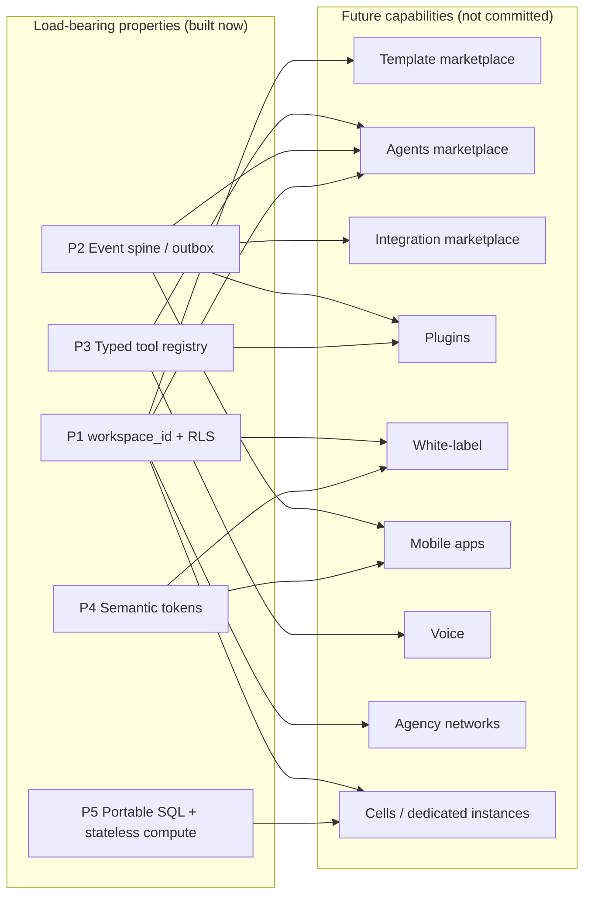
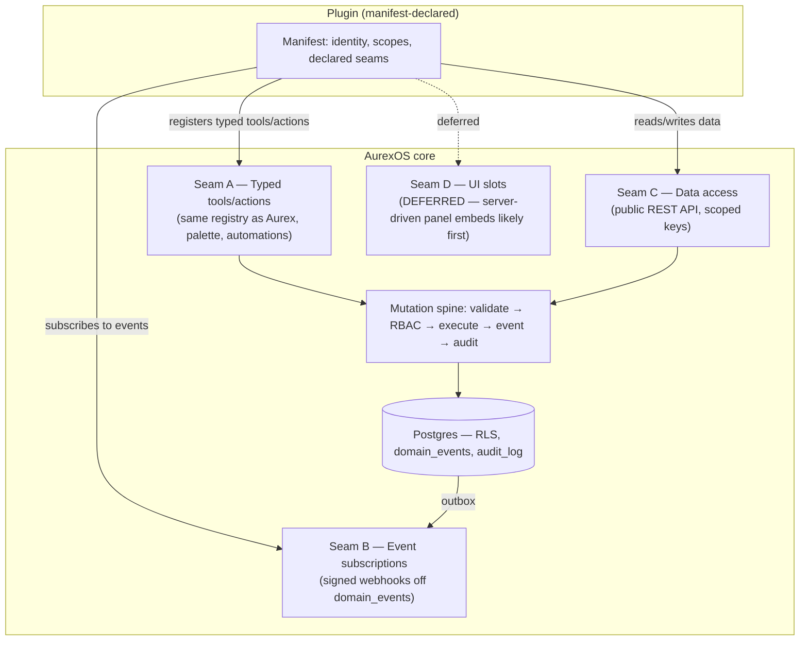
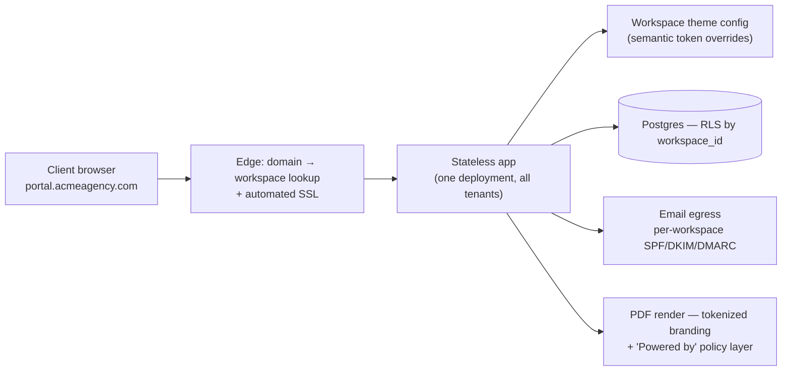
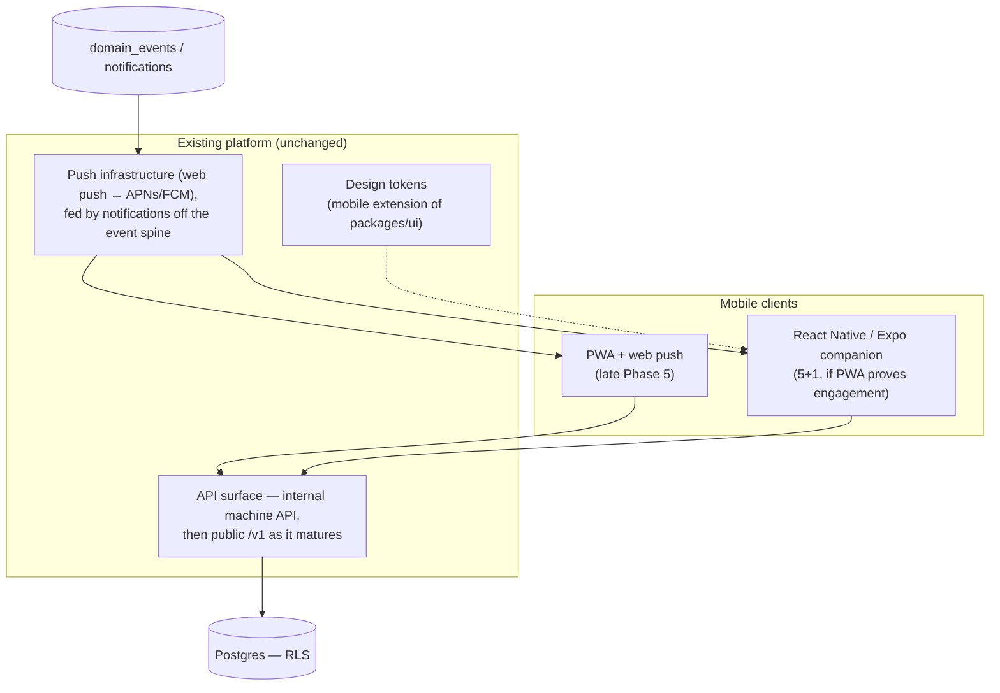

# Future Architecture — How Today's Design Carries Tomorrow's Product

| | |
|---|---|
| **Document** | Future Architecture — AurexOS |
| **Status** | Approved — Living Document |
| **Version** | 1.0 |
| **Date** | 2026-07-08 |
| **Owner** | Founding CTO, AurexDesigns |
| **Related** | [Architecture.md](./Architecture.md) · [APIStrategy.md](./APIStrategy.md) · [AIArchitecture.md](./AIArchitecture.md) · [MicroservicesStrategy.md](./MicroservicesStrategy.md) · [15_Future_Ideas.md](../15_Future_Ideas.md) · [07_AI_Strategy.md](../07_AI_Strategy.md) · [09_Scaling_Strategy.md](../09_Scaling_Strategy.md) |

> **Nothing in this document is committed scope.** It inherits the stance of [15_Future_Ideas.md](../15_Future_Ideas.md) in full: ideas graduate into the roadmap only through the phase-gate process (15 §14) — with an advocate, a prerequisite audit, and an ADR. Until graduation, per [12_Project_Rules.md](../12_Project_Rules.md): no speculative abstractions, no "future-proofing" code paths, no schema fields for features that live only on that page. This document exists for one purpose: to **prove that the architecture we are already building carries each future capability without a rewrite** — to name the load-bearing design properties, show which future depends on which property, and restate the gates. It is an audit of reachability, not a plan of record.

---

## 1. Purpose & Stance: The Architecture Carries the Future

The correct preparation for the ideas in [15_Future_Ideas.md](../15_Future_Ideas.md) is not building toward them — it is keeping the core clean enough that they remain *cheap to reach*. Every capability below is traced back to one or more of five properties the current architecture already enforces. If a future idea cannot be expressed as a composition of these properties, that is a signal it needs its own ADR series (as §10 shows for agency networks), not a signal to quietly bend the core.

### 1.1 The five load-bearing properties

| # | Property | Where it is defined | What it makes reachable |
|---|---|---|---|
| P1 | **`workspace_id` everywhere + RLS deny-by-default** | [09_Scaling_Strategy.md](../09_Scaling_Strategy.md) §2, [DatabaseArchitecture.md](./DatabaseArchitecture.md) | Template export/import (entity graphs are already tenant-scoped rows), dedicated instances, cells, white-label per-workspace config, per-workspace API keys |
| P2 | **Event spine (`domain_events` as outbox)** | [APIStrategy.md](./APIStrategy.md) §6, [09_Scaling_Strategy.md](../09_Scaling_Strategy.md) §5 | Public webhooks, integration marketplace, plugin event subscriptions, mobile push, service extraction |
| P3 | **Typed tool registry as the single action surface** | [AIArchitecture.md](./AIArchitecture.md) §5, [07_AI_Strategy.md](../07_AI_Strategy.md) §2.3 | Agents marketplace, plugins, voice commands, automations — every future "actor" invokes the same audited, permission-checked tools |
| P4 | **Semantic design tokens** | [11_Design_Principles.md](../11_Design_Principles.md) §2 | White-label theming, portal branding, branded PDFs, mobile design-token reuse |
| P5 | **Portable SQL + stateless compute** | [09_Scaling_Strategy.md](../09_Scaling_Strategy.md) §2.5, §4.1; [MicroservicesStrategy.md](./MicroservicesStrategy.md) §6–7 | Dedicated instance tier, cell sharding, 100,000+ users without a platform rewrite |

The rule that follows: **any change that weakens P1–P5 must be evaluated against every arrow above, not just the feature that wants the change.**

---

## 2. Marketplace Architecture

The marketplace trilogy ([15_Future_Ideas.md](../15_Future_Ideas.md) §1) sequences by trust: templates (5+1) → integrations (5+1, API-dependent) → agents (5+2). Each rides an existing seam; none requires a new primitive.

### 2.1 Template marketplace (5+1)

**What exists today:** templates *are already data*. Pipelines, project templates, and automation recipes are ordinary tenant-scoped rows under P1 — there is no "template engine" to build, only content to move between workspaces.

**What is missing:** stable **export/import of cross-module entity graphs**. Design considerations recorded now so the core stays compatible:

| Concern | Design consideration |
|---|---|
| **ID remapping** | Exports serialize entity graphs with internal references expressed as graph-local handles, never raw UUIDs. Import mints fresh UUIDv7 keys and remaps references in one pass — a template can never smuggle a foreign `workspace_id` (P1 holds by construction). |
| **Version pinning** | A published template pins the schema version it was exported under; import runs forward-migrations on the payload, mirroring how plain-SQL migrations already work ([09_Scaling_Strategy.md](../09_Scaling_Strategy.md) §2.5). Templates from a newer schema than the target refuse to install. |
| **Preview-before-install** | Import is two-phase: dry-run produces a manifest ("creates 1 pipeline, 14 stages, 3 automation recipes") rendered before commit — the same shape as the plan-before-execute pattern in [07_AI_Strategy.md](../07_AI_Strategy.md) §2.2. |
| **Partial failure** | Import is transactional per graph; a failed import leaves zero rows, not a half-installed template. |

**Gates:** entity-graph export/import shipped and dogfooded on AurexDesigns' own templates; 30+ first-party templates seeded before third-party submissions; content moderation + review pipeline; Stripe Connect payouts (15 §1.1).

### 2.2 AI agents marketplace (5+2)

Per [07_AI_Strategy.md](../07_AI_Strategy.md) §12, which is authoritative: an installable agent is **a packaged LangGraph subgraph + tool-permission manifest + prompt assets + eval set** — invoked as a tool by the main orchestrator exactly like first-party sub-agents ([07_AI_Strategy.md](../07_AI_Strategy.md) §2.2). No new primitives:

- **Same registry (P3):** marketplace agents compose registered tools; they cannot mutate the registry or gain capabilities the installing user lacks — an installed agent is always *less* privileged than its installer.
- **Install = permission diff:** the manifest declares every tool and scope; install renders the diff like mobile app permissions.
- **Sandboxed:** bounded steps/cost/wall-time, no registry mutation, external calls only through vetted connectors with credential vaulting — never arbitrary egress.
- **Eval-gated:** submission runs the safety regression suite; agents ship with eval sets and minimum score bars.
- **Kill-switch:** per agent version, platform-side.
- **Audited:** full `AIRun` traces identical to first-party Aurex ([AIArchitecture.md](./AIArchitecture.md) §11).

**Gates:** tool registry stable ≥ 2 phases; eval infrastructure mature; tenant isolation independently audited; public API + webhooks shipped (07 §12).

### 2.3 Integration marketplace (5+1, hard-dependent on the public API)

**What exists today:** the seam is fully specified — the public API surface, signed webhooks off the event spine (P2), and the n8n connector layer ([APIStrategy.md](./APIStrategy.md) §1, §6). An integration is an OAuth-scoped per-workspace install of API credentials + webhook subscriptions + optional n8n recipes underneath.

**What is missing:** public API GA itself, the connector review process, and per-integration least-privilege tokens (R-S6). **Gates:** [APIStrategy.md](./APIStrategy.md) §4–6 shipped; webhook delivery with signing and retries proven; connector review pipeline staffed (15 §1.3 — prefer partner-built connectors; every first-party connector is a permanent support commitment).

---

## 3. Plugin & Extension Model (Design Sketch — Not Committed)

A plugin is **a declared manifest over seams that already exist**. There is no plugin runtime to invent; the four seams are the internal architecture, exposed under review.

| Seam | Mechanism | Status |
|---|---|---|
| A — Typed tools/actions | Registration in the same tool registry that serves Aurex, the command palette, and automations (P3) | Registry exists Phase 3; external registration is the marketplace-gated addition |
| B — Event subscriptions | Signed webhooks, `domain_events` as source ([APIStrategy.md](./APIStrategy.md) §6) | Infrastructure lands with public API |
| C — Data | Public REST API with scoped keys ([APIStrategy.md](./APIStrategy.md) §4–5) | Phase 5 / 5+1 GA |
| D — UI slots | **Deferred.** Server-driven panel embeds are the likely first shape. Arbitrary client-side code injection is **rejected** — third-party JS in the OS shell means XSS-class access to the user's session, and no review pipeline makes that safe. | Evaluate-only |

**Governance:** marketplace review pipeline for all plugins; install shows a permission diff across all declared seams; per-plugin kill-switch; every plugin action flows through the one mutation spine ([APIStrategy.md](./APIStrategy.md) §1) so RLS, RBAC, and audit are never bypassed.

**The dogfood proof:** first-party modules already eat this model. Every module registers tools in the same registry a third-party plugin would use ([07_AI_Strategy.md](../07_AI_Strategy.md) §1 — AI contracts are in the definition-of-done), emits events on the same spine, and mutates through the same pipeline. A plugin is a module that lives outside the repo — which is precisely why the model needs no new primitives.

---

## 4. White-Label & Custom Branding

Staging per [15_Future_Ideas.md](../15_Future_Ideas.md) §4: **light portal branding in Phase 4** (already roadmapped) → **full white-label at 5+1**. The portal-first order is deliberate: the client portal is the surface agencies most want branded, and it exercises every white-label mechanism at lower blast radius.

**Why it is cheap:** [11_Design_Principles.md](../11_Design_Principles.md) §2 makes theming structural. Components reference semantic CSS variables (`--bg-surface`, `--accent-solid`), never raw values; a workspace theme is a Layer-2 alias override stored as per-workspace config rows (P1, P4). No component changes — white-label theming was paid for on day one.

Full white-label adds four pieces of infrastructure:

| Piece | Design |
|---|---|
| Multi-domain routing + automated SSL | Custom domain → workspace mapping at the edge; automated certificate issuance/renewal per domain |
| Per-workspace sender domains | SPF/DKIM/DMARC per workspace so portal/report email authenticates as the agency's domain |
| Branded PDFs | Invoice/report/proposal rendering consumes the same semantic tokens (P4) — logo, accent, typography per workspace |
| "Powered by AurexOS" placement | A **deliberate commercial decision**, not a theming detail (15 §4): placement rules per tier are set by policy and enforced in the render layer, outside workspace-editable config |

Note the routing map is the *same mechanism* the dedicated-instance tier needs ([09_Scaling_Strategy.md](../09_Scaling_Strategy.md) §2.5): workspace → destination lookup in a thin edge layer, with the app itself unchanged (P5).

**Gates:** Phase 4 portal branding shipped and stable; multi-domain + SSL automation; deliverability proven on per-workspace sender domains; "Powered by" policy decided at the commercial level before build.

---

## 5. Public API & Developer SDK

Fully specified in [APIStrategy.md](./APIStrategy.md) — this section only places it in the future map and does not duplicate it. GA at 5+1; OpenAPI-first REST; TypeScript SDK generated from the spec ([APIStrategy.md](./APIStrategy.md) §7); the internal machine API (surface 3) is the embryo of the public surface (surface 4), so publishing is a policy decision, not an engineering project.

The **developer platform** around the API is the part that lives here as future scope:

| Component | Notes |
|---|---|
| Docs portal | Generated from the OpenAPI spec; sustained investment is a named prerequisite (15 §5) |
| Sandbox workspaces | Disposable, seeded workspaces for developers — ordinary tenants under P1, nothing special-cased |
| Key management | Per-workspace hashed, scoped, expiring keys ([APIStrategy.md](./APIStrategy.md) §5); least privilege per R-S6 |
| Rate limits & abuse | Per-plan limits; abuse infrastructure before GA ([APIStrategy.md](./APIStrategy.md) §9) |

**Gates:** deprecation policy + versioning recorded as ADRs (R-DOC2); publish narrow, expand deliberately — every published endpoint is a multi-year contract (15 §5).

---

## 6. Mobile Apps

Staging per [15_Future_Ideas.md](../15_Future_Ideas.md) §3: **PWA with web push first** (late Phase 5, S effort — the cheap validation step), **native companion apps** (React Native/Expo) at 5+1 only if PWA engagement proves the jobs-to-be-done.

**Companion scope, explicitly bounded:** approvals, notifications, task triage, quick capture, Aurex chat, client-portal mode. Full workspace editing stays desktop web. **Approvals-on-the-go is the killer job:** an approval card sitting unanswered for six hours because the owner was at lunch undermines the human-in-the-loop model (R-AI3) — mobile exists first to close that loop.

**What the API must provide (the real prerequisite):** stable authenticated endpoints for the approval queue (list, decide, resume the suspended LangGraph run — [07_AI_Strategy.md](../07_AI_Strategy.md) §2.2), notifications, task triage mutations, quick-capture creates, and Aurex chat streaming. API maturity ([APIStrategy.md](./APIStrategy.md) §3–4) is why native waits for 5+1.

**Push infrastructure:** notification fan-out already consumes the event spine (P2); mobile adds delivery channels (web push, then APNs/FCM), not new event semantics.

**Offline stance: offline-tolerant, not offline-first.** Queued capture and cached read views survive a dead spot; full offline sync/CRDT is explicitly out — the companion scope never justifies its complexity.

**Gates:** notification infrastructure v1 (Phase 4); API maturity; mobile extension of design tokens (P4); PWA engagement data before any native commitment.

---

## 7. Desktop Apps

**Evaluate-only, and honestly so — desktop apps do not appear in [15_Future_Ideas.md](../15_Future_Ideas.md) at all.** The PWA already installs on desktop today, which covers the visible job (a dock icon and a dedicated window) at zero cost. A wrapped shell (Tauri-class) would be considered only if a *named* need appears that a PWA cannot serve: global shortcuts, offline capture, or tray presence. None is evidenced. No commitment, no earliest phase, no ADR-to-be — if a need materializes, it enters through 15 §14 like everything else.

---

## 8. Browser Extension

Two distinct things, kept honest:

1. **Password-manager autofill extension** — the only extension mentioned in [15_Future_Ideas.md](../15_Future_Ideas.md) (§2), bound to the vault module at 5+3 with its zero-knowledge and audit burden. Not discussed further here.
2. **Broader capture extension** — clip a page to the Knowledge Base, capture a lead from LinkedIn, create a quick task. A plausible S–M idea, **presented here as an unranked candidate**: it is *not* in docs/15, holds no phase slot, and must earn one through the §14 graduation path with an advocate and demand evidence.

Security architecture notes recorded now, because an extension is a **new attack surface** (a new release/review pipeline, injected into arbitrary hostile pages):

- **Scoped API tokens only** — the extension authenticates with its own least-privilege, revocable token class (R-S6), never full-account credentials.
- **No session sharing** — it must never piggyback on the web app's cookies/session; compromise of the extension must not equal compromise of the OS session.
- Capture writes go through the public API and therefore the one mutation spine — validated, RBAC-checked, audited like any other client.

---

## 9. Voice Assistant

Three slices in honesty-order (15 §7), each riding the previous:

| Slice | What | Earliest phase |
|---|---|---|
| 1 — Meeting transcription | Recording → transcript → summary → extracted action items as tasks, upgrading Phase 2's manual flow. High value, well-trodden. | 5+1 (S–M) |
| 2 — Voice capture | "Log a 30-minute call with Meridian; action items are…" — speech in, tool calls out via the registry (P3) | After slice 1 |
| 3 — Conversational voice OS | Hands-free briefings ("what needs my attention today?") — differentiating but speculative | 5+2 (M) |

Two binding rules:

- **Gateway rule (R-AI1):** speech models are reached exclusively through the AI gateway ([AIArchitecture.md](./AIArchitecture.md) §2) — routing, metering, budgets, and fallback apply to audio exactly as to text. No direct speech-vendor SDK anywhere in feature code.
- **Consent-first:** recording-consent flows ship *before* the transcription feature, not with it (15 §7 — consent is jurisdictionally messy and reputationally sharp). Audio storage lifecycle on R2 is part of the same gate.

Slices 2–3 are architecturally just a new input surface onto the existing orchestrator — "one brain, many surfaces" ([07_AI_Strategy.md](../07_AI_Strategy.md) §1) already forbids a separate voice brain.

---

## 10. Multi-Organization / Agency Networks (5+2)

Agency groups, white-label sub-workspaces, partner networks with cross-workspace project sharing and inter-agency invoicing (15 §9). **This is the one idea on the future map that bends tenancy itself**, and it is treated accordingly:

- Everything else in this document composes P1–P5 without touching them. Agency networks require a **first-class shared-object primitive**: explicit, auditable, revocable grants for cross-workspace access — designed so RLS (R-D1/R-D2) and the AI isolation guarantee (R-AI4) are *extended*, never weakened. A subtle grant bug here is a cross-tenant breach by construction.
- It therefore requires **its own ADR series before a line of feature code**, plus expansion of the adversarial test suite (the pgTAP cross-tenant assertions and two-tenant Playwright probes of [09_Scaling_Strategy.md](../09_Scaling_Strategy.md) §2.3 grow a third, shared-grant tenant dimension).
- The Aurex context assembler must treat shared objects as an explicit scope with its own retrieval boundary — R-AI4 holds untouched for everything not covered by a live grant.
- **Demand gate:** evidence from ≥ 3 customer pairs who actually want to collaborate, before design work begins (15 §9).

Interaction with §11 noted now: workspaces never span cells ([09_Scaling_Strategy.md](../09_Scaling_Strategy.md) §2.5), so the shared-object design must assume the two sides of a grant may live in different cells — pushing it toward reference-and-fetch semantics rather than cross-database joins. This is a design constraint for the future ADR series, not a feature of today's schema.

---

## 11. The 10-Year Scaling Picture

The full treatment is [MicroservicesStrategy.md](./MicroservicesStrategy.md) §7 and [09_Scaling_Strategy.md](../09_Scaling_Strategy.md) §2.5 — summarized, not duplicated: the path to 100,000+ users is **cells** (each cell a full stack hosting a set of workspaces, thin global routing layer, small control-plane DB) plus a **dedicated-instance tier** for enterprise tenants (dump → filtered restore → cutover; no code changes, only a routing map). Both are possible *because* of P1 and P5, and both are trigger-gated, not scheduled.

What 100,000+ users looks like per subsystem:

| Subsystem | At 100,000+ users |
|---|---|
| Database | Multiple cells, each an independent Postgres with local joins only; append-only tables partitioned by month; workspace → cell map in the control plane ([09_Scaling_Strategy.md](../09_Scaling_Strategy.md) §2.5, §3.2) |
| Compute | Unchanged model: stateless app + workers, horizontally scaled per cell (P5); likely extracted workers: AI pipelines, monitoring probes, email ingestion ([09_Scaling_Strategy.md](../09_Scaling_Strategy.md) §5) |
| AI | Gateway with tier routing and batch pipelines; vectors on dedicated instances or a vector store behind the `retrieval` interface; per-workspace budgets billing-enforced ([09_Scaling_Strategy.md](../09_Scaling_Strategy.md) §3.5, §4.4) |
| Events & webhooks | `domain_events` partitioned, archived to R2 as Parquet beyond 12 months; outbox → relay feeding external webhook delivery at marketplace scale (P2) |
| API | Public `/v1` behind per-plan rate limits; dedicated pools per workload; abuse infrastructure ([APIStrategy.md](./APIStrategy.md) §9) |
| Marketplaces | Review pipelines and eval infrastructure as standing operations; take-rate billing metered off gateway telemetry and `domain_events` |
| White-label | Thousands of custom domains on the edge routing layer; the same map that routes dedicated instances |
| Mobile | Push fan-out as a worker consuming the notification stream; API is the only contract mobile knows |

The point of the table is its dullness: **no subsystem needs a different architecture at 100,000+ users — only more instances of the current one**, split along seams that exist today.

---

## 12. Graduation Gates

Restated from [15_Future_Ideas.md](../15_Future_Ideas.md) §13–14 with owning-ADR placeholders. **No row below is committed.** Each capability enters the roadmap only via a phase-gate brief (advocate, prerequisite audit, first slice) and lands with an ADR.

| Capability | Earliest phase | Hard prerequisite | Owning ADR-to-be |
|---|---|---|---|
| Template marketplace | 5+1 | Entity-graph export/import (§2.1); 30+ first-party templates; Stripe Connect payouts | ADR: Entity-graph export/import format |
| Integration marketplace | 5+1 | Public API GA; signed webhook delivery; connector review process | ADR: Connector review & token scoping |
| AI agents marketplace | 5+2 | Registry stable ≥ 2 phases; eval harness mature; isolation independently audited | ADR: Agent manifest & sandbox spec |
| Plugins / extensions | 5+1 → 5+2 (seam by seam) | Public API + webhooks; marketplace review pipeline; UI slots stay deferred | ADR: Plugin manifest & permission diff |
| White-label (full) | 5+1 (light: Phase 4) | Multi-domain routing + SSL; sender-domain auth; "Powered by" policy decided | ADR: Multi-domain routing & SSL automation |
| Public API & SDK GA | 5+1 | Versioning/deprecation ADRs; rate-limit & abuse infra ([APIStrategy.md](./APIStrategy.md)) | ADR: API versioning & deprecation policy |
| Mobile — PWA | Late Phase 5 | Notification infra v1 (Phase 4) | ADR: Web push & PWA scope |
| Mobile — native companion | 5+1 | PWA engagement proven; API maturity; mobile token extension | ADR: Native companion scope & release train |
| Desktop shell | — (evaluate-only) | A named need the installed PWA cannot serve | none until evidenced |
| Browser capture extension | — (unranked candidate) | 15 §14 graduation; scoped-token security model (§8) | ADR: Extension security architecture |
| Voice — transcription | 5+1 | Consent flows shipped first; speech via gateway (R-AI1); R2 audio lifecycle | ADR: Speech pipeline & consent |
| Voice — conversational OS | 5+2 | Slices 1–2 in production; voice surface on the one orchestrator | ADR: Voice surface architecture |
| Agency networks | 5+2 | Shared-object primitive ADR series; adversarial test expansion; ≥ 3 customer-pair demand | ADR series: Shared-object primitive |
| Cells / dedicated instances | 5+ (trigger-gated) | Triggers in [09_Scaling_Strategy.md](../09_Scaling_Strategy.md) §2.5; first enterprise contract (dedicated) | ADR: Cell routing & control plane |

When an idea graduates, [15_Future_Ideas.md](../15_Future_Ideas.md) is updated to mark it, the ADR is linked, and the corresponding section here converts from "reachability proof" to a pointer at the real architecture document that replaces it.
