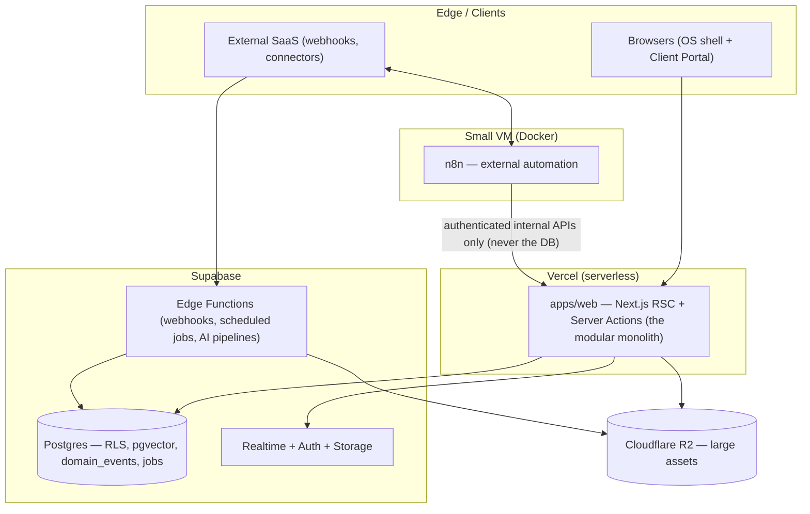
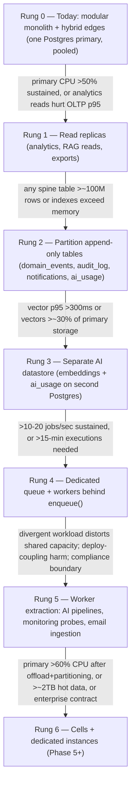
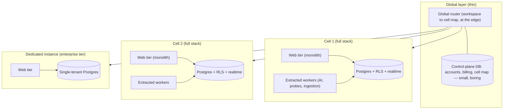

# Microservices Strategy — Monolith vs. Modular Monolith vs. Microservices vs. Hybrid

| | |
|---|---|
| **Document** | Microservices Strategy — AurexOS |
| **Status** | Approved — Living Document |
| **Version** | 1.0 |
| **Date** | 2026-07-08 |
| **Owner** | Founding CTO, AurexDesigns |
| **Related** | [Architecture.md](./Architecture.md) · [ModuleArchitecture.md](./ModuleArchitecture.md) · [DatabaseArchitecture.md](./DatabaseArchitecture.md) · [ADR-0001](../adr/0001_Multi_Tenant_Modular_Monolith.md) · [09_Scaling_Strategy.md](../09_Scaling_Strategy.md) |

This document formalizes the system-type strategy for AurexOS. The underlying decision was made in [ADR-0001](../adr/0001_Multi_Tenant_Modular_Monolith.md); this document answers the strategic question — monolith, modular monolith, microservices, or hybrid — definitively, defends the answer against each alternative, and lays out the exact evolution path to 100,000+ users. Nothing here introduces a new decision; it makes the existing one legible, binding, and hard to accidentally violate.

---

## 1. The Question and the Answer

**Question:** Should AurexOS be a monolith, a modular monolith, microservices, or a hybrid — for a 2–4 person startup building a 20+ module, AI-native, multi-tenant SaaS that intends to reach 100,000+ users?

**Answer:** AurexOS is a **modular monolith with hybrid edges, evolving toward selective worker extraction and cell-based sharding only on named triggers.** One deployable application (`apps/web`), one shared-schema Postgres with `workspace_id` + RLS tenancy, module boundaries enforced at the package/import level (`13_Folder_Structure.md` §5) — surrounded by deliberately placed edge components (Supabase Edge Functions, self-hosted n8n, Vercel serverless) that are deployment topology, not services. This is the highest-leverage choice for a startup that wants to scale: it spends the team's scarce complexity budget on product and the AI layer (`03_System_Goals.md` §11.1), preserves the cross-module joins and transactions the domain demands (invoices ↔ projects ↔ clients), keeps tenant isolation in exactly one enforcement point (RLS), and — because module seams, the `domain_events` spine, and `workspace_id` keying are designed in from Phase 0 — leaves every scaling door open without paying for any of them early.

**What we are NOT doing, and why:**

- **Not a pure monolith** — a single undifferentiated codebase would rot under 20+ modules; when extraction triggers eventually fire there would be no seams to cut along, and Phase 5's marketplace (`03_System_Goals.md` §5) requires module boundaries third parties can occupy.
- **Not microservices** — a 2–4 person team pays the full distributed-systems tax (network failure modes, distributed transactions, N observability surfaces, N tenancy enforcement points) with none of the organizational pressure that justifies it. §3 itemizes the failure modes. ADR-0001 Option D rejected this explicitly.
- **Not a permanent "hybrid architecture"** as a goal in itself — the hybrid edges we run today (§5) exist because each solves a concrete problem (webhook isolation, connector catalog, serverless autoscale), not because heterogeneity is a virtue. New edge components require the same burden of proof as extractions (§8).

The strategy in one sentence: **build like a monolith, structure like microservices, extract like a surgeon — and only when the dashboards say so.**

---

## 2. Comparison of System Types

Each option scored against the constraints that actually bind AurexOS. Scale: ✅ strong fit · ⚠️ workable with friction · ❌ disqualifying.

| Criterion | Pure Monolith | **Modular Monolith (chosen)** | Microservices | Hybrid (services + monolith mix) |
|---|---|---|---|---|
| Team of 2–4 engineers | ✅ Minimal overhead | ✅ Minimal overhead, one deployable | ❌ Ops load exceeds team capacity | ⚠️ Every service added subtracts a person-week/month |
| 20+ modules without entropy | ❌ Boundaries erode; big ball of mud by module ~8 | ✅ Lint-enforced package boundaries (`13` §5) | ✅ Physical boundaries — at maximal cost | ⚠️ Boundaries clear only where services split |
| Multi-tenant SaaS ambition (RLS tenancy) | ✅ One enforcement point | ✅ One enforcement point — RLS in one database | ❌ Tenancy re-implemented per service datastore | ⚠️ Each split datastore re-opens the isolation question |
| AI-first workloads (RAG, agents, batch pipelines) | ⚠️ AI batch load contends with OLTP | ✅ pgvector + RLS in-database now; pre-planned extraction seams (`09` §3.5) | ⚠️ AI services possible but context assembly crosses networks | ⚠️ Same, partially |
| 10-year / 100k-user horizon | ❌ No seams → eventual rewrite | ✅ Seams + outbox + cells blueprint → no rewrite (§7) | ✅ Scales — if you survive the early years | ⚠️ Depends entirely on where the seams landed |
| Operational cost (infra + attention) | ✅ Lowest | ✅ Near-lowest: one app, one DB, one CI/CD | ❌ N deploys, N pagers, mesh/gateway, contract testing | ⚠️ Cost scales with service count |
| Data consistency — cross-module joins/transactions (invoices ↔ projects ↔ clients) | ✅ Local ACID | ✅ Local ACID + single-source-of-truth (`03` §4); one transaction writes mutation + event | ❌ Distributed transactions or sagas for core flows | ⚠️ ACID only inside each island |
| Deploy velocity at our stage | ✅ One pipeline | ✅ One pipeline, preview deploys, instant rollback (`09` §7) | ❌ Cross-service changes need choreographed releases | ⚠️ Mixed |
| Hiring & onboarding | ✅ One codebase to learn | ✅ One codebase; identical module shape (`13` §3) flattens ramp-up | ❌ Requires distributed-systems experience we can't select for yet | ⚠️ Mixed mental models |

**Verdict:** the modular monolith is the only column with no ❌. It matches the pure monolith on cost and velocity while matching microservices on decomposition — the two properties everyone assumes are in tension.

---

## 3. Why Microservices Specifically Fail This Startup Now

Not a general argument — these are the five ways microservices break *this* system, with *this* team, at *this* stage.

1. **Distributed transactions vs. the single-source-of-truth principle.** `03_System_Goals.md` §4 is binding: a client is one row that CRM, Projects, Finance, Contracts, Portal, and Aurex all point at. Splitting those modules into services splits that row's consumers across network boundaries — marking an invoice paid, updating the deal, and notifying the project would become a saga with compensation logic instead of one ACID transaction. We would be adopting eventual consistency for flows where "two views disagree about a fact" is defined as a Sev-2 data bug. The domain is intensely relational (per `08_Tech_Stack.md` §3.1); the architecture must not fight the domain.
2. **The event spine would become a network dependency.** Today every mutation writes its domain event *in the same transaction* as the state change (`08_Tech_Stack.md` §5.2) — the dual-write problem does not exist here by construction. With services, event emission crosses a broker: now we need exactly-once semantics, ordering guarantees, dead-letter handling, and broker ops — infrastructure the transactional `domain_events` table gives us for free.
3. **RLS-based tenancy would fragment into N enforcement points.** Our entire isolation story (`09_Scaling_Strategy.md` §2.3) rests on one database refusing cross-tenant reads, verified by one pgTAP suite and one two-tenant Playwright suite. Every service with its own datastore re-implements tenant isolation in application code — precisely the "developer remembers a WHERE clause" model RLS was chosen to eliminate. Cross-tenant leakage is a top-5 risk (`14_Risk_Assessment.md` §S1); multiplying its enforcement surface is the single worst architectural move available to us.
4. **The observability and operations tax.** N services means N deploy pipelines, N log streams to correlate, distributed tracing as a prerequisite rather than a nicety, service discovery, retry/timeout/circuit-breaker policy per edge, and versioned internal API contracts. For a 2–4 person team this tax is paid in the only currency we cannot mint: engineering attention (`09_Scaling_Strategy.md` §1.3).
5. **Premature seam-guessing.** Pre-Phase-2, we do not yet know which boundaries are hot. Services freeze boundaries in infrastructure — a wrong seam means either distributed refactoring (the most expensive kind) or living with chatty cross-service calls forever. Package boundaries freeze the same seams in *lint rules*, which cost one PR to move. We keep the decomposition and defer the commitment.

---

## 4. What "Modular" Makes Real

"Modular monolith" is an empty phrase unless the modularity is mechanical. Ours is — the monolith keeps microservices' logical decomposition without the network:

| Mechanism | What it enforces | Where defined |
|---|---|---|
| **Package boundaries** | Each module is a self-contained folder with an identical internal shape; `packages/core` is the dependency root and imports nothing but itself and config | `13_Folder_Structure.md` §1, §3, §5 |
| **Import lint (CI-failing)** | Cross-module imports only via the module's `index.ts` public surface; apps import packages, never the reverse; `ai`/`db` never import `ui` (must run headless in future workers) | `13_Folder_Structure.md` §5 — the three iron laws |
| **Public surfaces** | A module's `index.ts` is its API contract — exactly what a service's network API would be, minus serialization and failure modes | `13_Folder_Structure.md` §3 |
| **Events-only cross-module side effects** | If Projects must *react* to CRM, it consumes `crm.contact.created` from `domain_events` — never calls into CRM internals. Consumers are idempotent by contract | `03_System_Goals.md` §3; `08_Tech_Stack.md` §5.2 |
| **The mutation spine** | Every action follows: validate (Zod) → authorize (`can()`) → mutate (RLS backstop) → emit event → invalidate. Uniformity is what makes any module extractable | `13_Folder_Structure.md` §3 |

The equivalences to hold in mind: **module public surface ≡ future service API. Event contract ≡ future topic schema. `domain_events` table ≡ future outbox.** The events registry in `packages/core/events` types every payload *as if external consumers will read it* — because one day, extracted workers will (§6). We get microservices' discipline at compile time instead of at 3 a.m.

---

## 5. The Hybrid Edges Today

The system already runs on more than one compute surface. None of these are microservices — the test is in the table below the diagram.

Why these don't count as microservices:

| Edge component | Why it exists | Why it is not a microservice |
|---|---|---|
| **Vercel serverless web tier** | Autoscaling, preview deploys, instant rollback (`08` §7) | It *is* the monolith — one codebase, one deploy, stateless by rule (`09` §4.1). Serverless is how it's hosted, not how it's decomposed |
| **Supabase Edge Functions** | Isolate untrusted webhook payloads; run scheduled/background logic beyond a request lifetime (`08` §3.4) | Same monorepo, same `packages/core` contracts, same database, same RLS. No independent domain ownership, no private datastore, no service API |
| **Self-hosted n8n** | Hundreds of external connectors we should never hand-write (`08` §5.1) | A boundary *appliance*: it calls authenticated internal APIs only and never touches the database — RLS/RBAC/audit remain the single enforcement path. It owns zero domain logic |

The defining properties of a microservice — independent domain ownership, a private datastore, and a network contract other teams depend on — are absent from all three. What we have is **one logical application deployed across the compute surfaces that suit each workload.** That is deployment topology, and it is cheap; services are organizational commitments, and they are not.

---

## 6. Evolution Path: The Staged Ladder

From `09_Scaling_Strategy.md` §§3–5 and §10 — reproduced here as strategy, with the rule that gives it teeth: **every rung has a named trigger; no rung is climbed early.** Each step is roughly 10× the operational cost of the previous one.

Rungs 1–4 are *database and infrastructure* moves inside the monolith — application code changes are confined to `packages/db` (the `dbRead('analytics')` handle) and `packages/core` (the `enqueue()` interface). Rung 5 is the first true extraction, and it is **workers, not user-facing services**:

| Extraction (in order) | Trigger (from `09` §5) | What moves | Why the outbox makes it mechanical |
|---|---|---|---|
| **1. AI pipeline workers** | GPU/latency/batch profile distorts shared capacity; long agentic runs exceed function limits | Embedding generation, batch enrichment, digest/agent pipelines — `packages/ai` code redeployed to dedicated workers (it already runs headless by iron law 2) | Workers consume `domain_events` via the events-table-as-outbox relay; job contracts already live in `packages/core/jobs`; results written back through the same `packages/db` layer under the same RLS discipline |
| **2. Website Monitoring probes** | A polling fleet's steady background load is the textbook divergent workload; probe cadence must not compete with invoice saves | The probe/scheduler fleet only. The Monitoring module's UI, tables, and RLS stay in the monolith | Probes emit `monitoring.check.completed` events into the same spine; the monolith's consumers (notifications, automations, analytics) don't know or care that the producer moved across a network |
| **3. Email ingestion** | Inbound parse volume and third-party-content risk justify isolation; deploy cadence diverges from the app's | Inbound receipt, parsing, and classification pipeline | Parsed messages land via the same typed event/job contracts; the Email Center module in the monolith remains the single owner of email domain data |

In every case the seam was pre-cut: the module's public surface becomes the API, the event contract becomes the topic schema, and the `domain_events` table — written transactionally with every mutation since Phase 0 — becomes the outbox that a relay ships to the extracted worker. **Extraction is a redeployment of existing boundaries, not a redesign.** The user-facing monolith likely survives to very large scale (`09` §5).

---

## 7. The Ten-Year Picture: 100,000+ Users

At Phase 5+ scale, the unit of scaling stops being the instance and becomes the **cell** (`09_Scaling_Strategy.md` §2.5):

- **Each cell is a full stack** — the same modular monolith plus its extracted workers, hosting a set of workspaces. Cells share nothing but the thin routing layer and the small control-plane DB (accounts, billing, cell map).
- **Workspaces never span cells.** Every join a product feature makes stays local to one database — the "everything joins locally" property that keeps the product simple survives to 100k+ users intact.
- **Dedicated instances are a degenerate cell of one** — the enterprise isolation/compliance tier, a dump → filtered restore → cutover, sold at a premium.
- **Blast radius, noisy neighbors, and data residency** all become cell-placement decisions rather than architecture projects.

Four properties of today's design — each already binding in Phases 0–1 — are what make this picture reachable **without a rewrite**:

1. **`workspace_id` everywhere** (`ADR-0001`): every row, vector, file key, realtime channel, and job already carries the shard key. Cell assignment is a routing-table entry, not a schema migration.
2. **No cross-workspace joins in product features** (`09` §2.5): the invariant that makes "workspaces never span cells" free. This is precisely why the cells blueprint is documented now — so nothing in Phases 0–4 accidentally violates it.
3. **Stateless compute** (`09` §4.1): web tier and workers hold zero instance state, so "run another copy of everything per cell" is a deployment exercise.
4. **Portable SQL** (`14_Risk_Assessment.md` §T1): plain Postgres + SQL migrations means a cell is any Postgres, anywhere — including a customer's jurisdiction.

The ten-year system is therefore not a different architecture. It is **today's architecture, photocopied per cell, with a router in front.**

---

## 8. Governance

1. **Burden of proof is on extraction — permanently.** The default position is *never extract* (`09` §5). A proposal to extract a service, add a datastore, or introduce a new hybrid edge must demonstrate a fired trigger from §6 with dashboard evidence, not projections. "It would be cleaner" and "it's industry standard" are rejected by default as anti-goal violations.
2. **ADR required.** Any extraction, new runtime, new datastore, or change to this strategy ships as an ADR in `docs/adr/` (per the process in `08_Tech_Stack.md`), naming the trigger that fired, the metric evidence, what moves, the rollback story, and the operational cost accepted. This document is then updated in the same PR.
3. **Anti-goals restated as binding** (`03_System_Goals.md` §11): **no microservices** until a measured scaling wall forces extraction — the complexity budget goes to product and the AI layer; **no exotic infrastructure** — Postgres until an ADR proves it genuinely cannot serve. A `services/` directory in the repo before a trigger fires is a lint-visible design error (`13_Folder_Structure.md` §8).
4. **Triggers are watched, not remembered.** Every trigger in §6 maps to a dashboard panel with its threshold drawn on the chart, reviewed monthly (`09` §6). Strategy review is a standing agenda item at each phase gate (`10_Roadmap.md`).
5. **The seams are maintained even while unused.** Import-boundary lint, event-contract typing, and the mutation spine are enforced in CI from Phase 0 — a seam that has rotted is not a seam. Boundary violations in `main`: zero, always (`03` §5).

---

## Revisit triggers

Revisit this document when any of the following occurs:

- Any extraction trigger from §6 fires and is sustained (divergent workload distorting shared capacity; deploy-coupling causing measured harm; a compliance boundary requiring physical separation).
- The first worker extraction actually ships — validate that the outbox/relay pattern worked as designed and fold the lessons back into §6.
- An enterprise contract demands a dedicated instance, or the cell-split trigger fires (sustained >60% primary CPU after replica offload and partitioning, or >~2 TB hot data) — §7 graduates from blueprint to design doc.
- Team size grows beyond ~10 engineers and deploy contention becomes measurable — the org-pressure argument against services weakens and deserves honest re-scoring in §2.
- ADR-0001 is superseded or amended, or `09_Scaling_Strategy.md` §5 changes its trigger definitions — this document must never contradict either.
