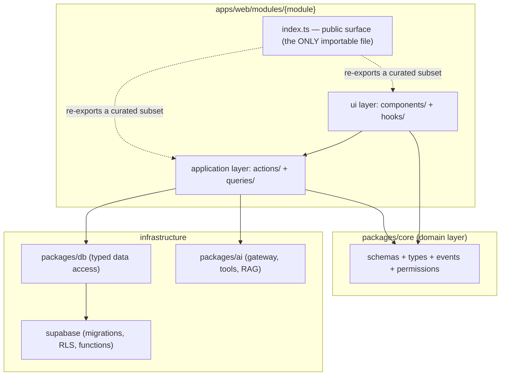
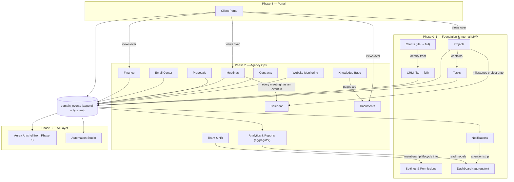
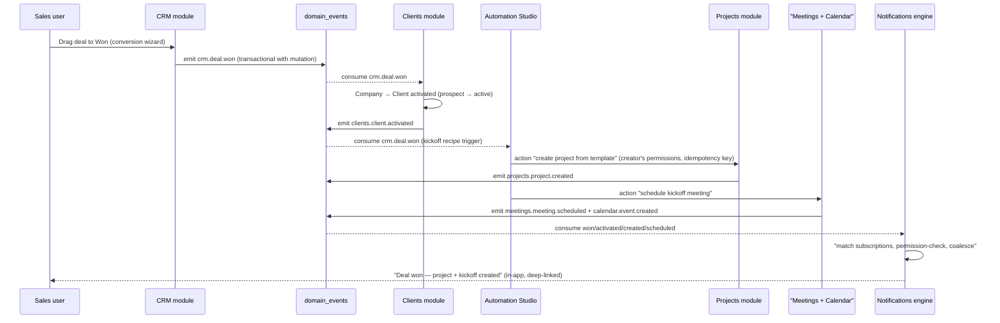
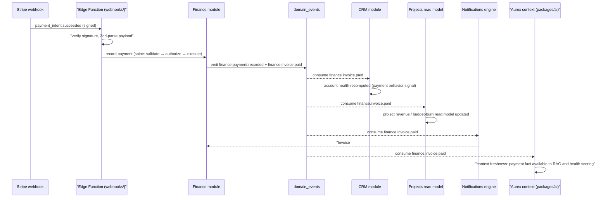

# Module Architecture — AurexOS

| | |
|---|---|
| **Document** | Module Architecture — AurexOS |
| **Status** | Approved — Living Document |
| **Version** | 1.0 |
| **Date** | 2026-07-08 |
| **Owner** | Founding CTO, AurexDesigns |
| **Related** | [./Architecture.md](./Architecture.md) · [./SystemDiagram.md](./SystemDiagram.md) · [../06_Module_Breakdown.md](../06_Module_Breakdown.md) · [../13_Folder_Structure.md](../13_Folder_Structure.md) · [../12_Project_Rules.md](../12_Project_Rules.md) · [../adr/0001_Multi_Tenant_Modular_Monolith.md](../adr/0001_Multi_Tenant_Modular_Monolith.md) |

---

AurexOS is a modular monolith (ADR-0001) whose unit of design, ownership, testing, documentation, and eventual extraction is the **module**. [../06_Module_Breakdown.md](../06_Module_Breakdown.md) defines *what* the 21 modules are; [../13_Folder_Structure.md](../13_Folder_Structure.md) defines *where* their code lives. This document defines *how modules relate*: what a module is made of, how modules are allowed to talk to each other, and how we keep those seams from eroding (risk T5, [../14_Risk_Assessment.md](../14_Risk_Assessment.md)). The rules here are binding in the sense of [../12_Project_Rules.md](../12_Project_Rules.md) — violations are citable in review by section number.

---

## 1. The Module as the Unit of Architecture

A module is not a folder of components. A module is a **vertical slice of the operating system** with a name, an owner, and a contract. Every one of the 21 modules in [../06_Module_Breakdown.md](../06_Module_Breakdown.md) consists of the same seven parts, wherever those parts physically live in the monorepo:

| # | Part | Location | Contract it fulfils |
|---|---|---|---|
| 1 | **Routes** | `apps/web/app/(os)/{module}/` | Thin pages (≤ ~30 lines) that compose module components — [../13_Folder_Structure.md](../13_Folder_Structure.md) §2 |
| 2 | **Module folder** | `apps/web/modules/{module}/` | `components/`, `hooks/`, `actions/`, `queries/`, `types.ts`, `constants.ts`, `index.ts` — [../13_Folder_Structure.md](../13_Folder_Structure.md) §3 |
| 3 | **Core schemas & types** | `packages/core/schemas`, `types`, `permissions` | Zod single source of truth (R-T3/R-T4); permission keys for every capability |
| 4 | **Migrations** | `supabase/migrations/` | Tables with `workspace_id` + RLS + pgTAP tests (R-D1/R-D2); UUIDv7 keys (R-D5) |
| 5 | **AI tools** | `packages/ai/tools/` | Typed, schema-validated actions Aurex can invoke ([../07_AI_Strategy.md](../07_AI_Strategy.md)) |
| 6 | **Event contracts** | `packages/core/events/` | Emitted/consumed `module.entity.verb` events in the versioned registry ([../06_Module_Breakdown.md](../06_Module_Breakdown.md) Appendix A) |
| 7 | **Docs** | `docs/` | Module doc per R-DOC1: purpose, data model, permissions matrix, events, AI surfaces |

A change that touches parts 3–7 without updating the module doc is an incomplete PR (R-DOC3). A "module" missing any of these parts is a prototype, not a module.

### 1.1 Walking-skeleton scaffold checklist

[../03_System_Goals.md](../03_System_Goals.md) §5 commits us to "≤ 1 day to walking skeleton" for a new module. The module generator ([../03_System_Goals.md](../03_System_Goals.md) §9) scaffolds this checklist; a new module PR is reviewable only when every box is checked:

1. **Design doc first** — a new module requires a design doc and an entry in [../06_Module_Breakdown.md](../06_Module_Breakdown.md) before any folder exists ([../13_Folder_Structure.md](../13_Folder_Structure.md) §6).
2. **Migration** — table(s) with `workspace_id`, RLS deny-by-default policies, pgTAP adversarial tests (R-S7), soft-delete column (R-D3).
3. **Core contracts** — Zod schemas in `packages/core/schemas`; permission keys in `packages/core/permissions`; at minimum a `{module}.{entity}.created` event in `packages/core/events`.
4. **Module folder** — the canonical internal shape with an `index.ts` exporting nothing yet ("empty public surface" is the correct starting state).
5. **One route** — a thin `(os)/{module}/page.tsx` rendering one list view via `queries/`.
6. **One mutation** — a `defineAction` server action running the full spine: validate → authorize → execute → emit event → audit (R-A3).
7. **Three AI contracts** — at least one registered tool, one context provider (RAG ingestion hook or an explicit "no indexable content" declaration), and event semantics documented (§6 below).
8. **Docs page** — the R-DOC1 module doc, created in the same PR.
9. **Boundary registration** — the module added to the ESLint boundaries map and the event registry; CI green on the full R-Q5 suite.

The skeleton walks when: a signed-in user can create and list the module's primary entity, the mutation appears in the audit log, the event appears in `domain_events`, and a cross-tenant read fails in the adversarial suite.

---

## 2. Module Anatomy and the Public Surface

Inside every module, dependencies flow one way (R-A1): `ui → application (actions/services) → domain → infrastructure`. UI never imports the DB client; domain logic never imports React.



**The public-surface rule.** `index.ts` is the only file another module may import — enforced by eslint-plugin-boundaries, not convention ([../13_Folder_Structure.md](../13_Folder_Structure.md) §5). Everything else is private by default. Consequences:

- The public surface is a **curated export list**, not a barrel file. Each export exists because a named consumer needs it; a PR adding an export must name that consumer.
- Exports are components and read-only hooks, never raw queries or another module's mutations. If Projects needs to *change* CRM state, that is a domain event or a CRM-owned action — never an import.
- A growing `index.ts` is an erosion signal (§7). The healthiest modules export fewer than ten symbols.
- Portal pages may only import public surfaces explicitly marked portal-safe ([../13_Folder_Structure.md](../13_Folder_Structure.md) §4).

Conceptually, a module's full contract is:

```ts
interface ModuleContract {
  surface: PublicExports;        // index.ts — components, read hooks
  events: { emits: EventType[]; consumes: EventType[] };  // packages/core/events
  tools: AiToolDefinition[];     // packages/ai/tools
  contextProviders: RagSource[]; // ACL-scoped RAG ingestion
  actions: ActionDefinition[];   // Automation Studio registry
  permissions: PermissionKey[];  // packages/core/permissions
}
```

---

## 3. Module Dependency Map

The 21 modules, grouped by the phase that introduces them ([../10_Roadmap.md](../10_Roadmap.md)). The `domain_events` table sits at the center: every module emits into it; the four platform consumers — Automation Studio, Notifications, Analytics, and Aurex context — read from it ([../03_System_Goals.md](../03_System_Goals.md) §3). Dashboard and Analytics are **pure aggregators**: they own almost no data and consume read models; solid arrows below are containment/aggregation ("is composed of / reads from"), not permission to import internals.



Reading the map: nothing user-facing depends on Phase 3+ modules to function (R-AI6 — the OS works when the AI doesn't), and every Phase 2 module was reachable from Phase 1 primitives plus the events spine. Dependency direction never points from an earlier phase to a later one.

---

## 4. Module Communication Architecture

This is the heart of the modular monolith. There are exactly **four sanctioned mechanisms** by which module A may interact with module B. Anything else — deep imports, cross-module DB joins in product code, shared mutable state — is a boundary violation (R-A1, R-A6) and a rejected PR.

### 4.1 The four mechanisms

| # | Mechanism | Nature | When to use | When NOT to use |
|---|---|---|---|---|
| **(a)** | **Public-surface import** | Synchronous composition | Module A renders module B's UI or reads B's data *in the user's current request*, via B's `index.ts` exports (components, read hooks). Example: Projects imports CRM's `ContactPicker`. | Never for mutations, never for side effects, never past `index.ts`. If A imports B "to trigger B's behavior", that is (b). |
| **(b)** | **Domain events** | Asynchronous side effects | Module A did something; module B (and Automation, Notifications, Analytics, AI) must *react*. Transactionally emitted with the mutation (R-A6, [../03_System_Goals.md](../03_System_Goals.md) §3); consumers are idempotent; names are `module.entity.verb` past tense, versioned per the registry ([../06_Module_Breakdown.md](../06_Module_Breakdown.md) Appendix A). | Never for data the user is waiting on in-request. Events describe *what happened*, not *what B should do* — `crm.deal.won`, never `projects.please_create_project`. |
| **(c)** | **Shared canonical entity via FK** | Referential data sharing | Both modules genuinely concern the same business object. There is exactly one authoritative row ([../03_System_Goals.md](../03_System_Goals.md) §4 — reference, never copy): an Invoice carries `client_id`, a Task carries `project_id`. Reads resolve through the owning module's queries or declared read models; RLS follows the FK chain. | Never copy fields "for convenience" — a denormalized copy is allowed only as a declared, rebuildable cache. Two views disagreeing about a fact is a Sev-2 data bug. |
| **(d)** | **Read models / materialized views** | Aggregation | Consumers that summarize *many* modules — Dashboard widgets, Analytics metrics — read projections computed from the events stream, never the transactional tables ([../06_Module_Breakdown.md](../06_Module_Breakdown.md) §19: "analytics never hammers transactional tables"). Projections are rebuildable from the spine by definition. | Never as a write path, and never as a way for a feature module to snoop another's internals — (d) is reserved for declared aggregators. |

Decision rule of thumb: **need it now → (a); react to it later → (b); it's the same business object → (c); summarizing everyone → (d).** When two mechanisms both fit, prefer the weaker coupling: (b) over (a), (c) over duplication, (d) over ad-hoc cross-module queries.

### 4.2 Communication matrix

Concrete, normative examples of which mechanism each significant pair uses. (Events shown are from the emitting module's catalog in [../06_Module_Breakdown.md](../06_Module_Breakdown.md).)

| From → To | Mechanism | Concrete example |
|---|---|---|
| Projects → CRM | (a) | Imports `ContactPicker` and `CompanyCard` from `modules/crm` public surface |
| CRM → Projects | (b) | `crm.deal.won` → conversion wizard / project scaffold |
| CRM → Clients | (b) + (c) | `crm.deal.won` activates the Client; `Client.company_id` references the CRM Company row |
| Tasks → Projects | (b) + (c) | `tasks.task.completed` / `tasks.task.blocked` feed health recompute; `Task.project_id` FK |
| Projects → Tasks | (a) | Imports `TaskBoard` and `useProjectTasks` from `modules/tasks` for the project board view |
| Finance → CRM | (b) | `finance.invoice.paid` / `finance.invoice.overdue` → account/deal health signals |
| Finance → Clients | (c) | `Invoice.client_id` references the canonical Client; billing profile read via Clients' public queries |
| Finance → Email | (b) | `finance.invoice.sent` → Email Center creates the send thread |
| Contracts → Finance | (b) | `contracts.contract.signed` → InvoiceSchedule created |
| Proposals → CRM | (b) | `proposals.proposal.accepted` → deal advanced |
| Email → CRM | (b) | `email.message.received` → thread↔contact linking, activity logging |
| Email → Tasks | (b) | `email.message.converted_to_task` → task creation |
| Meetings → Tasks | (b) | `meetings.action_items.extracted` → accept/reject review → Tasks |
| Meetings → Calendar | (b) + (c) | Consumes `calendar.event.created` (meeting-typed); `Meeting.calendar_event_id` FK |
| Calendar → Team & HR | (b) | Consumes `hr.leave.approved` → availability blocks |
| Knowledge Base → Aurex | AI context (see §6) + (b) | `kb.page.verified` → RAG (re)ingestion; verification state weights retrieval |
| Aurex → every module | Typed tools + (b) consume | Invokes registered tools (e.g. `tasks.create`); consumes the full event stream as recency-weighted context |
| Automation → every module | (b) consume + action registry | Triggers on any event (e.g. `finance.invoice.overdue`); executes modules' `ActionDefinition`s with the creator's permissions |
| Notifications → every module | (b) consume | Subscribes to all subscribed event types; permission-checks recipients before render ([../06_Module_Breakdown.md](../06_Module_Breakdown.md) §23) |
| Dashboard → every module | (d) + (a) | Widgets read materialized read models; widget shells import owning modules' public-surface components |
| Analytics → every module | (d) | Event-stream projections into the semantic layer; `analytics.anomaly.detected` emitted back onto the spine |
| Clients → Portal | (c) | `ClientAccount.client_id` scopes all portal RLS; `PortalShare` rows are the explicit visibility record |
| Monitoring → Tasks | (b) | `monitoring.incident.detected` → incident task auto-created |

Anything **not** in this matrix defaults to (b): when in doubt, emit an event and let the other module decide whether to care.

### 4.3 Anti-patterns (citable in review)

- **Deep import** — `modules/crm/queries/get-contacts` imported from Projects. Violation of §2; use the public surface or an event.
- **Command event** — an event whose name is an instruction to another module. Events are facts.
- **Shadow copy** — Finance storing `client_name` on invoices "so we don't join". Reference the canonical row (mechanism c); denormalize only as a declared cache.
- **Aggregator creep** — a feature module reading Analytics read models to make transactional decisions. Read models are eventually consistent; transactional logic reads canonical rows.
- **Synchronous chain** — module A's action calling module B's action inline. The mutation spine emits an event; B consumes it idempotently.

---

## 5. Event Flow Walkthroughs

Two end-to-end flows showing the mechanisms composing in practice. Every mutation shown runs the full spine (validate → authorize → execute → emit → audit, R-A3); every consumer is idempotent ([../03_System_Goals.md](../03_System_Goals.md) §3).

### 5.1 Deal won → client activated → project scaffolded → kickoff → notifications

The flagship agency flow ([../06_Module_Breakdown.md](../06_Module_Breakdown.md) §3, §4, §14). In Phases 1–2 the kickoff bundle is a hardcoded system automation; at Phase 3 it becomes a visible Automation Studio recipe — the event contract is identical either way.



Note what did *not* happen: CRM never imported Projects, never called Clients' internals, and does not know the kickoff recipe exists. Removing Automation Studio degrades this flow gracefully to manual steps — nothing breaks.

### 5.2 Invoice paid via Stripe webhook → money recorded → the OS reacts

The money loop ([../06_Module_Breakdown.md](../06_Module_Breakdown.md) §9). External input enters through an Edge Function, is Zod-parsed at the boundary (R-T3), and becomes ordinary domain events.



The same two events also feed Analytics projections (AR aging, cash-in) and are eligible Automation Studio triggers ("on invoice paid → thank-you email draft") without Finance changing a line of code — the whole point of the spine.

---

## 6. AI Contracts per Module

Every module ships **three AI contracts as Definition of Done** ([../03_System_Goals.md](../03_System_Goals.md) §2 — 100%, DoD-gated): registered typed **tools**, **context providers** for permission-aware RAG, and documented **event semantics** feeding context freshness. The authoritative capability catalog is [../07_AI_Strategy.md](../07_AI_Strategy.md) §11; this table summarizes each module's contract surface.

| Module | Tools (examples) | Context providers | Event semantics (freshness signals) |
|---|---|---|---|
| Dashboard | configure report widget (L1) | none (aggregator — sources own their content) | `dashboard.digest.viewed` tunes digest engagement |
| Aurex AI | (is the tool registry host) | conversations + curated MemoryItems | `ai.run.*`, `ai.approval.*` self-describe the AI layer |
| CRM | create/update lead, deal, activity; NL pipeline query | companies, contacts, deals, activity timelines | `crm.deal.*`, `crm.lead.*` refresh scoring and risk |
| Projects | create project from template; draft status update | project briefs, status updates, health history | `projects.*` drive delay prediction inputs |
| Tasks | create/assign/update task; breakdown into subtasks | task titles/descriptions (ACL-scoped) | `tasks.task.*` feed velocity and triage sweeps |
| Calendar | propose slots; create event (L2 confirm) | availability, event metadata | `calendar.event.*`, `calendar.booking.created` |
| Meetings | extract action items; draft summary | transcripts + summaries (top RAG source after KB) | `meetings.transcript.ingested` → ingestion queue |
| Email Center | draft reply (send is L2 floor); classify thread | linked-thread bodies (untrusted input — fenced per T4) | `email.message.received/sent` refresh threads |
| Finance | draft invoice; categorize expense; collections draft | invoices, payment history, expense categories | `finance.invoice.*`, `finance.payment.*` |
| Proposals | generate first draft; select case studies | proposal sections, win/loss outcomes | `proposals.proposal.*` feed win/loss insight |
| Contracts | draft from template (send permanently human-gated) | clause library, obligations, plain-language summaries | `contracts.contract.*`, `contracts.obligation.due` |
| Documents | AI blocks: draft/rewrite/summarize | full document corpus (primary knowledge substrate) | `documents.document.published` → RAG ingestion |
| Knowledge Base | draft SOP; propose gap-fill page | verified pages — highest-priority RAG corpus | `kb.page.verified/flagged_stale` gate retrieval weight |
| Clients | draft outreach; create upsell deal suggestion | account notes, health explanations, briefs | `clients.health_changed`, `clients.client.*` |
| Client Portal | draft client-safe update (PM-approved) | portal-visible data ONLY (restricted registry, §8.7 of AI Strategy) | `portal.*` behavior signals → team nudges |
| Team & HR | draft self-review skeleton (scoped) | skills matrix, capacity (comp fields excluded) | `hr.capacity.changed`, `hr.leave.approved` |
| Automation Studio | compose automation from NL (never auto-activated) | recipe gallery, run histories | `automation.run.*` feed failure diagnosis |
| Notifications | none mutating — ranking only (L3 read) | none (renders others' content) | `notifications.notification.actioned` trains priority |
| Analytics | NL analytics query with metric lineage | MetricDefinitions, report snapshots | `analytics.anomaly.detected` feeds attention strip |
| Website Monitoring | draft incident task; draft client health report | incident histories, site health series | `monitoring.incident.*`, `monitoring.*.expiring` |
| Settings & Permissions | **none — explain-only, permanently** (hard floor) | settings documentation for explanations | `settings.*` mirrored to audit; consumed as governance signals |

All retrieval is RLS-scoped by `workspace_id` and permission-filtered per user (R-AI4); all tool executions flow through the gateway and the audit log (R-AI1/R-AI2); outbound and destructive tools require approval cards (R-AI3).

---

## 7. Boundary Enforcement

Risk T5 ([../14_Risk_Assessment.md](../14_Risk_Assessment.md)) names seam erosion as high-likelihood and compounding. Boundaries therefore have teeth at four layers, per the enforcement architecture of [../12_Project_Rules.md](../12_Project_Rules.md) §9:

| Layer | Check | What it catches |
|---|---|---|
| Lint | eslint-plugin-boundaries with explicit layer/module map ([../13_Folder_Structure.md](../13_Folder_Structure.md) §5) | Deep imports past `index.ts`; layer inversions (ui → db); package matrix violations; provider SDK imports outside `packages/ai` (R-AI1) |
| CI | madge circular-dependency check (R-A5); event-registry payload validation (Appendix A); jscpd duplication (R-A4); migration linter | Import cycles; undeclared or contract-drifting events; copy-paste "sharing"; tables without RLS or `workspace_id` |
| Review | PR checklist keyed to rule IDs (R-A1, R-A6); public-surface exports must name their consumer; new modules require the §1.1 checklist | Layering intent, command-events, shadow copies — everything automation cannot judge |
| Runtime | RLS + `defineAction` spine | A module bypassing another's actions still cannot bypass tenancy, audit, or events |

**Quarterly dependency-graph review.** Each quarter the CTO diffs the turbo/madge dependency graph against the §3 map. Every new edge must be justified against §4.1 or removed; the diff and decisions are recorded (an ADR if a boundary genuinely moves — R-DOC2).

**Erosion early-warning signals** (from T5 — any of these in review is a stop-and-fix, not a note):

1. Lint-rule suppressions (`eslint-disable` on boundary rules) accumulating anywhere.
2. PRs adding exports to a module's `index.ts` "just for one caller" without a named, reviewed consumer.
3. Event contracts bypassed in favor of direct cross-module table reads in product code.
4. A module's public surface growing faster than its feature set — the seam is becoming a thoroughfare.
5. "Temporary" shared state between modules (a shared cache, a shared context object) that outlives its PR description.

---

## 8. Extraction Readiness

**Default position: never extract** ([../09_Scaling_Strategy.md](../09_Scaling_Strategy.md) §5). But every rule in this document doubles as extraction insurance: a module that only communicates through its public surface, the events spine, canonical FKs, and read models is a service that happens to be in-process. When an extraction trigger fires (workload-profile divergence, deploy coupling, compliance boundary — §5 of the scaling strategy), the mapping is mechanical:

| Module part (§1) | On extraction |
|---|---|
| Module folder (`actions/`, `queries/`) | **Moves** — becomes the service's application layer; actions become RPC/HTTP endpoints with identical Zod contracts |
| Core schemas & event contracts | **Stay in `packages/core`** — shared contracts are exactly what both sides keep importing (they are pure, R-A5) |
| Migrations / tables | **Move** — the module's tables go with it; the `domain_events` table doubles as the outbox → relay for its emissions |
| Domain events (b) | **Unchanged semantics** — consumers already tolerate async, idempotent, at-least-once delivery; only transport changes |
| Public-surface imports (a) | **The one seam that changes** — synchronous component/hook composition becomes an API call or a thin client package; this is why (a) is deliberately the *narrowest* mechanism |
| FK references (c) | **Reviewed per entity** — canonical ownership either stays (service reads via API) or transfers with the module; never duplicated |
| Read models (d) | **Unchanged** — projections already rebuild from the event stream, wherever it is relayed |
| Routes | **Stay** — routes never contained logic ([../13_Folder_Structure.md](../13_Folder_Structure.md) §2), so the UI keeps living in `apps/web` and calls the extracted service |
| AI contracts | **Unchanged** — tools are registered against schemas, not in-process functions; the gateway routes to wherever the tool executes |

Likely first extractions are workers, not user-facing modules: AI pipeline workers, Website Monitoring probes, Email ingestion ([../09_Scaling_Strategy.md](../09_Scaling_Strategy.md) §5). Each would take its tables, subscribe to the relayed event stream, and change nothing about §4's rules — which is the definition of the seams having held.

---

## Open questions

1. **Public-surface budget:** should we set a hard lint ceiling on `index.ts` export counts per module (e.g. warn > 10, fail > 20), or keep it a review signal only? *Lean: warn-level lint from Phase 2.*
2. **Read-model ownership:** are Dashboard/Analytics projections owned by the aggregator or by the emitting module (who best knows the payload)? *Lean: aggregator owns the projection, emitting module owns the event contract — revisit if projections start needing module internals.*
3. **Typed event consumers:** do we generate consumer stubs from the event registry (like DB types) to make "consumes" contracts as mechanically checked as "emits"? Candidate for the Phase 2 → 3 gate.
4. **Cross-module transactions:** rare flows may genuinely need atomicity across two modules' tables (e.g. deal-won conversion). Current stance: single-module transaction + events for the rest; document any exception as an ADR. Is a saga-style compensation pattern ever justified pre-extraction?
5. **Matrix maintenance:** should §4.2 be generated from the event registry + boundaries map instead of hand-maintained, to keep it un-driftable (R-DOC3)?
