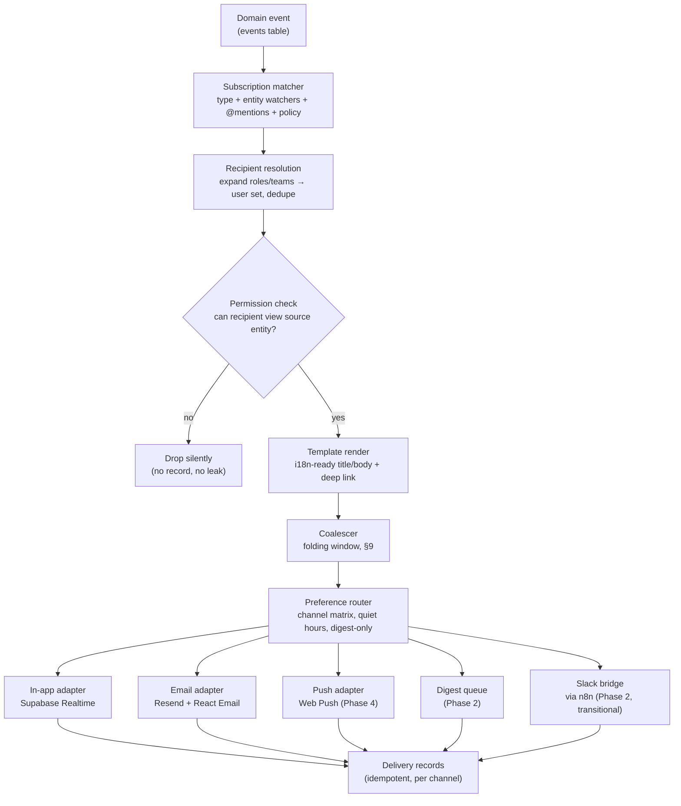
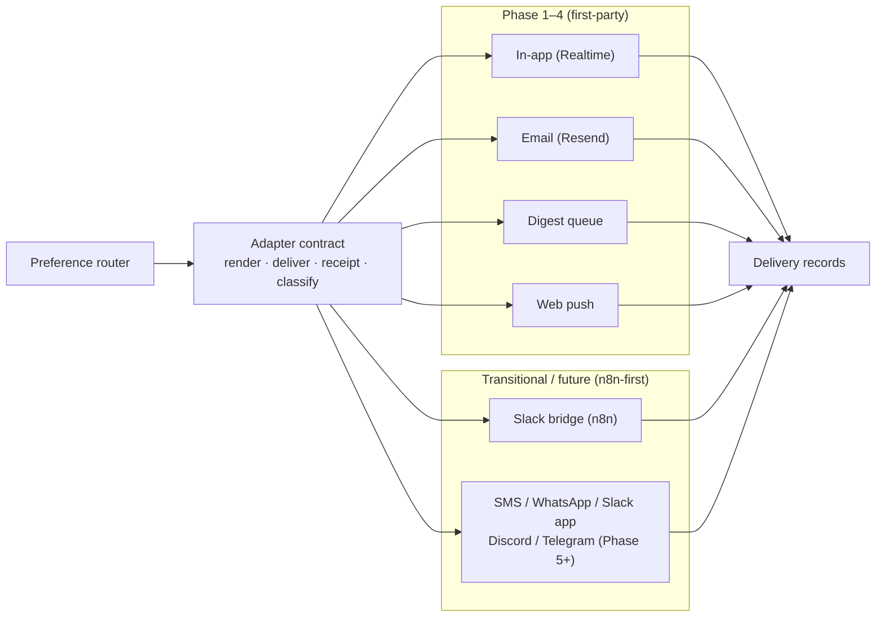
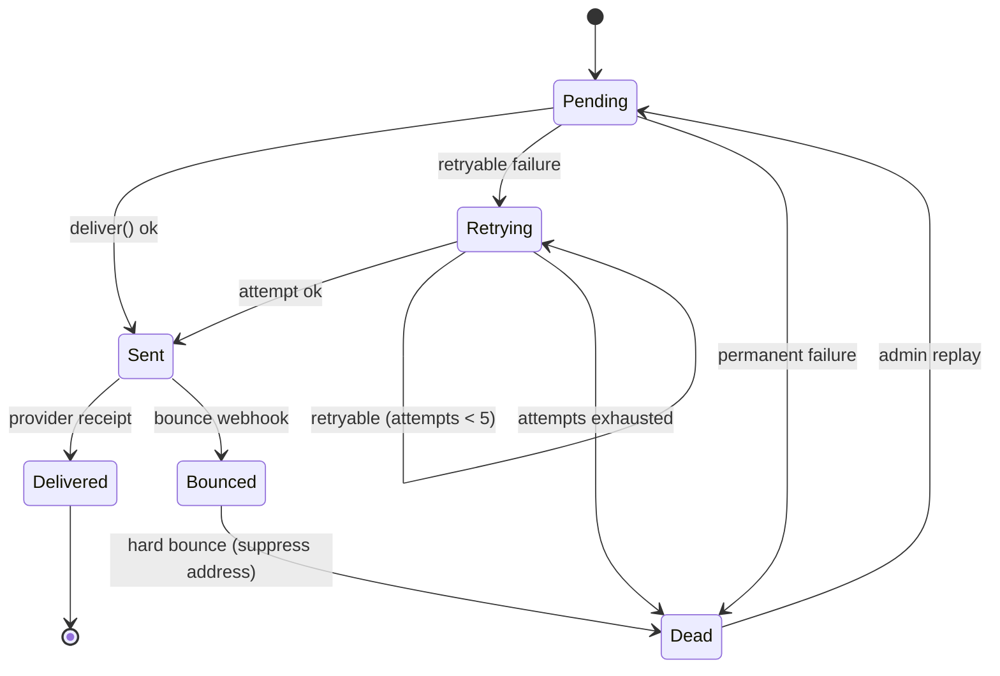

# Notifications Architecture — AurexOS

| | |
|---|---|
| **Document** | Notifications Architecture — AurexOS |
| **Status** | Approved — Living Document |
| **Version** | 1.0 |
| **Date** | 2026-07-08 |
| **Owner** | Founding CTO, AurexDesigns |
| **Related** | [./Architecture.md](./Architecture.md) · [./AutomationArchitecture.md](./AutomationArchitecture.md) · [./AIArchitecture.md](./AIArchitecture.md) · [../06_Module_Breakdown.md](../06_Module_Breakdown.md) · [../11_Design_Principles.md](../11_Design_Principles.md) · [../08_Tech_Stack.md](../08_Tech_Stack.md) |

---

AurexOS has exactly **one notification engine**. [../06_Module_Breakdown.md](../06_Module_Breakdown.md) §18 defines the Notifications module and §23 its internals; this document is the binding elaboration: the full pipeline, the channel adapter contract, the data model, reliability semantics, and the AI layer. No module ships its own ad-hoc notifications — a module that wants to tell a human something emits a domain event and lets this engine decide *whether*, *whom*, *how*, and *when*. Violations are citable in review by section number, per [../12_Project_Rules.md](../12_Project_Rules.md).

---

## 1. Principles

1. **One engine.** Every notification in the OS — task assignment, invoice overdue, security alert, portal update — flows through the single pipeline in §2. A module calling an email API directly is an architecture violation, full stop.
2. **Respectful by design.** [../11_Design_Principles.md](../11_Design_Principles.md) §12.3 is law: no default-on low-value notifications, batching and quiet hours by default, every type individually mutable (except the mandatory categories in §6.3). If users mass-disable a type, we delete the type — we do not re-enable it.
3. **Permission-safe.** A notification is a read of the source entity. The recipient must hold view permission on that entity at render time; we never leak even the *title* of an invisible entity (same doctrine as search, [../06_Module_Breakdown.md](../06_Module_Breakdown.md) §22).
4. **Event-driven.** The engine is a consumer of the domain events table — it never polls module tables and modules never call it imperatively. New notification types are declared against event types in the versioned registry ([../06_Module_Breakdown.md](../06_Module_Breakdown.md) Appendix A).
5. **Channels are adapters.** In-app, email, push, digest, Slack-bridge — and every future channel — sit behind one adapter contract (§4). Adding a channel never touches the pipeline.

---

## 2. End-to-End Pipeline

The pipeline from [../06_Module_Breakdown.md](../06_Module_Breakdown.md) §23, stage by stage:



| Stage | Responsibility | Failure behavior |
|---|---|---|
| Subscription matcher | Map event type → candidate audiences: declared type subscriptions, entity watchers (§2.1), @mentions in the payload, workspace policy defaults | Unknown event type → no-op + warning metric (never an error; events outlive notification types) |
| Recipient resolution | Expand roles/teams to concrete users; dedupe (a watcher who is also mentioned gets one notification); exclude the actor (you don't get notified of your own action) | Missing/deactivated user → skip that recipient, continue the batch |
| Permission check | Effective-permission evaluation against the source entity at *this moment*, per [../05_User_Roles.md](../05_User_Roles.md) | Denied → drop silently with a counted metric; **never** a redacted placeholder row |
| Template render | Render title/body from the type's template (i18n-ready), resolve deep link, mark inline safe actions (§5) | Template error → dead-letter the notification (§8), never a half-rendered send |
| Coalescer | Folding window + digest threshold, §9 | Fold-merge conflict → deliver unfolded (worse UX beats a lost notification) |
| Preference router | Per-recipient channel matrix, quiet hours, digest-only, mandatory-type override (§6) | Missing preference row → workspace role defaults from NotificationPolicy |
| Channel adapters | Deliver via the contract in §4 | Retry with backoff → DLQ (§8); one channel's failure never blocks another channel |
| Delivery records | One idempotent row per (notification, channel) with state transitions | The at-least-once safety net: replays are absorbed by the idempotency key |

The entire pipeline after the matcher runs as a job on the Postgres jobs substrate ([./Architecture.md](./Architecture.md)) — notification work never runs inline in a user's request path.

### 2.1 Watchers model

Every major entity supports **watch/unwatch**. Assignment and @mention auto-watch; module events fan out to watchers by default. Unwatching is always one click from any notification about that entity. Watch state is per-user, per-entity, workspace-scoped under RLS like everything else.

---

## 3. Data Model

Four tables, all `workspace_id` + RLS + UUIDv7 keys per [../08_Tech_Stack.md](../08_Tech_Stack.md) and R-D1/R-D5:

| Entity | Key fields | Notes |
|---|---|---|
| **Notification** | recipient, type key, source event ref, entity refs, rendered title/body, read/seen state, fold group ref | One row per recipient per (possibly folded) notification; the in-app inbox is a straight RLS-filtered read of this table. High-write — pruned per §12 |
| **NotificationDelivery** | notification ref, channel, idempotency key, state (pending/sent/delivered/bounced/failed/dead), attempt count, provider message id, last error class | One row per (notification, channel). The idempotency key = `(notification_id, channel)` — replays upsert, never duplicate |
| **NotificationPreference** | user, type key or category, channel matrix (in-app / email / push / digest-only / off), quiet hours, digest cadence | Per user; absent rows fall back to policy defaults |
| **NotificationPolicy** | workspace defaults per role, mandatory types (security, approvals — cannot be muted), portal-client defaults | Workspace settings; edited under `settings.*` permissions, audited |

Rendered title/body are stored **denormalized** on the Notification row: the inbox must keep displaying what was said even if the source entity is later renamed or deleted — but a *click-through* re-checks permission live.

---

## 4. Channel Adapter Architecture

### 4.1 The adapter contract

Every channel implements the same four capabilities (conceptual sketch — the only code-shaped thing in this document):

```
ChannelAdapter {
  render(notification, recipient)   → channel-specific payload (email HTML, push body, inbox row)
  deliver(payload, idempotencyKey)  → provider receipt | classified failure
  receipt(webhookEvent)             → delivery-state update (delivered / bounced / complained)
  classify(error)                   → retryable | permanent | throttled
}
```

`classify` is what makes the retry machinery in §8 channel-agnostic: the pipeline doesn't know what a 429 from Resend means — the adapter does.



### 4.2 Current channels

| Channel | Transport | Phase | Notes |
|---|---|---|---|
| In-app inbox | Supabase Realtime | 1 | §4.4; the default channel — always on unless a type is fully muted |
| Email | Resend + React Email templates in `packages/ui/emails` | 1 | Templates are design-system components ([../08_Tech_Stack.md](../08_Tech_Stack.md) §7); bounce/complaint webhooks per §8 |
| Digest (daily/weekly) | Email, via the digest queue | 2 | Folding + Aurex narration, §7 |
| Slack bridge | n8n connector | 2 | **Transitional** — mirrors critical types during internal Slack migration (PRD Q8); retired when internal Slack is |
| Web push | Web Push API (VAPID) | 4 | Alongside PWA work, resolving the §18 open question in [../06_Module_Breakdown.md](../06_Module_Breakdown.md); mentions/approvals/alerts only |

### 4.3 Future channels (Phase 5+)

Future channels are **adapters, not modules**. Each ships behind the §4.1 contract, initially delivered through n8n connectors ([./AutomationArchitecture.md](./AutomationArchitecture.md)) and promoted to a first-party adapter only when volume justifies it. None is built without its demand trigger firing.

| Channel | Adapter path | Demand trigger | Compliance / cost notes |
|---|---|---|---|
| SMS (Twilio-class) | n8n → first-party | Tenants in field-service/events verticals request time-critical alerts; ≥ 5 paying workspaces ask | Sender registration (10DLC in US, per-country rules); per-message cost — SMS is **never** a default-on channel; opt-in consent records required |
| WhatsApp Business | n8n → first-party | Tenant demand in markets where WhatsApp is the client-communication norm (LATAM, India, SEA) | Template pre-approval by Meta for business-initiated messages; conversation-based pricing; 24-hour session rules |
| Slack app (first-party) | n8n bridge → first-party Slack app | External tenants (not us) want notifications in *their* Slack; distinct from the §4.2 transitional bridge | Slack app review + OAuth scopes; free API tier, cost is engineering upkeep |
| Discord | n8n → first-party | Agency tenants running client communities on Discord ask | Bot verification above 100 servers; free API; rate limits per guild |
| Telegram | n8n → first-party | Regional demand (EE/CIS/MENA client bases) | Bot API is free and unreviewed — cheapest adapter; per-chat opt-in still required |

### 4.4 Real-time in-app mechanics

- One Supabase Realtime channel **per user** (not per workspace): `notifications:{user_id}`, authorized by RLS — the socket only ever carries rows the user may read.
- New Notification row insert → Realtime pushes to the open client → inbox prepends + badge count increments. Badge count is a cached unread aggregate, reconciled against the table on every inbox open (Realtime is a hint, the table is the truth).
- Read/seen state syncs across devices through the same channel: marking read on the laptop clears the phone's badge. `seen` (rendered in viewport) and `read` (explicitly opened/dismissed) are distinct — priority learning (§10) uses both.

---

## 5. Notification Center (Inbox UX Contract)

The in-app inbox is the reference surface for every notification type. Binding contract, per [../04_Feature_List.md](../04_Feature_List.md) §20:

1. **Unified and filterable** — one inbox, filters by module, type, read state, and entity; no per-module inboxes.
2. **Mark read/unread**, individually and bulk ("mark all read" never requires confirmation — it's reversible, [../11_Design_Principles.md](../11_Design_Principles.md) §12.4).
3. **Inline safe actions** — where the action is safe and atomic, it's executable from the row: approve expense, acknowledge incident, accept mention-invite. Inline actions run the standard action spine (validate → authorize → execute → emit → audit); an inline approval is a real approval, fully audited.
4. **Deep links** — every notification links to the exact entity *and* position (the comment, the line item), permission-checked at click time.
5. **Fold expansion** — a folded row ("Priya completed 6 tasks in Meridian") expands in place to its members.
6. **Mute affordance** — every row exposes "mute this type" / "unwatch this entity" one click deep. Making muting easy is policy, not a concession (§6.4).

The Dashboard attention strip reads from this same table ([../06_Module_Breakdown.md](../06_Module_Breakdown.md) §18) — it is a view over notifications, not a second system.

---

## 6. Preferences & Policy

### 6.1 Per-user matrix

`NotificationPreference` is a matrix of *type (or category) × channel* with values **in-app / email / push / digest-only / off**, plus quiet hours and digest cadence. Granularity per [../04_Feature_List.md](../04_Feature_List.md) §20: per-module, per-event-type (Phase 2).

### 6.2 Workspace role defaults

`NotificationPolicy` sets per-role defaults so a new member starts sensible: a PM defaults to watching project events, Finance to invoice events. Users override freely from there. Defaults must be right for ~90% of users — a default users always change is a bug ([../11_Design_Principles.md](../11_Design_Principles.md) §12.9).

### 6.3 Mandatory categories

**Security** and **approvals** cannot be muted on all channels simultaneously — they may be rerouted (email instead of push) but never silenced, and they bypass quiet hours and digest folding. The mandatory set lives in NotificationPolicy and is deliberately tiny; every addition needs Owner sign-off.

### 6.4 Quiet hours & the delete-unloved-types rule

Quiet hours defer non-mandatory deliveries to the window's end (folded if the coalescer applies). And the standing rule from [../11_Design_Principles.md](../11_Design_Principles.md) §12.3: **if users mass-disable a notification type, we delete the type.** Opt-out rates per type are a tracked product metric (PostHog); a type above the mass-disable threshold gets a removal PR, not a re-engagement campaign.

---

## 7. Digest Architecture (Phase 2)

- **What folds in:** everything routed digest-only, plus everything below the recipient's priority threshold that wasn't individually delivered. Mandatory categories never fold.
- **Cadence:** daily or weekly per user preference; sent at a user-local hour respecting quiet hours.
- **Aurex narration (Phase 3):** the digest is composed by Aurex *per recipient* — a readable brief ("Meridian shipped 2 milestones; the Hollis invoice is 5 days overdue"), not a raw list. Narration input is **permission-filtered before the model sees it**: the context assembled for recipient R contains only entities R can view ([./AIArchitecture.md](./AIArchitecture.md)). Narration is L3 read-only — it summarizes notifications, never creates or alters them, and is attributed as AI content per [../11_Design_Principles.md](../11_Design_Principles.md) §12.6.
- **Engagement feedback loop:** digest opens and click-throughs are events (`notifications.notification.read/actioned`) feeding priority learning (§10). Items a user consistently clicks from digests get promoted toward individual delivery suggestions; items never opened sink — closing the loop between what we send and what people actually read.

---

## 8. Queue, Retry & Reliability

Delivery is a job on the **Postgres jobs substrate** ([./Architecture.md](./Architecture.md)) — no separate queue infrastructure until the scale triggers in [../09_Scaling_Strategy.md](../09_Scaling_Strategy.md) fire.

- **At-least-once, idempotent:** a crashed worker replays the job; the delivery record's idempotency key `(notification_id, channel)` absorbs the replay. Duplicate *sends* are structurally prevented at the record, not by hoping the queue delivers exactly once.
- **Backoff schedule:** retryable failures (per the adapter's `classify`) retry at 30s → 2m → 10m → 1h → 6h (max 5 attempts, jittered). Permanent failures (hard bounce, invalid address) skip retries entirely. Throttled failures respect the provider's retry-after.
- **Dead-letter:** exhausted or permanently failed deliveries land in the DLQ state and are **surfaced to workspace admins** — an admin-visible "delivery issues" panel in Settings, plus a (mandatory-category) notification to admins when DLQ volume spikes. Dead letters are replayable after the cause is fixed.
- **Bounce/complaint webhooks:** Resend webhooks drive delivery records to `bounced`/`complained`. A hard-bounced address suppresses further email to that recipient until the address changes (the preference router consults suppression state); complaints auto-route that recipient's matrix away from email and flag for admin review — a spam complaint is a deliverability emergency, not a metric.



**Deliverability posture:** SPF + DKIM + DMARC on our sending domain from day one; dedicated notification subdomain so marketing (if ever) can't poison transactional reputation. Per-workspace sending domains arrive in Phase 5 with the commercial platform ([../08_Tech_Stack.md](../08_Tech_Stack.md) §7). Postmark remains the named fallback provider if Resend deliverability disappoints — the adapter contract makes that a swap, not a rewrite.

---

## 9. Batching & Coalescing

- **Folding window:** default 10 minutes. Notifications sharing (actor, entity group, type family) within the window merge into one folded notification ("Priya completed 6 tasks in Meridian" — never 6 rows, [../06_Module_Breakdown.md](../06_Module_Breakdown.md) §18). The window is per-type-configurable; approvals and security use window 0 (never delayed).
- **Priority thresholds:** each type carries a default priority; per-recipient learned priority (§10) adjusts it. Below the recipient's digest threshold → digest queue; above → individual delivery, still fold-eligible.
- **Burst storms:** bulk operations must not become notification storms — a 500-row import must **never** fire 500 emails. Two guards: (1) bulk-context events carry a batch ref the coalescer folds on regardless of window; (2) hard per-recipient rate caps per channel (e.g., email ≥ N/hour → automatic digest fallback for the remainder, with one "high activity" summary notification). Rate-cap trips are metered and visible in the §12 dashboards.

---

## 10. AI Layer

All notification AI is **L3 read-only** in the autonomy ladder of [../07_AI_Strategy.md](../07_AI_Strategy.md): it ranks, summarizes, and suggests — it never creates, alters, mutes, or suppresses a notification's content on its own.

| Capability | What it does | Autonomy |
|---|---|---|
| Priority ranking | Learns per-user from acted-on behavior (`read/actioned` events, §4.4 seen-vs-read) and orders/folds accordingly. Content is never altered — ranking only | L3 read-only |
| Digest narration | Per-recipient composed brief, permission-filtered input (§7) | L3 read-only, attributed |
| Noise reports | Weekly: "you dismiss 92% of X notifications — mute or fold into digest?" — the *change* is a one-tap user action | L1 (one-tap apply) |
| Auto-throttling | Any AI-*originated* proactive surface whose acted-on rate stays below threshold is automatically throttled — anti-spam applies to Aurex hardest of all | System rule, not a model choice |

The learning signal is exactly the emitted events `notifications.notification.delivered/read/actioned` ([../06_Module_Breakdown.md](../06_Module_Breakdown.md) §18) — no additional tracking surface.

---

## 11. Portal Notifications

Clients get a deliberately small, client-facing subset ([../06_Module_Breakdown.md](../06_Module_Breakdown.md) §18): portal updates published to them, approval requests, invoice sends, shared files, monitored-site status they're allowed to see. Rules:

- **Email-first:** clients don't live in AurexOS; delivery is email with **portal deep links** — the notification is the doorbell, the portal is the room. An in-portal inbox may follow with Phase 4 portal surfaces.
- **Same pipeline, portal-scoped:** portal recipients pass the same permission check against PortalShare visibility — a client is never notified about an entity that isn't explicitly shared to their portal. No internal type can even be *subscribed* to a portal recipient.
- **Client preferences:** clients hold their own NotificationPreference rows (defaults from NotificationPolicy's portal section) and can mute non-mandatory types from an unauthenticated-safe preference link in every email. Invoice and approval notifications follow the mandatory rules; everything else is fully mutable. Respectful-by-design applies doubly to people who are paying us.

---

## 12. Scale & Observability

- **Fan-out cost is per-workspace.** The expensive stage is recipient resolution × permission checks. Watcher fan-out is bounded per event (watchers + mentions + policy audience); an event that would fan out beyond a sanity ceiling (default 500 recipients) delivers via digest/summary instead — nobody meaningfully "notifies 2,000 people".
- **Pruning:** `notifications` is high-write and transient. Read notifications are pruned at **90 days** (unread mandatory-category rows are exempt until read). Delivery records prune with their notification. Long-term "what was sent" accountability lives in the audit log ([../06_Module_Breakdown.md](../06_Module_Breakdown.md) §24), not this table. Partitioning strategy for the table is defined in [./DatabaseArchitecture.md](./DatabaseArchitecture.md).
- **Delivery SLO:** event emitted → first-channel delivery **p95 ≤ 5s** for non-folded, non-quiet-hours notifications (in-app is the pacing channel). Folding and digests are intentional latency and excluded from the SLO.
- **Dashboards** (Sentry + metrics, tenant-tagged per [../08_Tech_Stack.md](../08_Tech_Stack.md)): pipeline latency per stage; delivery success/bounce/complaint rates per channel; DLQ depth and age; per-type opt-out and acted-on rates (the §6.4 delete-unloved-types input); rate-cap and fan-out-ceiling trips; Realtime channel connect health.

---

## Open questions

1. **Fan-out ceiling default** — is 500 recipients the right sanity ceiling, and should it be a NotificationPolicy knob or a system constant? Lean: system constant until a real tenant hits it.
2. **Per-workspace sending domains (Phase 5)** — DNS self-serve verification UX and warm-up strategy for tenant domains; who owns deliverability when a tenant's domain reputation is bad?
3. **Digest send-time optimization** — fixed user-local hour vs. learned open-time per recipient (an L3 ranking-style improvement). Defer until digest open rates give us data.
4. **Slack bridge retirement criteria** — a dated exit condition for the transitional n8n bridge, so "transitional" doesn't become permanent; propose tying it to internal Slack decommission in the Phase 2 exit review.
5. **Web push provider** — raw VAPID vs. a push service abstraction; decide with the Phase 4 PWA spike.

---

*Changes to this document follow the rule-change process in [../12_Project_Rules.md](../12_Project_Rules.md) §10. Engine phase gates track [../10_Roadmap.md](../10_Roadmap.md).*
