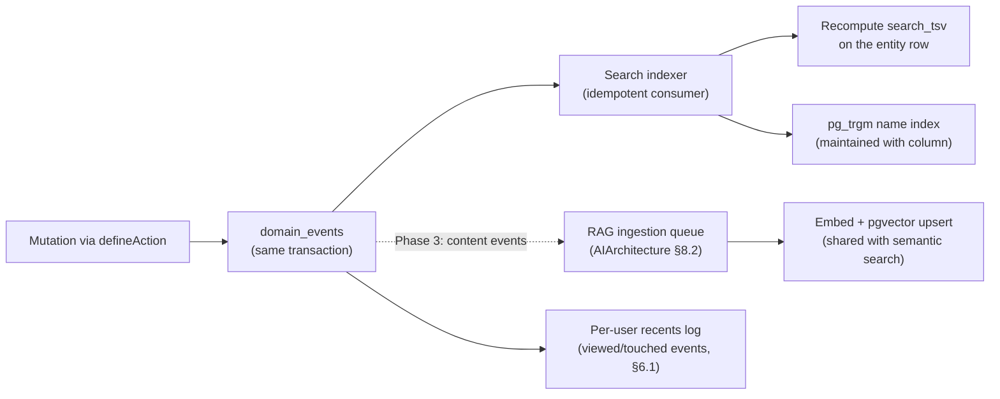
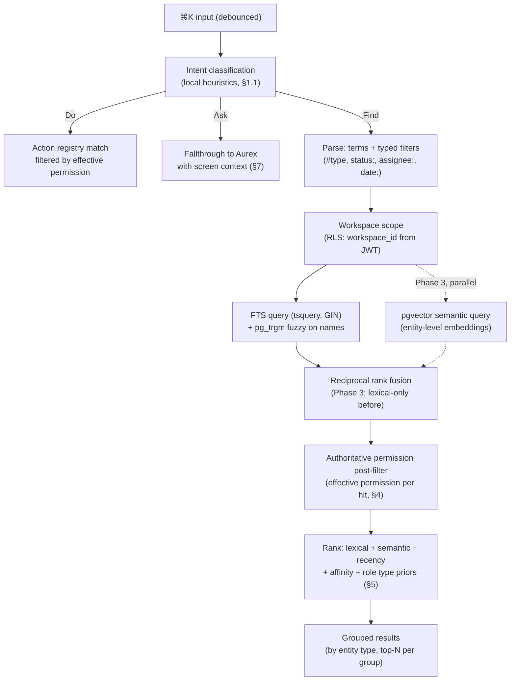
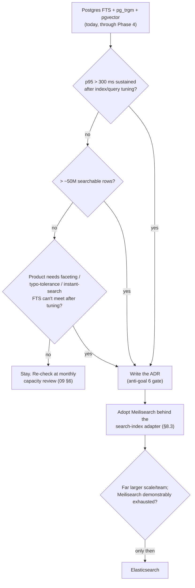

# Search Architecture — Global Search & Command Palette

| | |
|---|---|
| **Document** | Search Architecture — AurexOS |
| **Status** | Approved — Living Document |
| **Version** | 1.0 |
| **Date** | 2026-07-08 |
| **Owner** | Founding CTO, AurexDesigns |
| **Related** | [./Architecture.md](./Architecture.md) · [./AIArchitecture.md](./AIArchitecture.md) · [./DatabaseArchitecture.md](./DatabaseArchitecture.md) · [../06_Module_Breakdown.md](../06_Module_Breakdown.md) · [../07_AI_Strategy.md](../07_AI_Strategy.md) · [../03_System_Goals.md](../03_System_Goals.md) |

This document is the engineering design for ⌘K — the global search and command palette defined in [../06_Module_Breakdown.md](../06_Module_Breakdown.md) §22 — and it formalizes the search-engine decision: **Postgres FTS + pgvector, no dedicated search engine, until named triggers fire** (§8). The contractual latency target is **p95 ≤ 300 ms** ([../03_System_Goals.md](../03_System_Goals.md) §7). The tone is binding: "must" means CI, the database, or the permission layer refuses.

---

## 1. Search as the OS Front Door

⌘K is not a feature bolted onto modules; it is the operating system's front door: **find anything, do anything, ask anything** — three intents in one input.

| Intent | What it does | Backed by | Phase |
|---|---|---|---|
| **Find** | Entity search across all modules — tasks, docs, deals, invoices, people, KB pages… — with type filters | Search index (§2) + query pipeline (§3) | 1 |
| **Do** | Action registry: "create task", "new invoice", "go to Meridian project" | The **same typed `ActionDefinition`s** used by Automation Studio and Aurex tools ([./ModuleArchitecture.md](./ModuleArchitecture.md) §Do-not-duplicate rule); execution runs through the `defineAction` spine ([./APIStrategy.md](./APIStrategy.md) §3.1) with full RBAC/event/audit | 1 (nav) / 2 (full registry) |
| **Ask** | Free text falls through to Aurex with current-screen context | AI orchestrator ([./AIArchitecture.md](./AIArchitecture.md) §4), invoker-context session (see [../07_AI_Strategy.md](../07_AI_Strategy.md) §3) | 3 |

There is exactly one action registry in AurexOS. The palette's Do intent is a *view* over it, filtered to actions the current user's effective permission allows — an action the user cannot perform does not appear (the same no-existence-leak posture as entity results, §4).

### 1.1 Intent disambiguation

Disambiguation is layered: cheap heuristics first, explicit override always available, graceful fallthrough last.

1. **Explicit modes (always win).** Prefix characters force intent: `>` forces Do (VS Code convention), `?` forces Ask, `#` forces a type-scoped Find (`#task overdue`). Tab-completable mode chips render in the input so the mechanism is discoverable, not folklore.
2. **Prefix heuristics.** Unprefixed input matches against both indexes concurrently: verb-leading input that prefix-matches a registered action label ("create inv…") ranks Do candidates into the top group; noun-like input ranks Find. Both groups render — heuristics reorder, never hide.
3. **Fallthrough.** Input that produces no confident Find or Do match (or any input terminated with the Ask affordance / `Enter` on the "Ask Aurex" row) falls through to Ask with the query and current-screen context attached (§7.1). Ask is never auto-invoked silently: the user always sees and chooses the "Ask Aurex" row — an accidental model call is a cost and a surprise, and we do neither ([../07_AI_Strategy.md](../07_AI_Strategy.md) §9).

Intent classification is **local and deterministic** (string heuristics over the registry + index), never a model call — the palette must respond in single-digit milliseconds before any query is issued.

---

## 2. Index Architecture

### 2.1 Postgres FTS, per entity type

The search index is **Postgres FTS from Phase 1** — `tsvector` columns on searchable entities, GIN-indexed, in the same database and under the same RLS regime as everything else ([./DatabaseArchitecture.md](./DatabaseArchitecture.md) §5). No new datastore: anti-goal 6 ([../03_System_Goals.md](../03_System_Goals.md) §11.6) is in force and §8 is the only sanctioned exit.

Conceptual shape (physical schema in `supabase/migrations/`, per [./DatabaseArchitecture.md](./DatabaseArchitecture.md)):

- Each searchable entity table carries a `search_tsv tsvector` column, weighted by field class: **A** = title/name/number, **B** = key structured fields (status, client name denorm-free via join at index time), **C** = body/description excerpt. Names additionally get a `pg_trgm` GIN index for fuzzy/typo matching (§3.2).
- A thin `search_documents` registry view unions the per-entity indexes into one queryable surface: `{workspace_id, entity_type, entity_id, title, snippet_source, search_tsv, updated_at}`. Per-entity columns (not one giant table) keep index bloat local, let each module tune its weights, and keep RLS evaluation on the entity's own policy.
- From Phase 3, the same entities' embedding rows (pgvector, [./AIArchitecture.md](./AIArchitecture.md) §8) serve as the semantic side of hybrid search — **shared infrastructure with the RAG pipeline**: same embeddings, same ACL post-filter authority, same workspace pinned embedding model.

### 2.2 Event-driven indexer

Index updates are **event-driven**: the search indexer is a `domain_events` consumer like Notifications, Automations, and Analytics ([../03_System_Goals.md](../03_System_Goals.md) §3). It is idempotent by contract (recompute-and-overwrite per entity; duplicate delivery converges to the same tsvector) and tolerates unknown fields per the event-catalog rules ([../06_Module_Breakdown.md](../06_Module_Breakdown.md) Appendix A).

- **Freshness SLO:** entity create/rename/status-change visible in search within **≤ 10 s p95** (aligned with the event → automation trigger SLO, [../03_System_Goals.md](../03_System_Goals.md) §3). Deletes and permission-relevant changes propagate at high queue priority — a trashed or revoked entity must promptly stop appearing, mirroring the RAG revocation rule ([../07_AI_Strategy.md](../07_AI_Strategy.md) §5.1). Semantic-index freshness follows the RAG ingestion SLO (minutes), which is acceptable: lexical freshness carries recency, semantic carries recall.
- **Backfill:** enabling search on a module (or changing weights/config) is an expand→migrate→contract batched backfill, workspace-by-workspace, throttled, per the migration protocol ([../09_Scaling_Strategy.md](../09_Scaling_Strategy.md) §7). The tsvector is a **rebuildable derivation** (read-model discipline, [./DatabaseArchitecture.md](./DatabaseArchitecture.md) §2 class 4): losing it is an inconvenience, never data loss, and every module doc declares its rebuild procedure.

### 2.3 What is indexed per module

| Module | Indexed entities | A-weight (title) fields | Notable exclusions |
|---|---|---|---|
| Projects & Tasks | projects, tasks, milestones | name/title, task number | — |
| CRM & Clients | clients, companies, contacts, deals | names, deal title | deal margin fields (field-restricted, §4.3) |
| Finance | invoices, expenses, payments | invoice number, vendor | amounts indexed as B-weight exact tokens only; visible only to finance-permitted roles via RLS anyway |
| Documents & KB | documents, KB pages | titles, headings | draft-visibility respected via entity ACL |
| Proposals & Contracts | proposals, contracts | title, counterparty | contract body indexed only post-send (immutable versions) |
| Meetings & Calendar | meetings, transcripts (summary level) | title, attendees | raw transcript text is RAG-only (chunks), not entity search |
| Email Center | linked threads (subject/participants) | subject | private mailbox bodies never entity-indexed |
| Team & HR | people (directory fields) | name, role title | **compensation fields are never written into any search index** (§4.3) |

---

## 3. Query Pipeline

### 3.1 Request flow

Order is normative: **permissions filter before ranking** — an entity the user cannot view must not influence scores, counts, or grouping, because any of those would leak existence (§4.1). Note the RLS workspace/entity scope already applies *inside* the FTS and semantic queries (structural isolation); the post-filter re-checks effective permission per hit (role scopes, per-entity shares, field rules) exactly as the RAG retrieval path does ([./AIArchitecture.md](./AIArchitecture.md) §8.3) — the pre-filter is an optimization, the post-filter is the guarantee.

### 3.2 Fuzzy matching

`pg_trgm` similarity on name/title columns catches typos and partial recall ("Meridain" → Meridian). Trigram candidates enter the fusion as a low-weighted lexical source; exact tsquery matches always dominate. Trigram search runs only against A-weight name fields, keeping its index and query cost bounded.

### 3.3 Latency budget (p95 ≤ 300 ms, instrumented)

| Stage | Budget | Notes |
|---|---|---|
| Client debounce → request on wire | — | 150 ms debounce; excluded from server budget, tuned for perceived instant-ness |
| Edge/API ingress + parse + intent | ≤ 20 ms | Local heuristics; no model calls |
| FTS + trigram query (GIN, workspace-scoped) | ≤ 80 ms | Composite indexes lead with `workspace_id` (C5, [./DatabaseArchitecture.md](./DatabaseArchitecture.md) §3); LIMIT per entity type |
| Semantic query (Phase 3, parallel) | ≤ 100 ms | HNSW, per-workspace partial indexes; runs concurrently with FTS — the budget is max(), not sum() |
| RRF fusion | ≤ 5 ms | In-process over ≤ ~200 candidates |
| Permission post-filter | ≤ 60 ms | Batched effective-permission resolution against the session's cached permission set ([./AuthenticationArchitecture.md](./AuthenticationArchitecture.md) §5); per-entity share checks only for hit rows |
| Ranking + grouping + serialize | ≤ 15 ms | Pure computation |
| **Total server** | **≤ 280 ms** | 20 ms headroom against the 300 ms contract |

Recents (§6.1) render at palette-open from a per-user cache **before any query is issued** — perceived latency for the most common palette use is ~0.

---

## 4. Permission-Aware Search

### 4.1 The no-existence-leak rule

**A user never sees even the existence of an entity they cannot view.** No "1 result hidden", no dimmed rows, no total counts that include invisible entities, no type-group badges inflated by them. This is the search-surface expression of the aggregation-loophole rule in [../05_User_Roles.md](../05_User_Roles.md) §8 and the notifications rule in [../06_Module_Breakdown.md](../06_Module_Breakdown.md) §23. Enforcement is two-layer, same as everywhere else: RLS makes invisible rows structurally unreadable; the application post-filter re-checks effective permission (role scope, overrides, per-entity shares) on every hit before it can affect any output — including ranking inputs and result counts (§3.1). Permission-leak tests for search join the adversarial tenancy suite: **0 escapes, ever** ([../03_System_Goals.md](../03_System_Goals.md) §1, §2).

### 4.2 Portal-scoped search

Portal users (Client role) get a **separate, portal-scoped search** (Phase 4) — not the workspace palette with a filter. It runs inside the portal route tree against only portal-whitelisted entities (their projects' shared items, invoices, files, threads per [../05_User_Roles.md](../05_User_Roles.md) §7), under the portal's whitelist-RLS policies. Do intent is limited to portal actions; Ask intent is the portal-scoped Aurex surface (opt-in per workspace, [../05_User_Roles.md](../05_User_Roles.md) §6). The two searches share the pipeline code, never a result surface.

### 4.3 Field-level exclusions

Field-restricted data is excluded **at index time, not query time**: compensation fields ([../05_User_Roles.md](../05_User_Roles.md) §3.4), deal margins, and any `hr.compensation.*`-guarded value are never written into `search_tsv`, trigram indexes, or entity embeddings visible to workspace search. Searching a salary figure returns nothing for anyone — including Owner — because the index simply does not contain it; comp data is reachable only through its module UI under field-level permission checks. This mirrors the DTO-shaping rule for AI reads ([./AIArchitecture.md](./AIArchitecture.md) §5): the safest filter is the data never being there.

---

## 5. Ranking

Ranking runs **after** the permission post-filter, over visible hits only.

| Signal | Source | Notes |
|---|---|---|
| Lexical score | `ts_rank_cd` over weighted tsvector (+ trigram similarity for fuzzy hits) | Exact matches on A-weight fields (names, invoice numbers) dominate |
| Semantic score | pgvector cosine similarity (Phase 3) | Entity-level embeddings shared with RAG |
| Recency decay | `updated_at` half-life decay per entity type | Tasks decay fast, contracts slowly |
| Interaction affinity | Per-user touch log (§6.1): entities recently viewed/edited/commented by *this user* rank higher | The "your stuff first" signal |
| Role type priors | Per-role prior over entity types: Sales sees deals first, Finance sees invoices, PMs see projects/tasks | Seeded from the role matrix ([../05_User_Roles.md](../05_User_Roles.md) §6); per-user behavior gradually overrides the prior |

**Combination.** Lexical and semantic candidates fuse via **reciprocal rank fusion** — the same fusion as RAG retrieval ([../07_AI_Strategy.md](../07_AI_Strategy.md) §5.4) — because RRF is rank-based and needs no cross-scale score calibration. Recency, affinity, and type priors then apply as multiplicative boosts on the fused score. Weights are configuration (registry table, per [./DatabaseArchitecture.md](./DatabaseArchitecture.md) §2 class 5), not code, so tuning never requires a deploy. No model call sits in the ranking path — the 300 ms budget forbids it.

**Feedback loop.** Result clicks emit a `search.result.clicked` domain event (query hash, entity ref, rank position). The events feed (a) the per-user affinity signal and (b) an offline ranking-quality eval (click-through rank distribution, abandoned-search rate) reviewed alongside the AI retrieval evals ([./AIArchitecture.md](./AIArchitecture.md) §13). Feedback tunes weights offline; it never mutates ranking online (no per-query learning loops to debug at 2 a.m.).

---

## 6. Recents, Saved Searches & Filters

### 6.1 Recents

Palette-open (before typing) shows **per-user recents**: recently viewed/touched entities, instantly. Mechanics: view/edit/comment interactions append to a per-user, per-workspace touch log (an event-fed, size-capped read model — last ~100 entities, deduped, newest-first). Reads are a single PK-range lookup, cacheable in the session; entries are permission-checked on render (a revoked entity drops out) and respect soft-delete. The same log powers the affinity signal (§5) — one write path, two consumers.

### 6.2 Saved searches & views

Saved searches/views follow the "everything user-configurable is data" rule ([../03_System_Goals.md](../03_System_Goals.md) §5): a saved view is a **row**, not code — `{workspace_id, owner_id, scope: personal|shared, module|global, name, filter_ast (jsonb), sort, grouping, pinned}`.

- **Personal + shared:** personal views are owner-visible; shared views are workspace-visible artifacts on every list/board ([../04_Feature_List.md](../04_Feature_List.md) §Cross-cutting: "Saved views & filters", P1 Phase 1–2). Sharing a view shares the *definition*, never the results — every execution re-runs under the executing user's permissions (§4).
- **Pinnable:** pinned views surface in module navigation and in the palette's Find results (a saved view is itself a searchable, Do-navigable entity).
- The `filter_ast` JSONB is a sanctioned schemaless payload (C12, [./DatabaseArchitecture.md](./DatabaseArchitecture.md) §3): it is executed, not filtered-on.

### 6.3 One typed filter grammar

There is **one filter grammar** in AurexOS — a typed AST over `{entity type, module, status, assignee, client, date ranges, custom fields}` — with three producers and one evaluator:

| Producer | Surface |
|---|---|
| Palette syntax | `#task status:overdue assignee:me client:meridian` |
| List/board filter UI | The same AST built visually; saved as views (§6.2) |
| NL→filter translation (Phase 3) | Aurex emits the same AST from natural language (§7.2) |

The evaluator compiles the AST to SQL predicates under RLS. One grammar means a palette query, a saved view, and an AI-translated filter are the same object — storable, shareable, auditable, and marketplace-distributable later (Phase 5 template thinking, [../03_System_Goals.md](../03_System_Goals.md) §5).

---

## 7. AI Search

### 7.1 Ask fallthrough

Ask hands the palette query to Aurex as a normal invoker-context session ([./AIArchitecture.md](./AIArchitecture.md) §4) with **current-screen context** attached: route/module, focused entity ref, applied filters — the situational frame defined in [../07_AI_Strategy.md](../07_AI_Strategy.md) §3. From there the full AI stack applies unchanged: permission-shaped tools, autonomy levels, approvals, audit. Search adds no AI capability and no AI bypass — it is a doorway.

### 7.2 Natural-language filters (Phase 3)

"my overdue tasks for Meridian" → Light-tier model translates NL to the typed filter AST (§6.3) — an **L0/L1** operation per the autonomy ladder ([../07_AI_Strategy.md](../07_AI_Strategy.md) §7): the structured filter is **shown to the user as populated filter chips** before or alongside execution, so the translation is verifiable and correctable, never a black box. The executed object is the same AST as a hand-built filter — same evaluator, same RLS, same audit posture. A successful NL filter is one save-click away from becoming a saved view.

### 7.3 Semantic search and the RAG relationship

Phase 3 hybrid search reuses RAG infrastructure wholesale (§2.1): same embedding pipeline, same workspace-pinned model, same pgvector store, same two-stage ACL enforcement, same RRF fusion. The difference is the **unit of retrieval**:

| | Entity search (this doc) | RAG retrieval ([./AIArchitecture.md](./AIArchitecture.md) §8) |
|---|---|---|
| Returns | **Entities** (a task, a deal, a document) to navigate to | **Chunks** (passages) to ground an answer in |
| Consumer | A human scanning a result list | A model assembling context |
| Ranking | Lexical/semantic + recency + affinity + role priors | Source-trust weighting (verified KB ≻ docs ≻ transcripts…) |
| Latency | ≤ 300 ms hard | Inside the Aurex first-token budget |

Semantic search is the **recall layer** for Find: it catches "the doc about the rebrand pricing" when no lexical token matches — lexical FTS remains the precision layer for names, numbers, and jargon. Embed once, retrieve twice.

---

## 8. The Engine Decision: Postgres Until Named Triggers Fire

**Decision (binding).** No Elasticsearch. No Meilisearch. No dedicated search engine of any kind — now. Anti-goal 6 ([../03_System_Goals.md](../03_System_Goals.md) §11.6) requires an ADR proving Postgres genuinely cannot serve before any new datastore, and Postgres has not failed us: FTS + pg_trgm + pgvector carries entity search through Phase 4 comfortably at the documented scale envelope (~1M tasks-scale entity counts, ~5M vector chunks; [../09_Scaling_Strategy.md](../09_Scaling_Strategy.md) §8). A dedicated engine would mean a second datastore to secure per-tenant, a sync pipeline to keep honest, and a second backup/consistency story — the exact costs the pgvector decision already rejected once ([../08_Tech_Stack.md](../08_Tech_Stack.md) §4.4).

### 8.1 The honest comparison

Scored for **our** constraints: two-pizza team, shared-schema multi-tenancy with RLS as the isolation authority, ops budget near zero, p95 ≤ 300 ms.

| Criterion | Postgres FTS + pgvector | Meilisearch | Typesense | Elasticsearch |
|---|---|---|---|---|
| Tenancy isolation | **RLS — same model as all data, auditable in one place** | Per-index keys; isolation re-implemented in a second system | Scoped API keys; same second-system problem | DLS/filters; most complex to get right |
| Freshness/sync | **In-database; event consumer, no sync pipeline** | External sync pipeline required | External sync pipeline required | External sync pipeline required |
| Ops burden | **Zero new services** | Low (single binary, self-hostable) | Low-moderate (clustering for HA) | High — JVM, cluster ops, its own on-call discipline |
| Typo tolerance / instant search | pg_trgm — good, not best-in-class | **Excellent, default** | Excellent | Good, needs tuning |
| Faceting | SQL aggregates — adequate | Good | Good | **Best** |
| Semantic/hybrid | **pgvector shared with RAG — free** | Separate vector feature, second embedding store | Same | Same |
| Relevance at huge scale | Adequate to ~50M rows | Good | Good | **Best** |
| Fit today | **Wins on every criterion we currently pay for** | The designated successor | Credible alternative to Meilisearch | Not justified below far larger scale and team |

### 8.2 Named adoption triggers

A dedicated engine may be proposed (via ADR, per anti-goal 6) only when at least one fires — and the ADR must show the tuning work was actually done:

1. **Sustained search p95 > 300 ms** after honest index and query tuning at scale — covering indexes, per-type LIMIT strategies, replica routing (§9), weight tuning — not before it.
2. **> ~50M searchable rows** in a single deployment (Phase 5 commercial-scale territory, [../09_Scaling_Strategy.md](../09_Scaling_Strategy.md) §8).
3. **Product need** for advanced faceting, best-in-class typo tolerance, or true instant-search-as-you-type that FTS + pg_trgm demonstrably cannot meet after honest tuning effort.

### 8.3 If triggered: Meilisearch, behind an adapter

The pre-committed choice is **Meilisearch over Elasticsearch**: self-hostable (tenant data stays ours), per-index tenancy that maps cleanly to workspaces, and operations right-sized for this team. Elasticsearch is an operational heavyweight justified only at far larger scale and team size — adopting it early would be distributed-systems plumbing, which is where our complexity budget explicitly does not go ([../03_System_Goals.md](../03_System_Goals.md) §11.1).

Either engine sits behind a **search-index interface** — the same adapter pattern as the `retrieval/` interface in `packages/ai` ([./AIArchitecture.md](./AIArchitecture.md) §9) — carrying the identical isolation contract:

- **Per-workspace index keys** (one logical index/key-scope per workspace; no cross-workspace index, ever);
- **ACL post-filter authority stays in Postgres** — the external engine only ever narrows candidates; effective-permission enforcement and the no-existence-leak rule (§4.1) are re-checked against Postgres on every hit;
- **Deletion/revocation propagation SLO** identical to §2.2.

An engine that cannot express this contract does not qualify, whatever its benchmarks say.

---

## 9. Scale Plan

Projections against the load table in [../09_Scaling_Strategy.md](../09_Scaling_Strategy.md) §8:

| Phase | Searchable entity rows (est.) | Vector chunks (est.) | Search posture |
|---|---|---|---|
| 1–2 | 10⁴–10⁵ | — | FTS trivially fast; resist optimizing (09 §8 rule) |
| 3 | ~10⁵–10⁶ | ~10⁶ | Hybrid on; HNSW per-workspace partial indexes |
| 4 | ~10⁶ (envelope ~1M tasks-scale) | ~5M | Single well-indexed primary remains sufficient (09 §8 rule of thumb) |
| 5 | 10⁷–10⁸ aggregate | 10⁷+ | Replica routing → partitioning interplay → §8.2 triggers begin to be watchable |

- **Index sizing.** tsvector + GIN typically adds ~30–50% of text-column size per indexed entity table; monitored in the monthly capacity review ([../09_Scaling_Strategy.md](../09_Scaling_Strategy.md) §6) alongside vector storage share. Field-exclusion (§4.3) and A/B/C weighting keep indexed text minimal by design.
- **Partitioning interplay.** Canonical entities are not partitioned through Phase 4 (only append-only streams are, [./DatabaseArchitecture.md](./DatabaseArchitecture.md) §10). If Phase 5 partitions hot entity tables by `workspace_id` range, GIN and trigram indexes partition with them — every search query is already workspace-scoped (C5), so partition pruning is automatic, not a retrofit.
- **Replica routing.** Search reads are read-only and lag-tolerant within the freshness SLO (§2.2), making them a designated replica workload alongside analytics and RAG retrieval reads via the explicit `dbRead(...)` handle ([../09_Scaling_Strategy.md](../09_Scaling_Strategy.md) §3.3) — with one carve-out: the recents log read stays wherever read-after-write holds, since "the task I just touched" must appear immediately.
- **Order of operations.** When search gets slow, the standard ladder applies before any engine talk: query/index → pool → replica → partition ([../09_Scaling_Strategy.md](../09_Scaling_Strategy.md) §10). Only then do §8.2's triggers get a hearing.

### 9.1 Phase rollout (per [../06_Module_Breakdown.md](../06_Module_Breakdown.md) §22)

| Phase | Ships |
|---|---|
| 1 | Entity search (FTS + trigram), navigation actions, recents |
| 2 | Full action registry (Do), typed filters, saved searches/views (personal + shared) |
| 3 | Hybrid semantic search, Ask-Aurex fallthrough, NL→filter translation |
| 4 | Portal-scoped search |

---

## Open questions

1. **Cross-workspace search for multi-workspace users** — a personal palette spanning workspaces would be genuinely useful and genuinely dangerous (it must never blend result sets across RLS contexts). Deferred; related to the default-workspace UX question in [../06_Module_Breakdown.md](../06_Module_Breakdown.md) §21.
2. **Entity-level embeddings vs. reusing chunk embeddings** for Phase 3 semantic Find: a dedicated per-entity summary embedding is cleaner for ranking; max-over-chunks is cheaper. Decide with retrieval evals when Phase 3 opens.
3. **Recents log placement** — dedicated table vs. derivation from `domain_events`: the derivation is purer (one stream), the table is faster at palette-open. Current lean: capped table, event-fed, rebuildable (class 4 discipline).
4. **Search analytics retention** — how long to keep `search.result.clicked` events at Phase 5 volume before rollup-and-purge; align with the domain-events partitioning lifecycle ([./DatabaseArchitecture.md](./DatabaseArchitecture.md) §10).
5. **Per-user weight personalization ceiling** — how far behavioral affinity may override role type priors before search feels inconsistent across a team looking at the same screen.
