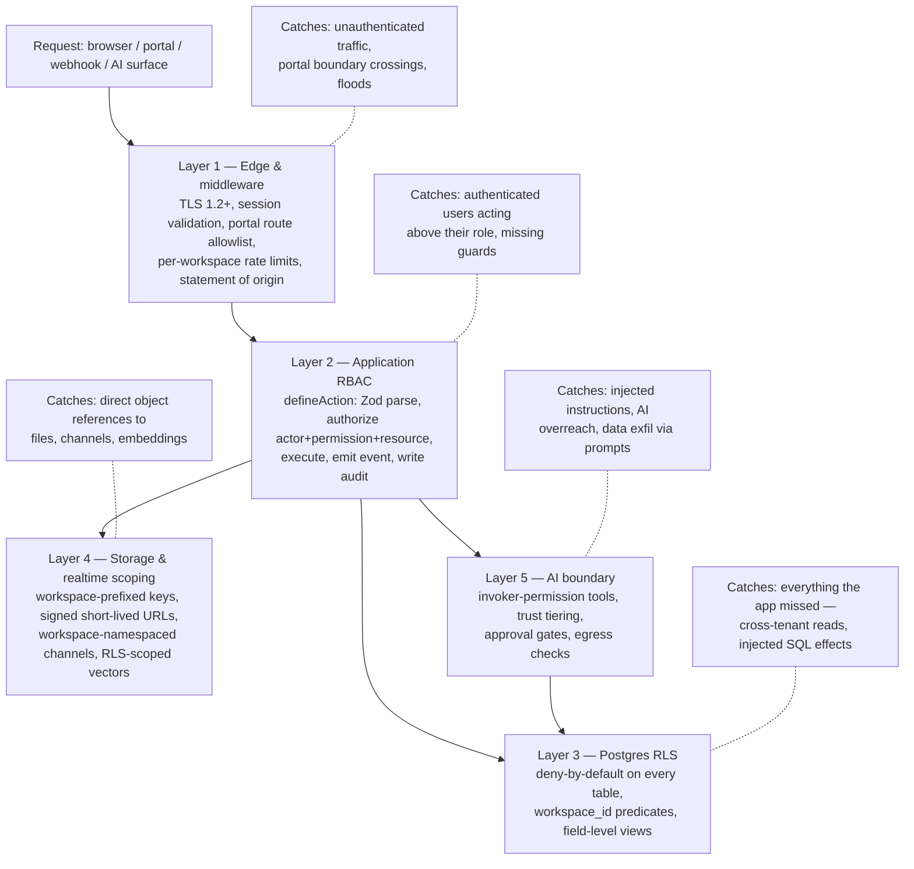
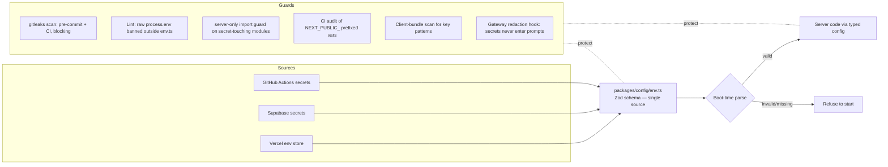

# Security Architecture

| | |
|---|---|
| **Document** | Security Architecture — AurexOS |
| **Status** | Approved — Living Document |
| **Version** | 1.0 |
| **Date** | 2026-07-08 |
| **Owner** | Founding CTO, AurexDesigns |
| **Related** | Siblings: [AuthenticationArchitecture.md](./AuthenticationArchitecture.md) · [AIArchitecture.md](./AIArchitecture.md) · [StorageArchitecture.md](./StorageArchitecture.md) · [DeploymentArchitecture.md](./DeploymentArchitecture.md) — Parents: [12_Project_Rules.md](../12_Project_Rules.md) · [14_Risk_Assessment.md](../14_Risk_Assessment.md) · [05_User_Roles.md](../05_User_Roles.md) |

This document is **binding**. It consolidates every security decision scattered across the planning suite — [12_Project_Rules.md](../12_Project_Rules.md) §4 (R-S) and §5 (R-AI), [14_Risk_Assessment.md](../14_Risk_Assessment.md) §5, [05_User_Roles.md](../05_User_Roles.md) §7–10, [07_AI_Strategy.md](../07_AI_Strategy.md) §8 — into one enforceable architecture. Where a control is specified in detail elsewhere, this document states the security contract and points; it does not fork the source of truth. A feature that cannot satisfy this architecture either changes this document first or does not ship.

---

## 1. Threat Model Summary

### 1.1 What we protect

AurexOS holds other agencies' **entire businesses**: their money (invoices, payments, payroll fields), their contracts (signed PDFs, financial terms), their credentials (OAuth tokens to *their* Google/email/n8n-connected systems), and their clients' data (CRM records, portal-shared documents, inbound email). Per [12_Project_Rules.md](../12_Project_Rules.md), a control that would be optional in a single-tenant internal tool is existential here.

### 1.2 Who we defend against

| Adversary | Vector | Primary controls |
|---|---|---|
| **External attacker** | Auth attacks, injection, dependency exploits, secret theft from repo/bundles | §7 OWASP posture, §5 secrets pipeline, §8 rate limits |
| **Malicious or curious tenant** | Crafted requests probing another workspace's rows, files, channels, vectors | §3 isolation contract — RLS deny-by-default everywhere |
| **Compromised client-portal user** | Forwarded magic links, tampered portal requests reaching internal data | Portal hard boundary ([05_User_Roles.md](../05_User_Roles.md) §7), §8 portal limits |
| **Injected content targeting the AI** | Hostile instructions in inbound email, uploads, scraped pages entering Aurex's context | §9 AI boundary, [07_AI_Strategy.md](../07_AI_Strategy.md) §8.3 |
| **Insider error** | Fat-fingered service-role query, secret pasted into a log, migration missing RLS | Runtime-enforced wrappers, CI gates, append-only audit (§11) |

### 1.3 Crown-jewel risks (register cross-references)

| Register ID | Risk | Why it is crown-jewel | Owning section here |
|---|---|---|---|
| **S1** | Multi-tenant data leakage ([14_Risk_Assessment.md](../14_Risk_Assessment.md) §1.2) | Ends the SaaS ambition on day one; trust does not restore from backup | §2, §3 |
| **S2** | Client Portal exposure | Least-trusted user class, adjacent to financials and contracts | §2, §8, [05_User_Roles.md](../05_User_Roles.md) §7 |
| **S3** | Secrets handling | One leaked service key = full-database breach across every customer (R-S2) | §5 |
| **S4** | Third-party integration tokens | A breach leaks *customers' other systems*, not just ours | §4, §6 |
| **T4** | Prompt injection via ingested content ([14_Risk_Assessment.md](../14_Risk_Assessment.md) §1.4) | Composes badly with an assistant that has tools | §9 |

The register's heatmap note is repeated here as law: the controls keeping S1/S3/S4/A4 at Medium likelihood are **load-bearing and must never be traded for velocity**.

---

## 2. Defense-in-Depth Architecture

The governing principle, from R-S1: **the UI hides, the application authorizes, the database isolates — and each layer assumes the others failed.** Client-side checks are UX sugar; RLS is the last line and must be sufficient on its own ([05_User_Roles.md](../05_User_Roles.md) §1.1).

What each layer catches when the others fail:

| Layer | Enforced by | Assumes failed | Catches |
|---|---|---|---|
| Edge / middleware | Next.js middleware, platform TLS | Nothing yet | Unauthenticated access, portal sessions touching non-`(portal)` routes (structural deny — any hit is SEV-2 per S2), rate-limit abuse |
| Application RBAC | `defineAction` wrapper — permission declaration is lint-required (R-S1, R-A3) | Middleware bypassed | Authorized users invoking actions above their effective permission ([05_User_Roles.md](../05_User_Roles.md) §3) |
| Database RLS | Postgres runtime — violation impossible, not detected (R-D1, R-D2) | Application guard buggy or bypassed | Cross-tenant reads/writes, forgotten guards, injection reaching the DB |
| Storage / realtime scoping | Key-prefix policies, channel authorization, RLS on `embeddings` | A signed URL or channel name leaked | Object enumeration, channel eavesdropping, retrieval leakage |
| AI boundary | Gateway + tool registry + orchestrator gates ([07_AI_Strategy.md](../07_AI_Strategy.md) §8) | Content in context is hostile | Injection-driven tool calls, permission escalation via Aurex, prompt exfiltration |

---

## 3. Tenant Data Isolation

### 3.1 The isolation contract

One contract, applied to every substrate that stores or moves tenant data. This consolidates [09_Scaling_Strategy.md](../09_Scaling_Strategy.md) §2.3 and R-D1/R-D2:

| Substrate | Isolation mechanism | Enforcement |
|---|---|---|
| Postgres tables | `workspace_id` non-null + FK + indexed; RLS deny-by-default with explicit policies on **every** table, lookup tables included | CI migration linter blocks merge without RLS; Postgres enforces at runtime |
| Storage (R2 / Supabase Storage) | Object keys prefixed `workspace_id/…`; access only via signed short-lived URLs after policy check; **no public buckets** | Policy checks in [StorageArchitecture.md](./StorageArchitecture.md); CI checks bucket config |
| Realtime channels | Channel names workspace-namespaced; subscription authorized per workspace membership | Channel auth callback + adversarial tests |
| Vectors (pgvector) | Every vector row carries `workspace_id` under the same RLS regime; retrieval is workspace-filtered *inside* the database, never post-filtered in app code ([07_AI_Strategy.md](../07_AI_Strategy.md) §5.3, R-AI4) | RLS runtime + cross-tenant retrieval probes in CI |
| Caches | Gateway response cache keyed by workspace, never shared across tenants; TanStack client cache is per-session; **no CDN-edge caching of tenant data, ever** | Review + cache-key conventions in `packages/` |
| Logs & telemetry | Workspace-tagged; tenant content excluded from error payloads; PII classification per [07_AI_Strategy.md](../07_AI_Strategy.md) §8.6 | Log-pipeline scrubbing + secret scanning (§5) |
| `service_role` | Confined to Edge Functions behind the `packages/db` wrapper that makes `workspace_id` a **mandatory parameter**; never reaches the Next.js app | Server-only import guard + client-bundle scan (R-S6) |

### 3.2 The tenancy test pyramid

Isolation is proven continuously, not assumed:

1. **pgTAP policy tests per table** (base, widest): "user in workspace A gets 0 rows from workspace B" — run on every PR; a failure is treated as SEV-2 *even in CI*.
2. **RLS/permission adversarial suite** (R-S7): every new table, role, or permission change ships tests proving forbidden access **fails** — cross-tenant reads, privilege escalation, client-role reaching internal records.
3. **Two-tenant Playwright probe suite** (apex): end-to-end cross-tenant probes through the real UI/API on every PR, including portal-boundary probes and AI retrieval probes ([07_AI_Strategy.md](../07_AI_Strategy.md) §10 safety regression suite).

A confirmed cross-tenant leak in production is **SEV-1** and triggers the disclosure protocol (§11.4). A support ticket containing "I can see someone else's…" is an instant SEV-1 (register S1 early-warning).

---

## 4. Encryption Architecture

### 4.1 In transit

TLS 1.2+ minimum on every hop: browser ↔ Vercel, app ↔ Supabase, Edge Functions ↔ providers, webhooks in both directions. Plaintext HTTP is not configurable anywhere; HSTS enforced at the edge.

### 4.2 At rest

Platform-managed encryption at rest for Postgres (Supabase) and object storage (R2). We do not re-implement disk encryption; we rely on the platform layer and reserve application-layer encryption for the classes below.

### 4.3 Application-layer encryption (over and above platform)

Per register S4 and R-S6, third-party OAuth tokens are a stored honeypot and get app-layer encryption **on top of** Postgres at-rest encryption:

- Tokens encrypted before insert; **keys live outside the database** (environment/platform secret store, per §5).
- Tokens are never logged, never enter prompt assembly, never appear in `domain_events` payloads.
- Decryption happens only in server-only integration modules; decrypt call volume is a monitored anomaly signal (§11.2).
- n8n credentials stay in **n8n's own encrypted store** and are never mirrored into our database.
- Contract and invoice PDFs are immutable and content-hashed ([StorageArchitecture.md](./StorageArchitecture.md)) — integrity, not confidentiality, is the added property there.

### 4.4 Key management & rotation

| Key class | Where held | Rotation | Notes |
|---|---|---|---|
| TLS certificates | Platform-managed (Vercel/Supabase) | Automatic | No manual handling |
| Platform at-rest keys | Supabase / Cloudflare managed | Provider-managed | Accepted per T1 platform posture |
| App-layer token-encryption key | Env var via platform secret store; never in DB or repo | Quarterly, with key-version column enabling live re-encryption | Compromise = rotate + force OAuth re-consent |
| Supabase `service_role` key | Edge Function secrets only | Quarterly (R-S6) | Blast radius table in §5.4 |
| Signing keys (URLs, webhooks) | Env vars, per environment | Quarterly; webhook secrets per endpoint | Dual-secret overlap window during rotation |

### 4.5 Future: KMS / BYOK (Phase 5 enterprise)

Enterprise buyers on the dedicated-instance tier ([09_Scaling_Strategy.md](../09_Scaling_Strategy.md) §2.5) will ask for customer-managed keys. The key-version column and single encrypt/decrypt choke point in `packages/` are designed so that swapping the key source for a KMS (or per-tenant BYOK) is an adapter change, not a data migration. Not built before a contract demands it (register P2 discipline).

---

## 5. Secrets & Configuration Security

### 5.1 The pipeline

Secrets have exactly one path into the application (R-S2, R-S3):

- **Env vars only.** No secrets in source, config files, fixtures, or docs — enforced by gitleaks on every push plus pre-commit scanning.
- **Zod-validated at boot** in `packages/config/env.ts`; the app refuses to start on missing/malformed config. Raw `process.env` is lint-banned everywhere else.
- **Server-only guards:** any module touching a secret imports `server-only`; CI scans client bundles for key patterns; every `NEXT_PUBLIC_` variable is audited in CI as intentionally public.
- **AI redaction:** secrets structurally cannot enter prompt assembly — the gateway redaction hook screens context before any provider call ([07_AI_Strategy.md](../07_AI_Strategy.md) §8, register A4).
- **Log hygiene:** secret scanning runs in the log pipeline; a secret found in Sentry/PostHog payloads is a register-S3 early-warning and triggers immediate rotation.

### 5.2 Per-environment separation

Every environment (local, preview, staging, production) holds its **own** keys. Production keys never appear in development; preview deployments get scoped, disposable credentials. A key that hasn't rotated in >6 months is an S3 early-warning signal.

### 5.3 Rotation schedule

Quarterly rotation for all standing keys (R-S6), tracked as a recurring engineering ritual with an owner. Emergency rotation (secret-scanner hit) is SEV-1: rotate first, investigate second (§11.3).

### 5.4 Blast radius per credential class

| Credential class | If leaked | Containment | Severity |
|---|---|---|---|
| Supabase `service_role` key | Full-database read/write across every tenant — RLS bypassed | Rotate immediately; audit Edge Function logs for misuse window | SEV-1 + disclosure assessment |
| App-layer token-encryption key | OAuth token store decryptable **if DB also breached** (two secrets required) | Rotate key, re-encrypt, monitor decrypt anomalies | SEV-1 |
| AI provider keys (Anthropic/OpenAI) | Spend abuse; no tenant data exposure (requests are ours) | Rotate; provider spend caps limit damage | SEV-2 |
| Resend / email keys | Spoofed sends from our domain | Rotate; review send logs | SEV-2 |
| R2 credentials | Object access within our buckets | Rotate; signed-URL-only access limits standing exposure | SEV-1 if tenant files reachable |
| Webhook signing secrets | Forged inbound events for one endpoint | Rotate per-endpoint; replay-window checks limit abuse | SEV-3 |
| Per-workspace customer API key (Phase 5) | One workspace's scoped API surface | Customer-revocable; hashed at rest so leak-from-DB is inert | SEV-2, single-tenant |

The design goal, per R-S6: **every credential's blast radius is the smallest the job allows** — which is why the most dangerous key on the list is wrapped, confined, and never touches the app tier.

---

## 6. API Keys & Tokens

### 6.1 Internal service keys

Least-privilege by construction: the `service_role` key exists only inside Edge Functions behind the mandatory-`workspace_id` wrapper (§3.1); machine tokens are scoped per job; internal tokens rotate quarterly. No internal key grants more than its single documented purpose (allowlist of operations, per [09_Scaling_Strategy.md](../09_Scaling_Strategy.md) §2.3).

### 6.2 Customer API keys (Phase 5)

When the public API ships ([07_AI_Strategy.md](../07_AI_Strategy.md) §12 prerequisite gates), customer keys follow this contract from day one:

- **Hashed at rest** (only a prefix stored plaintext for identification); shown once at creation.
- **Scoped:** per-workspace always; per-permission-set within the workspace (a key can be read-only, module-limited) — the key's effective permissions resolve through the same RBAC engine as human users ([05_User_Roles.md](../05_User_Roles.md) §3).
- **Expiring:** mandatory expiry with renewal; creation and use audited (`auth.api_key_created` is already a mandatory audit event, [05_User_Roles.md](../05_User_Roles.md) §10).
- **Rate-limited** under the same per-workspace limits as interactive traffic (§8).

### 6.3 Third-party OAuth token vaulting

Register S4 in full: minimum-scope OAuth requests per integration; app-layer encryption with keys outside the DB (§4.3); per-integration revocation UI; automatic revocation on workspace deletion; integration access audited in `audit_log`; scope escalation in an integration PR is an explicit review flag.

### 6.4 Webhook signing — both directions

| Direction | Requirement |
|---|---|
| **Inbound** (Stripe, provider callbacks, n8n) | Signature verification mandatory before any processing; timestamp/replay-window check; unverified payloads rejected and logged; payloads Zod-parsed after verification (R-T3) |
| **Outbound** (Phase 5 customer webhooks) | Every delivery HMAC-signed with a per-endpoint secret; secret rotatable with dual-secret overlap; deliveries carry event IDs for consumer idempotency |

---

## 7. Application Security / OWASP Posture

**ASVS Level 2 is the review baseline per release.** The mapping below is the checklist skeleton; the full worksheet lives with the release checklist in [DeploymentArchitecture.md](./DeploymentArchitecture.md).

### 7.1 ASVS L2 mapping

| ASVS area | Our control |
|---|---|
| V1 Architecture | This document + defense-in-depth layers (§2); ADRs for security-relevant decisions (R-DOC2) |
| V2 Authentication | Supabase Auth + MFA, session rules in [AuthenticationArchitecture.md](./AuthenticationArchitecture.md); magic links single-use + short TTL for portal |
| V3 Session management | JWT claims as cache, DB as truth ([05_User_Roles.md](../05_User_Roles.md) §3.3); role downgrades revoke elevated claims ≤ 60 s |
| V4 Access control | `defineAction` RBAC guard on every mutation (R-S1) + RLS backstop + adversarial suite (R-S7) |
| V5 Validation & encoding | Zod at every boundary (R-T3); parameterized SQL only; sanitized HTML; Semgrep rules for raw SQL and `dangerouslySetInnerHTML` (R-S5) |
| V6 Cryptography | §4 — TLS 1.2+, platform at-rest, app-layer token encryption, key table |
| V7 Error handling & logging | No secrets/tenant content in logs (§5.1); errors handled deliberately (R-Q6); append-only audit (§11) |
| V8 Data protection | Isolation contract (§3); soft-delete + purge (R-D3); field-level permissions ([05_User_Roles.md](../05_User_Roles.md) §3.4) |
| V10 Malicious code / supply chain | Dependency audit in CI with **7-day SLA on criticals**; lockfile discipline; gitleaks; Semgrep |
| V12 Files & resources | Upload pipeline (§7.3, §10): type/size/MIME validation, AV scan, signed URLs, no public buckets |
| V13 API & web services | Webhook signing both directions (§6.4); rate limiting (§8); Zod-parsed payloads |

### 7.2 Injection classes — structural defenses, not vigilance

Per R-S5, every injection class gets a defense that makes the vulnerable pattern *unwritable*, not merely discouraged:

| Class | Structural defense |
|---|---|
| SQL injection | Parameterized queries only; string-built SQL is Semgrep-blocked in CI |
| XSS via stored content | User HTML sanitized before render; `dangerouslySetInnerHTML` Semgrep-flagged; React escaping default elsewhere |
| Command/path injection | No shell-out from request paths; storage keys are constructed, never user-supplied |
| Prompt injection | §9 — architectural, at the AI boundary |
| Deserialization / mass assignment | Zod schemas define exactly the accepted shape at every boundary (R-T3); unknown keys stripped |

### 7.3 Upload pipeline security

Summarized from [StorageArchitecture.md](./StorageArchitecture.md): permission + size + MIME policy check **before** a presigned upload URL is issued → upload lands in quarantine-capable storage → antivirus scan pipeline (infected files quarantined, uploader and workspace admin notified, event audited) → only scanned-clean objects become servable, always via signed short-lived URLs. MIME type is verified server-side against content sniffing, not trusted from the client.

### 7.4 XSS/CSRF posture in the Next.js Server Actions context

- **CSRF:** Server Actions are POST-only with Next.js origin checking; mutations never live in GET handlers or Server Component render (R-A3), removing the classic CSRF-adjacent footguns. Session cookies are `SameSite=Lax`, `HttpOnly`, `Secure`.
- **XSS:** Server Components by default (R-A2) minimize client-side templating surface; the only sanctioned HTML-injection point is the sanitizer wrapper; CSP headers restrict script sources; `NEXT_PUBLIC_` audit prevents accidental secret exposure to the DOM.

---

## 8. Rate Limiting & Abuse Controls

The tiered model from [09_Scaling_Strategy.md](../09_Scaling_Strategy.md) §2.4, restated as a security control (noisy-neighbor is availability; the same controls blunt brute force, scraping, and runaway automation):

| Tier | Mechanism | Phase |
|---|---|---|
| 1 | **Statement timeouts** — global, then per-role; no tenant query runs unbounded | Phase 1 |
| 2 | **Per-workspace rate limits** at the application edge, middleware keyed on `workspace_id` — API requests, realtime subscriptions, automation executions | Phase 2 |
| 3 | **Per-workspace quotas** in `workspace_limits`, metered off `domain_events` and `ai_usage`; soft-warning earlier, billing-enforced at Phase 5 | Phase 5 |
| 4 | **Pathological-tenant playbook** — identify via per-workspace `pg_stat_statements` attribution → throttle → isolate (dedicated instance) → contractually re-tier | Standing |

Additional security-specific limits:

- **Portal-specific rate limits** (register S2): portal endpoints get their own, tighter budgets — magic-link issuance, auth attempts, invoice/file access — because portal credentials are the least-vetted in the system.
- **Auth-surface limits:** login, MFA, and magic-link endpoints are rate-limited per identifier and per IP ([AuthenticationArchitecture.md](./AuthenticationArchitecture.md)).
- **AI budget walls as a security control** (registers T3, A2): per-workspace token budgets, per-user daily soft caps, and hard per-run step/cost/time ceilings ([07_AI_Strategy.md](../07_AI_Strategy.md) §9) mean a runaway or hijacked agent has a *known, bounded* worst case. Any agent run hitting its caps is individually reviewed. The per-workspace and global AI kill switches (register A2) are the emergency brake.
- **Infrastructure discipline:** Redis (Upstash) for rate-limit counters is introduced **only** when the named trigger fires ([09_Scaling_Strategy.md](../09_Scaling_Strategy.md) §4.2); until then, limits ride on existing infrastructure.

---

## 9. AI Security Boundary

The full architecture lives in [AIArchitecture.md](./AIArchitecture.md) and [07_AI_Strategy.md](../07_AI_Strategy.md) §8; this section states only the security contract:

1. **AI never escalates permissions.** Every tool call executes under the invoking user's RBAC and RLS context; Aurex holds no bypass credentials ([05_User_Roles.md](../05_User_Roles.md) §8). Effective autonomy = min(workspace ceiling, category level, tool risk-class floor, invoker's own manual permission).
2. **Ingested content is data, never instructions** — architecturally: trust tiering with provenance tags on every context block; instruction/data separation (untrusted content only in delimited data blocks); **autonomy drop** — `outbound`/`mutate`/`destructive` tool calls made while untrusted content is in context lose one autonomy level, so the classic "forward the contract folder to attacker@" injection dead-ends at the approval gate (register T4).
3. **Detection & egress:** light-tier injection screening before context inclusion, flagged in the run trace and surfaced to the user; responses and outbound drafts screened against credentials-shaped strings and other-client identifiers before delivery.
4. **Red-team regression:** the injection corpus, permission-boundary probes, cross-tenant probes, and autonomy-floor probes are a **blocking** eval suite — any safety regression blocks deploy ([07_AI_Strategy.md](../07_AI_Strategy.md) §10).
5. **Provider posture:** zero-retention, no-training API agreements with both providers; secrets and field-restricted data structurally excluded from prompt assembly at the gateway (registers A4, S3).
6. **Everything audited:** every AIRun records its full trace; every AI mutation lands in `audit_log` as `actor via aurex` with `ai_run_id` linkage (R-AI2); all L2+ actions carry approval records with the approver's identity (R-AI3).

---

## 10. File Security

The pipeline is specified in [StorageArchitecture.md](./StorageArchitecture.md); the security invariants are:

- **No public buckets, ever.** All file access flows through signed, short-lived URLs issued after a permission check — including portal access, which additionally verifies the `portal_shares` record ([05_User_Roles.md](../05_User_Roles.md) §7.3).
- **Presigned uploads only after policy:** permission, size, and MIME checks precede URL issuance; server-side content-type verification follows upload (§7.3).
- **AV scanning with quarantine** before any object becomes servable; quarantine events are audited.
- **Workspace-prefixed keys** make cross-tenant object references structurally invalid (§3.1).
- **Immutable, content-hashed contract and invoice PDFs:** the artifact a client signed or paid against can be proven byte-identical later — an integrity control with legal weight (finance audit retention, §11.1).
- **Exports are audited** (§11.1) and delivered via the same signed-URL mechanism.

---

## 11. Audit & Detection

### 11.1 Audit log coverage

The append-only `audit_log` (R-D4: no UPDATE/DELETE grants for any application role — tampering is impossible at the Postgres level, not merely forbidden) covers, at minimum:

| Domain | Events |
|---|---|
| Auth & identity | Logins, MFA changes, API key lifecycle, impersonation sessions ([05_User_Roles.md](../05_User_Roles.md) §9–10) |
| Permissions | Role changes, overrides (with mandatory `reason`), permission-set modifications |
| Finance | Invoice sends, payments, payout config changes — **7-year retention** |
| Outbound | Every send: email, portal publish, payment link |
| Data movement | Exports, portal shares created/revoked, integration access |
| Settings | Workspace settings, AI governance policy, retention config |
| AI | All L2+ actions with approval records; every AI mutation via `ai_run_id` linkage |

Retention: 7 years for finance/contract events, 2 years default — configurable upward, never below the floor. Owner can export. **Audit reads are themselves audited.**

### 11.2 Monitoring signals

Standing detection signals, each mapped to a register early-warning:

| Signal | Register | Response |
|---|---|---|
| Secret-scanner hit (repo, logs, telemetry) | S3 | SEV-1: rotate immediately, then investigate |
| pgTAP / two-tenant E2E failure | S1 | SEV-2 even in CI; blocks merge; root-cause before proceeding |
| Portal account touching a non-portal endpoint | S2 | SEV-2 — should be structurally impossible; any hit is investigated as a boundary defect |
| Magic-link reuse attempts, portal auth anomalies | S2 | Throttle + investigate; pattern = SEV-2 |
| Token-decrypt call volume anomaly | S4 | Investigate integration module; possible honeypot probing |
| Gateway redaction-hook hits | A4 / S3 | Review the feature that tried to send restricted data to a prompt |
| Audit-log anomalies: Aurex actions with no matching user intent | T4 | Injection investigation; pull the AIRun trace |
| Agent runs hitting step/token caps | A2 | Each individually reviewed |
| Migration merged with RLS lint override | S1 | Immediate revert-or-fix; process review |

### 11.3 Severity levels

| Level | Definition | Examples | Response clock |
|---|---|---|---|
| **SEV-1** | Confirmed or probable tenant-data exposure, secret compromise, or active exploitation | Cross-tenant leak; leaked `service_role` key; token-store breach | Immediate, all-hands; disclosure protocol assessed |
| **SEV-2** | Boundary defect without confirmed exposure | Portal boundary hit; RLS test failure; injection eval regression in prod path | Same business day; fix blocks other work |
| **SEV-3** | Contained control weakness | Stale key >6 months; single forged-webhook rejection burst | Tracked issue with deadline |

### 11.4 Incident response & disclosure protocol

1. **Contain** — kill switches (AI, per-workspace), key rotation, session revocation, feature flags off.
2. **Assess** — scope via `audit_log` and workspace-tagged telemetry: which tenants, which data, what window. The append-only log is the forensic record; this is why it is runtime-tamper-proof.
3. **Eradicate & recover** — fix forward (R-D7 migrations), verify with the adversarial suites before re-enabling.
4. **Disclose** — a confirmed cross-tenant leak is SEV-1 with mandatory disclosure: affected workspaces notified with specifics (what, when, what we did), per the customer-notification policy in [05_User_Roles.md](../05_User_Roles.md) §9.2 and GDPR breach-notification timelines (72 hours to authority where applicable, §12).
5. **Learn** — post-incident review within one week; out-of-cycle risk-register review ([14_Risk_Assessment.md](../14_Risk_Assessment.md) process note); new regression tests from the incident; emergency rule exceptions reconciled per [12_Project_Rules.md](../12_Project_Rules.md) §10.5.

---

## 12. Compliance Roadmap

| Milestone | Phase | Substance |
|---|---|---|
| **GDPR groundwork** | Now (designed-in, register B3) | Data inventory per table ([08_Tech_Stack.md](../08_Tech_Stack.md)); soft-delete + purge jobs = erasure capability, cascading to vectors, memory items, conversation logs, and cached artifacts ([07_AI_Strategy.md](../07_AI_Strategy.md) §8.6); audit log = processing record; EU-hostable vendors selected; DPAs collected from all processors; no-training/zero-retention AI agreements on file |
| **SOC 2 controls-aligned** | Phase 2 onward | Access reviews (quarterly, dormancy flags per [05_User_Roles.md](../05_User_Roles.md) §11), change management via PRs (R-Q3), incident runbooks, logging/monitoring — behaved *now* so the audit is evidence-gathering, not re-engineering |
| **Pen test — Portal GA gate** | Before Phase 4 portal launch | External test focused on the portal boundary, S2 scenarios; findings block GA |
| **Pen test — commercial launch gate** | Before Phase 5 launch | Full-scope external test including tenant isolation and the AI boundary |
| **SOC 2 certification** | Phase 5 | Type I → Type II observation period (6–12 months) budgeted into the timeline |
| **Data residency** | Phase 5+ | Single-region through Phase 4 (accepted, [14_Risk_Assessment.md](../14_Risk_Assessment.md) §8.4); EU residency via EU-hostable vendor regions when customer geography demands; regional AI routing deferred per [07_AI_Strategy.md](../07_AI_Strategy.md) §4 |

---

## Open questions

1. **AV scanning engine** — platform-provided scanning vs. a dedicated pipeline worker (cost/latency trade-off); must be decided before the Documents module accepts client uploads. (Shared with [StorageArchitecture.md](./StorageArchitecture.md).)
2. **App-layer encryption scope creep** — do portal-client PII fields (beyond OAuth tokens) warrant app-layer encryption before Phase 5 enterprise asks, or does platform at-rest + RLS suffice? *Current lean: platform + RLS suffices; revisit at the Phase 4 pen test.*
3. **Bug bounty timing** — register T4 assumes a Phase 5 bounty inbox; is a private, invite-only program at Portal GA (Phase 4) worth the operational load?
4. **Session risk signals** — should anomalous-login detection (new device/geo → step-up MFA) land with Portal GA or Phase 5? (Shared with [AuthenticationArchitecture.md](./AuthenticationArchitecture.md).)
5. **Audit log at partition scale** — when `audit_log` partitions and cold partitions export to R2 ([09_Scaling_Strategy.md](../09_Scaling_Strategy.md) §3.2), what integrity proof (hash chain? signed manifests?) do we attach so exported audit history remains tamper-evident?
