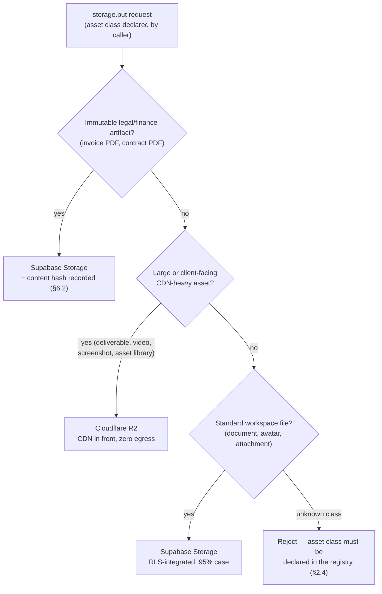
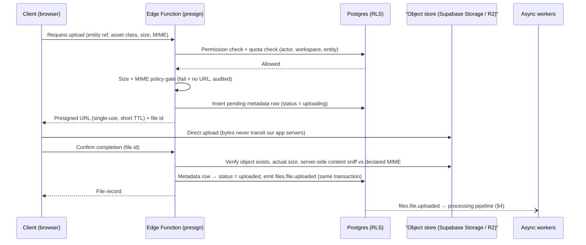
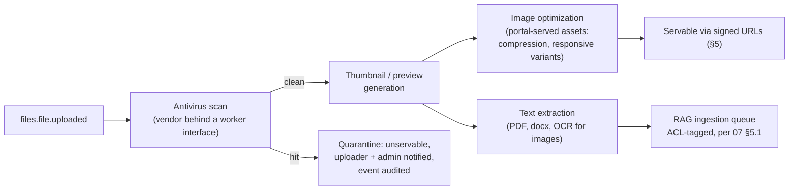

# Storage Architecture

| | |
|---|---|
| **Document** | Storage Architecture — AurexOS |
| **Status** | Approved — Living Document |
| **Version** | 1.0 |
| **Date** | 2026-07-08 |
| **Owner** | Founding CTO, AurexDesigns |
| **Related** | Siblings: [Architecture.md](./Architecture.md) · [SecurityArchitecture.md](./SecurityArchitecture.md) · [AIArchitecture.md](./AIArchitecture.md) · [DatabaseArchitecture.md](./DatabaseArchitecture.md) — Parents: [06_Module_Breakdown.md](../06_Module_Breakdown.md) · [08_Tech_Stack.md](../08_Tech_Stack.md) |

This document is **binding**. It expands the storage decisions of [08_Tech_Stack.md](../08_Tech_Stack.md) §6 and the file-handling contract of [06_Module_Breakdown.md](../06_Module_Breakdown.md) §25 into the full lifecycle architecture for every byte AurexOS stores outside Postgres. The security invariants stated here are consolidated in [SecurityArchitecture.md](./SecurityArchitecture.md) §10; where the two documents overlap, they must never diverge — a change to one changes both in the same PR.

---

## 1. Principles

1. **Postgres metadata is the authority; object stores hold dumb bytes.** Every stored object has exactly one metadata row (`files` table, [DatabaseArchitecture.md](./DatabaseArchitecture.md) §4.3 polymorphic-attachment list) under RLS. A file's visibility *is* its metadata row's visibility — there is no second permission system in the bucket layer. An object with no metadata row is an orphan and gets swept (§8.4).
2. **Tenancy in every key.** Object keys are prefixed `{workspace_id}/{module}/{entity}/…` in both stores. Cross-tenant object references are structurally invalid, not merely denied ([SecurityArchitecture.md](./SecurityArchitecture.md) §3.1). Keys are constructed server-side, never user-supplied (injection posture, [SecurityArchitecture.md](./SecurityArchitecture.md) §7.4).
3. **Signed access only. No public buckets, ever.** Uploads happen against presigned URLs minted *after* policy checks; downloads happen against short-lived signed URLs minted after an RBAC (and, for portal, PortalShare) check. This holds for every store, every asset class, every phase.
4. **One interface, two stores.** A single internal `storage` interface in `packages/core` routes by asset class ([08_Tech_Stack.md](../08_Tech_Stack.md) §6). Application code **never** imports a bucket SDK. Swapping or adding a backend touches one package — the same isolation bet as the `retrieval` interface in `packages/ai`.
5. **Processing is event-driven, never inline.** The upload request path ends when the metadata row commits and `files.file.uploaded` is emitted. Scanning, thumbnails, extraction — all asynchronous workers on the event spine ([08_Tech_Stack.md](../08_Tech_Stack.md) §5.2).

---

## 2. Asset-Class Taxonomy & Routing

### 2.1 The two stores

Per [08_Tech_Stack.md](../08_Tech_Stack.md) §6: **Supabase Storage** for standard files — RLS-integrated policies per workspace, signed URLs, zero extra vendor for the 95% case (Phase 1). **Cloudflare R2** for large/CDN-heavy assets — zero egress fees are decisive for client-facing delivery, Cloudflare CDN in front, S3-compatible API (Phase 2). *S3 everywhere* was rejected because egress pricing punishes exactly our Phase 4+ use case: clients downloading large deliverables.

### 2.2 Asset-class table (normative)

| Asset class | Store | Size class | Cache policy | Retention default | Phase |
|---|---|---|---|---|---|
| Documents / KB attachments | Supabase Storage | ≤ 50 MB | No CDN; signed URL per request | Follows parent entity + workspace retention | 1–2 |
| Images / avatars | Supabase Storage | ≤ 10 MB | Short browser cache on signed URL | Until replaced; old avatar purged | 1 |
| Invoice PDFs | Supabase Storage | ≤ 20 MB | No caching | **Immutable**; 7-year finance floor ([06_Module_Breakdown.md](../06_Module_Breakdown.md) §24) | 1 |
| Contract PDFs | Supabase Storage | ≤ 50 MB | No caching | **Immutable**; 7-year finance floor | 2 |
| Design deliverables | Cloudflare R2 | ≤ 5 GB | CDN, scoped to signed URL lifetime | Project lifetime + workspace retention | 2 |
| Video (raw delivery) | Cloudflare R2 | ≤ 20 GB | CDN range requests; no transcoding (§10.1) | Project lifetime + workspace retention | 2 |
| Monitoring screenshots | Cloudflare R2 | ≤ 5 MB | CDN, signed-scope | Rolling window per monitoring config ([06_Module_Breakdown.md](../06_Module_Breakdown.md) §21) | 2–3 |
| Client asset libraries | Cloudflare R2 | ≤ 5 GB | CDN, signed-scope | Client lifetime; erased on offboarding request | 2–4 |
| Email attachments | Supabase Storage | ≤ 25 MB | No caching | Follows email thread retention | 2 |
| Transcripts / recordings | Cloudflare R2 (recordings) · Supabase Storage (transcript text artifacts) | ≤ 2 GB | No CDN caching (tenant-sensitive) | Default 12 months, workspace-configurable ([DatabaseArchitecture.md](./DatabaseArchitecture.md) §10) | 3 |
| Audit exports | Cloudflare R2 | unbounded | No caching | WORM posture (§6.3); 7-year floor | 5 |

Per-file size ceilings above are policy defaults enforced at presign time (§3.1); Phase 5 makes them plan-configurable (§9).

### 2.3 Routing decision

### 2.4 The `packages/core` storage interface (conceptual contract)

No application code touches a bucket SDK ([12_Project_Rules.md](../12_Project_Rules.md) R-S5 stores files "behind signed URLs" — this interface is where that rule lives). The interface exposes, conceptually:

| Operation | Contract |
|---|---|
| `presignUpload` | Takes actor, workspace, asset class, declared size + MIME → runs the §3.1 policy gate → returns presigned URL + pending metadata-row id. The only way bytes enter a bucket. |
| `presignDownload` | Takes actor (or portal session), file id → RBAC / PortalShare check against the metadata row → short-lived signed URL. The only way bytes leave. |
| `delete` / `restore` | Soft-delete semantics against the metadata row; bytes removed only by the purge job (§8). |
| `verifyHash` | Recomputes and compares content hash for immutable classes (§6.2). |
| Routing | Internal: asset class → store, per §2.2. Callers name the class from a closed registry; adding a class is a PR to `packages/core`, reviewed against this table. |

The interface is deliberately narrow: no `list`, no raw-key operations, no bucket administration from application code.

---

## 3. Upload Architecture

### 3.1 Presign flow — policy before URL

The policy gate runs **before** a presigned URL exists ([SecurityArchitecture.md](./SecurityArchitecture.md) §7.3): (1) actor has upload permission on the target entity (RBAC via `defineAction`); (2) declared size within per-file ceiling and remaining workspace quota (§9); (3) declared MIME on the asset class's allowlist. Any failure means no URL is ever minted — there is no "upload then reject" window in the request path.

Key properties:

- **Direct-to-storage.** Bytes go browser → bucket; app servers and Edge Functions never proxy payloads. Presigned URLs are single-use, short-TTL, and bound to the exact key and content length.
- **Server-side MIME verification.** Declared MIME is a gate input; after upload, content sniffing verifies actual type — a mismatch quarantines the object and audits the event ([SecurityArchitecture.md](./SecurityArchitecture.md) §10). The client is never trusted.
- **Pending rows expire.** A metadata row stuck in `uploading` past its presign TTL is failed and its key reserved for the orphan sweep (§8.4).
- **Resumable/multipart for large assets.** R2-routed classes above a size threshold use S3-compatible multipart upload behind the same interface: each part URL presigned under the original policy decision, completion triggers the same confirm step. Abandoned multipart uploads are aborted by the sweep.
- **Client-side constraints are UX only.** File pickers filter by type and show size limits for good error messages — none of it is load-bearing. The edge policy gate and RLS are the enforcement ([12_Project_Rules.md](../12_Project_Rules.md) R-S1 analogue: the client is enemy territory).

---

## 4. Processing Pipeline

Everything downstream of `files.file.uploaded` is asynchronous jobs on the Postgres queue, worked by Edge Function workers — same machinery as AI ingestion ([AIArchitecture.md](./AIArchitecture.md) §8.2).

| Stage | Contract |
|---|---|
| **Antivirus scan** | Runs before *any* object becomes servable. A hit flips the metadata row to `quarantined`: all signed-URL issuance refuses, uploader and a workspace admin are notified, and the event is written to `audit_log`. Quarantined objects are retained for a fixed review window, then purged with audit record (§7.4). The scanning engine is a vendor decision behind the worker interface — swapping engines touches one worker, not the pipeline (open question shared with [SecurityArchitecture.md](./SecurityArchitecture.md) §14). |
| **Thumbnails / previews** | Images, PDFs, and video poster frames get preview derivatives stored alongside the original under the same workspace prefix, tracked as derivative rows pointing at the parent file. Derivatives inherit the parent's visibility and lifecycle — deleting the parent deletes them (§8.3). |
| **Image optimization** | Portal-served assets ([06_Module_Breakdown.md](../06_Module_Breakdown.md) §25) get compressed, modern-format (WebP/AVIF-class) responsive variants sized for portal breakpoints. Originals are always retained untouched; optimization produces derivatives only. |
| **Text extraction** | PDF/docx text extraction and OCR for images produce an extracted-text artifact per file, which enqueues a RAG ingestion job **ACL-tagged** with the file's metadata-row visibility — exactly the `files.file.uploaded → text-extracted` content event of [07_AI_Strategy.md](../07_AI_Strategy.md) §5.1. Retrieval-time ACL filtering and hash-diffed re-ingestion are owned by [AIArchitecture.md](./AIArchitecture.md) §8. |

**Failure handling.** Each stage is an idempotent job with bounded retries and backoff on the queue. A stage that exhausts retries marks the file's processing state (`scan_failed`, `extraction_failed`, …) without blocking unrelated stages — a failed thumbnail never blocks AV or extraction. **Fail closed on security, fail open on convenience:** a file with a failed or pending AV scan is not servable; a file with failed extraction or thumbnails is. Persistent failures surface in pipeline observability (Sentry, tenant-tagged) like any AI pipeline failure.

---

## 5. Download & Delivery

### 5.1 Signed URLs, always

Every read is a short-lived signed URL minted by `presignDownload` after a permission check against the metadata row. TTLs are minutes-scale, sized to the access pattern (inline preview vs. large deliverable download), never days. Leaked URLs age out fast; revocation of the underlying permission stops *new* URL issuance immediately.

### 5.2 CDN in front of R2 — what is cacheable

Cloudflare's CDN fronts R2 for exactly the classes routed there. The caching rule is strict: **no CDN caching of tenant data without signed scoping.** Cache entries are keyed to the full signed URL, so a cached object is only reachable by a holder of a valid, unexpired signature — the CDN accelerates, it never widens access. Assets that are neither non-tenant-sensitive nor signed-URL-scoped are marked no-store. Transcripts and recordings, the most sensitive R2 class, are served signed with no-store as defense in depth (§2.2).

### 5.3 Portal delivery

Portal file access flows through **the same signing path** with one additional gate: the request must resolve a live `portal_shares` record linking the portal contact to the file's entity ([05_User_Roles.md](../05_User_Roles.md) §7.3; [SecurityArchitecture.md](./SecurityArchitecture.md) §10). Revoking a share stops new signed URLs at once. Portal file endpoints carry the tighter portal rate limits of [SecurityArchitecture.md](./SecurityArchitecture.md) §8 — portal credentials are the least-vetted in the system. Portal-served images use the optimized variants of §4; deliverable downloads serve originals. Phase 4.

### 5.4 Egress economics

The Phase 4+ traffic shape is clients repeatedly downloading multi-GB deliverables and streaming delivery video. On egress-priced storage that cost scales with our success; on R2 it is zero — which is *why* the client-facing classes route there and why the routing table (§2.2) is normative, not advisory. Supabase Storage egress stays cheap because its classes are small and internally consumed. Egress and storage growth are monitored as capacity metrics (§9.3).

---

## 6. Versioning & Immutability

### 6.1 Version chains

Files attached to versioned entities — documents, contracts, deliverables — keep version chains: each version is a distinct immutable object with its own metadata row, linked to the entity's version history ([06_Module_Breakdown.md](../06_Module_Breakdown.md) §12 DocumentVersion). Uploads never overwrite in place; a "replace" is a new object + new row + chain link. Old versions follow the parent entity's retention, not immediate deletion.

### 6.2 Content-hash verification for legal/finance artifacts

Contract PDFs and invoice PDFs are **immutable**: written once, content-hashed (SHA-256-class) at ingest, hash stored on the metadata row. `verifyHash` (§2.4) can prove at any later date that the artifact a client signed or paid against is byte-identical — an integrity control with legal weight ([SecurityArchitecture.md](./SecurityArchitecture.md) §10). No code path updates these objects; correction means issuing a new document (credit note, contract amendment) per finance-module semantics.

### 6.3 WORM posture for audit exports

Phase 5 audit exports to R2 ([06_Module_Breakdown.md](../06_Module_Breakdown.md) §24) take a WORM-style posture: write-once keys, no update/delete grants for application roles, content-hashed manifests. Whether we add hash-chaining or signed manifests for tamper evidence is an open question shared with [SecurityArchitecture.md](./SecurityArchitecture.md) §14.

---

## 7. Security — the File-Security Contract

Consolidated here; invariants restated in [SecurityArchitecture.md](./SecurityArchitecture.md) §10. The two lists must stay identical in substance.

1. **Validation before presign** — permission, size, MIME allowlist checked before any upload URL exists; server-side content sniffing after upload (R-S5).
2. **AV scan before servable** — no object is downloadable until scanned clean (§4).
3. **Signed, short-lived URLs only** — for every read and write, every store, every audience including portal.
4. **No public buckets, ever** — CI checks bucket configuration; a public bucket is a SEV-1.
5. **Workspace-prefixed keys** — `{workspace_id}/{module}/{entity}/…`; keys constructed server-side only.
6. **Quarantine lifecycle** — infected or MIME-mismatched objects: unservable immediately → uploader + workspace admin notified → audited → retained for review window → hard-purged with audit record. Quarantined bytes never enter the processing pipeline (no thumbnails, no extraction, no RAG).
7. **Metadata row = permission source** — no access decision ever reads bucket ACLs; RLS on the `files` table is the last line ([SecurityArchitecture.md](./SecurityArchitecture.md) §2).
8. **Exports audited** — every export delivery uses the same signed-URL mechanism and writes to `audit_log`.

---

## 8. Lifecycle & Retention

### 8.1 Soft delete → trash → purge

Deleting a file soft-deletes its metadata row (audited, like all deletes — [06_Module_Breakdown.md](../06_Module_Breakdown.md) §24). Soft-deleted files are restorable ("trash") for the workspace's configured retention window, then a purge job hard-deletes the metadata row and the bytes, writing an audit record. Bytes are never removed while a live metadata row points at them; rows are never purged while unswept bytes remain — the purge is ordered and idempotent.

### 8.2 Retention by asset class

Defaults from §2.2, governed by workspace retention settings within compliance floors: finance/contract artifacts never below the 7-year floor; recordings/transcripts default 12 months workspace-configurable ([DatabaseArchitecture.md](./DatabaseArchitecture.md) §10); monitoring screenshots roll per monitoring config; everything else follows its parent entity plus the workspace trash window.

### 8.3 GDPR erasure cascade

Right-to-erasure is designed-in ([SecurityArchitecture.md](./SecurityArchitecture.md) §13; [DatabaseArchitecture.md](./DatabaseArchitecture.md) §7). Erasing an entity's files cascades, in order: metadata rows → bytes in both stores under the erased keys → **all derivatives** (thumbnails, previews, optimized variants) → extracted-text artifacts → RAG vectors and cached AI artifacts (deletion propagation at queue priority, [07_AI_Strategy.md](../07_AI_Strategy.md) §8.6 / [AIArchitecture.md](./AIArchitecture.md) §14). Cold R2 archives are handled through the erasure ledger of [DatabaseArchitecture.md](./DatabaseArchitecture.md) §7. Immutable finance artifacts within their legal retention floor are excluded and the exclusion is documented in the erasure record.

### 8.4 Orphan sweep

A scheduled reconciliation job walks each store's namespace against the `files` table: objects with no live metadata row (abandoned uploads past presign TTL, aborted multiparts, failed cascade remnants) are deleted; live rows whose objects are missing are flagged for integrity review. The sweep is the guarantee behind Principle 1 — bytes without an authoritative row do not persist.

---

## 9. Quotas & Cost

### 9.1 Quotas

Per-file ceilings (§2.2) and per-workspace total quotas are enforced at presign time — the quota check is part of the §3.1 policy gate, so an over-quota workspace is refused a URL, not failed mid-upload. Through Phases 1–4 quotas are generous internal guardrails; **Phase 5** makes them plan-based limits ([06_Module_Breakdown.md](../06_Module_Breakdown.md) §25), read from validated config/DB per R-C1 — never hardcoded.

### 9.2 Cost model

| Driver | Note |
|---|---|
| Supabase Storage | Bundled with the platform; fine for small, internally consumed classes; egress-priced, which is acceptable because its classes are small |
| R2 storage | Cheap at-rest pricing for the large classes that dominate volume |
| R2 egress | **Zero** — client delivery bandwidth does not scale cost with success; this asymmetry is the routing table's economic backbone |
| Processing | Edge Function worker time (AV, thumbnails, extraction) scales with upload volume, not storage volume — monitored per pipeline stage |

### 9.3 Monitoring

Storage growth per workspace, per asset class, and per store is a first-class capacity metric alongside the database triggers of [09_Scaling_Strategy.md](../09_Scaling_Strategy.md): dashboards track total bytes, growth rate, quota headroom, egress volume, and pipeline backlog depth. Anomalous growth (one workspace ballooning) is an operational alert before it is a billing event.

---

## 10. Scale & Future

### 10.1 Video: deliberate transcoding deferral

Video is stored on R2 and streamed via CDN **range requests** — no transcoding pipeline, no adaptive bitrate, by decision. Agencies deliver finished video files; they do not host a streaming platform. Building HLS/ABR machinery before demand exists is speculative complexity ([12_Project_Rules.md](../12_Project_Rules.md) R-A4 spirit). **Named trigger:** if heavy video demand emerges — sustained streaming-style consumption (repeated partial plays of long videos) rather than download-style delivery, or workspaces requesting playback quality controls — we evaluate **Cloudflare Stream** behind the existing storage interface, as a new routed asset class. The interface exists so this lands without touching application code.

### 10.2 White-label delivery domains (Phase 5)

Commercial SaaS brings per-workspace custom domains; client-facing asset delivery follows with per-workspace CDN hostnames in front of the same signed R2 paths. Signing and PortalShare checks are unchanged — only the hostname is tenant-branded. Sequenced with the per-workspace sending domains of [08_Tech_Stack.md](../08_Tech_Stack.md) §7 (Resend).

### 10.3 Multi-region

Single-region today, matching the database ([DatabaseArchitecture.md](./DatabaseArchitecture.md)). R2 with CDN already gives global *read* latency for the heavy classes — the main reason multi-region storage could be forced early is data-residency demands from EU customers (Phase 5 commercial question), not performance. If residency requires it: region-scoped buckets selected by workspace, behind the same interface; metadata stays with the primary database.

---

## Open questions

1. **AV scanning engine** — platform-provided scanning vs. a dedicated pipeline worker (cost/latency trade-off); must be decided before the Documents module accepts client uploads. (Shared with [SecurityArchitecture.md](./SecurityArchitecture.md) §14.)
2. **Presign TTL and single-use enforcement mechanics** — exact TTLs per asset class, and whether download URLs for large deliverables need a longer-lived but download-count-limited variant for flaky client connections.
3. **Derivative storage placement** — should optimized portal variants of Supabase-stored images be written to R2 (CDN benefit) even when the original lives in Supabase Storage, or does keeping original + derivatives co-located win on lifecycle simplicity?
4. **Audit-export tamper evidence** — hash chain vs. signed manifests for the Phase 5 WORM exports (shared with [SecurityArchitecture.md](./SecurityArchitecture.md) §14).
5. **Trash window default** — 30 days is the working assumption for the soft-delete window; confirm against workspace retention settings design before Phase 2 ships client uploads.
6. **Quota model shape at Phase 5** — flat GB per plan vs. per-asset-class allowances (video weighs differently than documents); decide with the packaging work in [10_Roadmap.md](../10_Roadmap.md) Phase 5.
