# System Diagram — The Visual Atlas of AurexOS

| | |
|---|---|
| **Document** | System Diagram — Visual Atlas |
| **Status** | Approved — Living Document |
| **Version** | 1.0 |
| **Date** | 2026-07-08 |
| **Owner** | Founding CTO, AurexDesigns |
| **Related** | `./Architecture.md`, `../08_Tech_Stack.md`, `../07_AI_Strategy.md`, `../09_Scaling_Strategy.md`, `../13_Folder_Structure.md`, `../06_Module_Breakdown.md`, `../adr/0001_Multi_Tenant_Modular_Monolith.md` |

This document is the diagram companion to `./Architecture.md`. Every picture here visualizes a decision that is already binding elsewhere in the planning suite — nothing in this atlas introduces new architecture. When a diagram and a prose document disagree, the prose document wins and this file gets fixed. Each section states the phase in which the depicted machinery exists; mechanisms that only appear when a scaling trigger fires are drawn as such and labeled with their trigger (`../09_Scaling_Strategy.md`).

---

## 1. Overall System

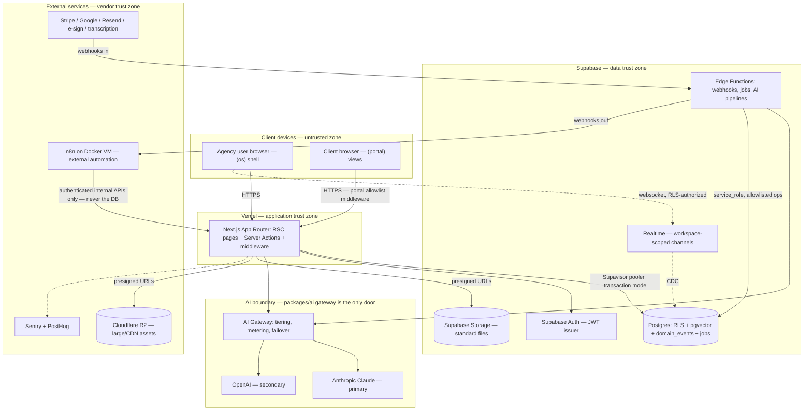

The system is four trust zones around one database. Browsers are untrusted and reach only the Next.js application on Vercel, which is the sole request-time compute (`../08_Tech_Stack.md` §2.1). All application connections to Postgres go through Supavisor in transaction mode from day one (`../09_Scaling_Strategy.md` §3.4), and every row the app can touch is guarded by deny-by-default RLS keyed on `workspace_id` (`../adr/0001_Multi_Tenant_Modular_Monolith.md`). Supabase Edge Functions form the second compute surface — webhook receivers, scheduled jobs, and AI background pipelines — and are the only place the RLS-bypassing `service_role` key may exist, under a documented operation allowlist (`../09_Scaling_Strategy.md` §2.3).

Two boundaries deserve emphasis because they are enforced structurally, not by convention. First, the AI boundary: no code path reaches a model provider except through the gateway in `packages/ai` (`../07_AI_Strategy.md` §4) — provider SDK types never leak past it. Second, the n8n boundary: n8n handles external SaaS glue only and calls authenticated internal API endpoints, never the database, so RLS, RBAC, and audit remain the single enforcement path (`../08_Tech_Stack.md` §5.1). Everything in this diagram exists by Phase 2 except the AI zone (Phase 1 scaffold, Phase 3 full) and R2 (Phase 2).

---

## 2. Frontend Architecture

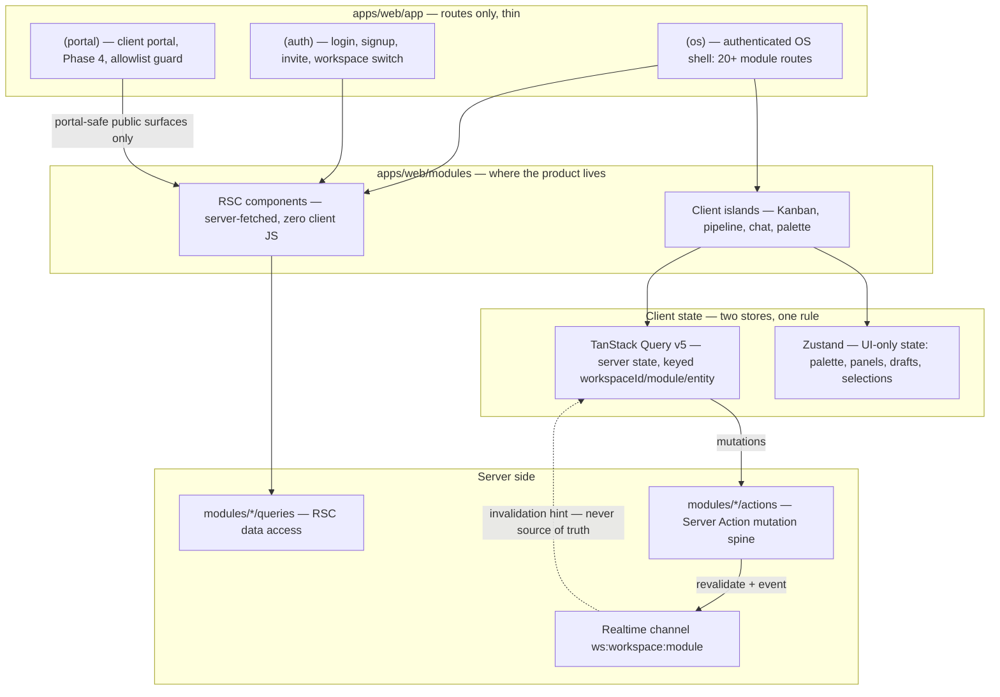

Route groups carry URL structure and layout nesting; all real code lives in `apps/web/modules/{module}/`, imported only through each module's public surface (`../13_Folder_Structure.md` §2–3, §5). Server Components are the default: first paint for read-heavy views is fetched server-side inside the RLS-authenticated client, shipping no data-fetching JavaScript. Client islands are opt-in and justified per file — interactivity, browser APIs, animation (`../08_Tech_Stack.md` §2.1).

After first paint, the division of state is a single rule: if the server knows about it, it belongs in TanStack Query; if only this browser tab cares, Zustand (`../08_Tech_Stack.md` §2.6). Supabase Realtime closes the loop — every realtime payload is treated as an invalidation hint that triggers a workspace-keyed TanStack Query refetch, never as data to render directly, which keeps correctness in Postgres (`../08_Tech_Stack.md` §3.5). The `(portal)` group is the same app behind an allowlist middleware guard and a restricted import surface, with extraction to `apps/portal` pre-registered as a Phase 5 escape hatch (`../13_Folder_Structure.md` §4). Phases: `(auth)` and `(os)` from Phase 0–1; `(portal)` at Phase 4.

---

## 3. Backend Request Paths

```mermaid
flowchart TB
    subgraph readpath["Read path — RSC (Phase 0)"]
        page["page.tsx — under 30 lines"] --> mq["module queries layer"]
        mq --> dbpkg["packages/db typed client"]
        dbpkg --> pgr[("Postgres — RLS evaluates JWT claims")]
    end

    subgraph mutpath["Mutation spine — Server Action (Phase 0, normative)"]
        sa["Server Action"] --> validate["1 — validate: Zod schema from packages/core"]
        validate --> authorize["2 — authorize: can() from core/permissions"]
        authorize --> execute["3 — execute: packages/db, RLS as backstop"]
        execute --> emit["4 — emit domain_event, same transaction"]
        emit --> auditw["5 — audit_log write"]
        auditw --> invalidate["6 — revalidate / realtime invalidation"]
    end

    subgraph edgepath["Edge Function paths (Phase 1)"]
        webhook["Webhook receiver — Stripe, email inbound, n8n callback"] --> verify["verify signature + Zod-parse payload"]
        verify --> enqueue["enqueue() → jobs table, transactional"]
        cron["pg_cron schedule"] --> worker["job worker — FOR UPDATE SKIP LOCKED"]
        enqueue --> worker
        worker --> pgw[("Postgres — service_role with explicit workspace_id")]
        worker --> emitw["emit events + audit"]
    end
```

Three request shapes cover the entire backend. Reads flow through RSC pages into the module's `queries/` layer and `packages/db`; RLS is evaluated on every query from the caller's JWT claims, so a forgotten `WHERE` clause returns nothing rather than everything. Mutations follow the six-step spine verbatim — reviewers reject actions that skip a step (`../13_Folder_Structure.md` §3) — and the domain event is written in the same transaction as the mutation, which is what makes every downstream consumer (automations, notifications, analytics, AI context) drift-free by construction (`../08_Tech_Stack.md` §5.2).

Event-driven and scheduled work lives in Edge Functions, deliberately off the Vercel request path: untrusted inbound payloads are isolated there, and background load never couples to the web deployment (`../08_Tech_Stack.md` §3.4). Jobs are Postgres rows claimed with `FOR UPDATE SKIP LOCKED`, idempotent by deterministic job key, carrying `workspace_id`; a durable queue platform arrives only behind the existing `enqueue()` interface when the named trigger fires — sustained >10–20 jobs/sec or >15-minute executions (`../09_Scaling_Strategy.md` §4.3).

---

## 4. Authentication Flow

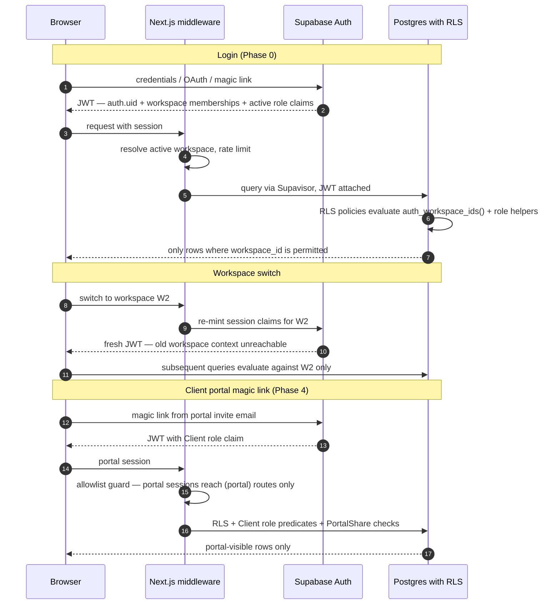

Identity is Supabase Auth; authorization is ours. The JWT carries `auth.uid()`, workspace memberships, and the active role, and RLS policies evaluate those claims through stable helper functions so the planner can cache them (`../09_Scaling_Strategy.md` §2.1). RBAC itself — the Owner-to-Guest role model of `../05_User_Roles.md` — lives in our `workspace_members` table, not in the vendor's system (`../08_Tech_Stack.md` §3.3). Because RLS context arrives via JWT claims per request, the model is fully compatible with transaction-mode pooling, which forbids session state.

A workspace switch is a claims change, not an application-state change: the fresh JWT makes the previous workspace structurally unreachable at the database layer. Portal authentication is the same machinery with two extra fences — the Client role's RLS predicates and the middleware allowlist that confines portal sessions to `(portal)` routes (`../13_Folder_Structure.md` §4). Defense-in-depth ordering is deliberate: middleware and `can()` checks fail fast and shape UX; RLS is the guarantee.

---

## 5. AI Layer

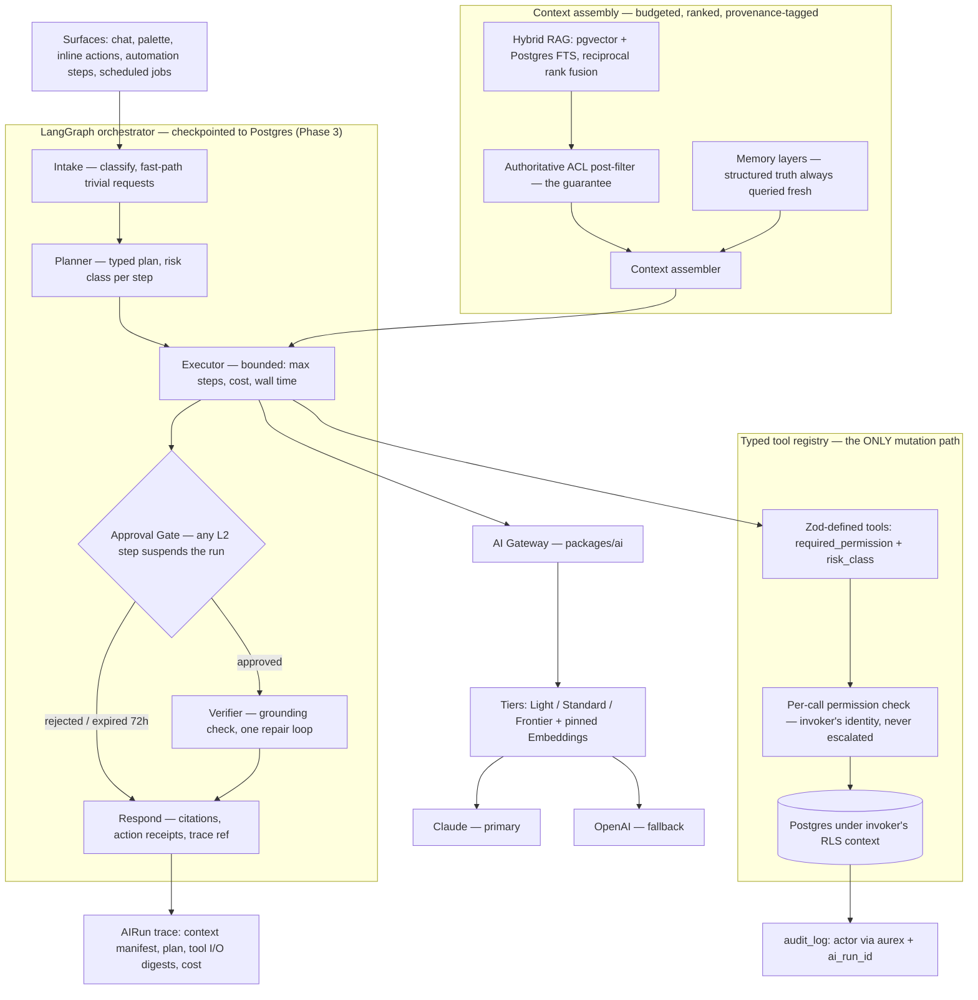

This is `../07_AI_Strategy.md` §2 in one picture: a single assistant, Aurex, whose every surface routes through the same six-node LangGraph — Intake, Planner, Executor, Approval Gate, Verifier, Respond — with run state checkpointed to Postgres after every node, so approvals can be decided days later and crashes resume rather than restart. The tool registry is the load-bearing contract: tools are the only way Aurex mutates anything, each tool declares its required permission and risk class, and handlers run under the invoking user's RLS context — Aurex inherits permissions and never escalates (`../07_AI_Strategy.md` §2.3).

Autonomy is graduated (L0 Suggest / L1 Draft / L2 Act-with-approval / L3 Act-and-report) with hard floors no configuration can lift: outbound and destructive actions cap at L2, contract sending and Settings mutations are permanently human-gated (`../07_AI_Strategy.md` §7). Retrieval is hybrid — pgvector semantic plus Postgres FTS fused with reciprocal rank fusion — and tenant isolation of vectors is the same RLS policy as everything else, with the ACL post-filter as the authoritative check on every hit (`../07_AI_Strategy.md` §5). Every run produces an AIRun trace, and every mutation lands in `audit_log` as `actor via aurex` with `ai_run_id` linkage. The gateway scaffold exists from Phase 1 (metering from the first call); the full layer is Phase 3.

---

## 6. Database Architecture

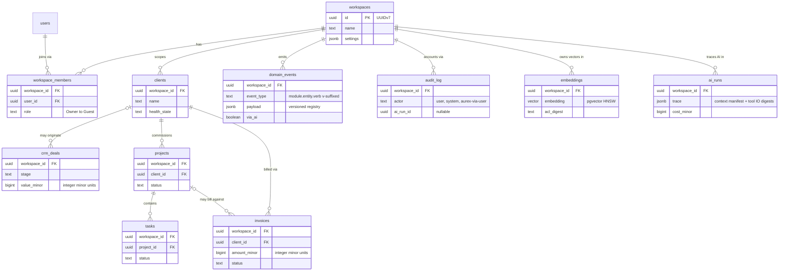

The diagram shows the tenancy spine, not the full schema — the real system has 20+ modules' tables, all following the same conventions (`../08_Tech_Stack.md` §3.2): UUIDv7 primary keys, trigger-maintained `created_at`/`updated_at`, `deleted_at` soft deletes baked into RLS policies, `workspace_id uuid NOT NULL` on every tenant table with composite indexes leading on it, and money as integer minor units. Implicit columns are omitted per the convention in `../06_Module_Breakdown.md`.

Two tables are architecturally special. `domain_events` is the append-only event spine — written transactionally with each mutation, consumed by automations, notifications, analytics read models, AI context, and the Phase 5 webhook surface; it doubles as the outbox if a service is ever extracted (`../08_Tech_Stack.md` §10.8). `audit_log` is its accountability twin: insert-only at the Postgres privilege level, distinct from events because events power features while audit powers accountability (`../06_Module_Breakdown.md` §24). Both, along with `notifications` and `ai_usage`, are the unbounded-growth tables pre-designed for range partitioning at the ~100M-row trigger (`../09_Scaling_Strategy.md` §3.2).

---

## 7. Automation Layer

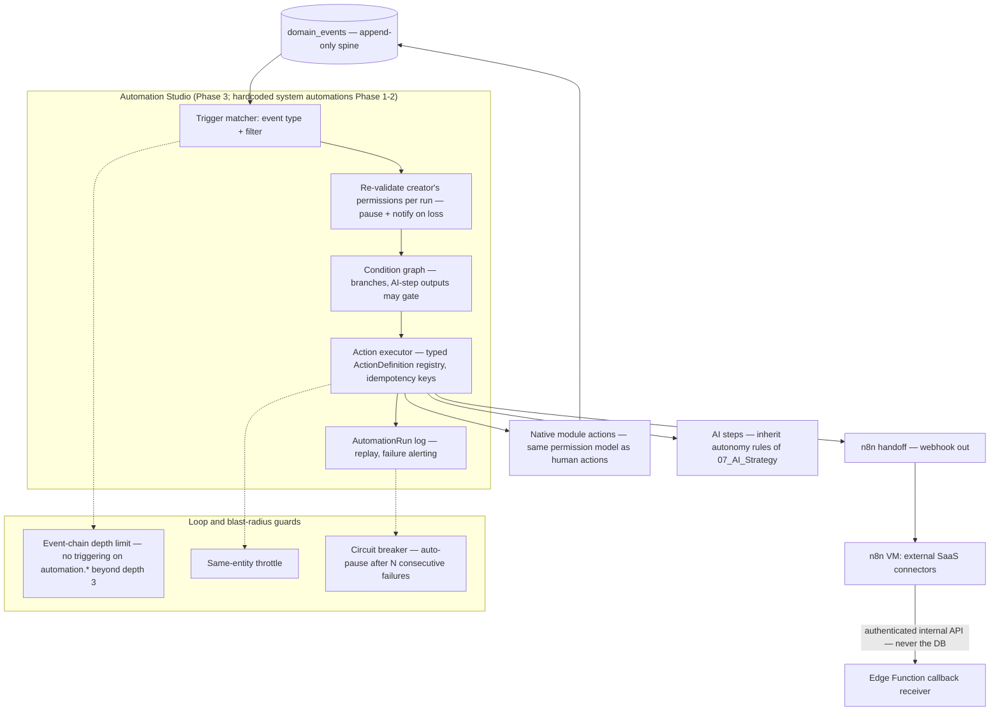

Automation Studio is the primary internal consumer of the event spine (`../06_Module_Breakdown.md` §17). Its permission model mirrors the AI layer's: an automation runs with its creator's permissions, re-validated on every run — if the creator loses the permission, the automation pauses and notifies rather than executing with orphaned privilege. Actions come from the same typed ActionDefinition registry that feeds the command palette and Aurex's tools, so there is exactly one catalog of "things that can be done" across humans, automations, and AI.

Because automations emit events and consume events, loops are a structural hazard handled by architecture: automations cannot trigger on `automation.*` events beyond chain depth 3, same-entity throttles damp ping-pong patterns, and a circuit breaker auto-pauses any automation after N consecutive failures. The external leg is one-way in each direction — Studio hands off to n8n via webhook, and n8n reports back through authenticated internal APIs received by Edge Functions, never by touching Postgres (`../08_Tech_Stack.md` §5.1). AI steps inside flows inherit the autonomy floors of `../07_AI_Strategy.md` §7 regardless of automation ownership: an automation cannot launder an unapproved outbound send.

---

## 8. Notification Layer

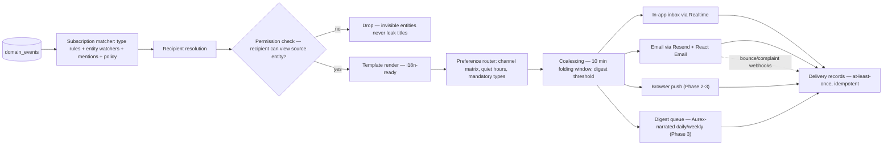

One respectful engine serves the whole OS — no module ships ad-hoc notifications (`../06_Module_Breakdown.md` §18, §23). The pipeline's most important stage is the permission check: a notification is only rendered for a recipient who can view the source entity, so notifications can never leak even the title of an invisible record. Mandatory categories (security alerts, approval requests) cannot be muted; everything else obeys the per-user channel matrix, quiet hours, and digest folding.

Delivery is at-least-once with idempotent delivery records; channel adapter failures retry with backoff, and email provider webhooks feed deliverability state back in. The AI layer sits on top without altering content: L3 read-only priority ranking orders and folds, Aurex narrates the daily digest per recipient with their permissions applied, and proactive surfaces whose acted-on rate stays below threshold are throttled automatically (`../07_AI_Strategy.md` §6). Phase 1 ships in-app + email with preferences; Phase 2 adds batching, digests, and push; Phase 3 adds ranking and narration.

---

## 9. Storage Layer

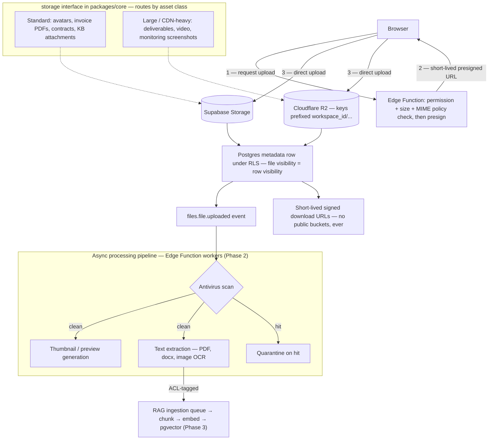

Application code never talks to a bucket SDK: the single `storage` interface in `packages/core` routes by asset class — Supabase Storage for the RLS-integrated 95% case, R2 for large and client-facing assets where zero egress is decisive (`../08_Tech_Stack.md` §6). Uploads go direct-to-storage via presigned URLs minted only after an Edge Function has enforced permission, size, and MIME policy; downloads are short-lived signed URLs after an RBAC check, and portal file access flows through the same signing path with PortalShare checks (`../06_Module_Breakdown.md` §25).

A file's visibility *is* its Postgres metadata row's visibility — tenancy and ACLs live in one place, with object keys prefixed by `workspace_id` as belt-and-braces. The processing pipeline is event-driven off `files.file.uploaded`: antivirus (quarantine on hit), previews, and text extraction, whose output feeds the RAG ingestion queue ACL-tagged so a revoked document promptly stops appearing in Aurex answers (`../07_AI_Strategy.md` §5.1). Contract and invoice PDFs are immutable and content-hash verified.

---

## 10. External Integrations

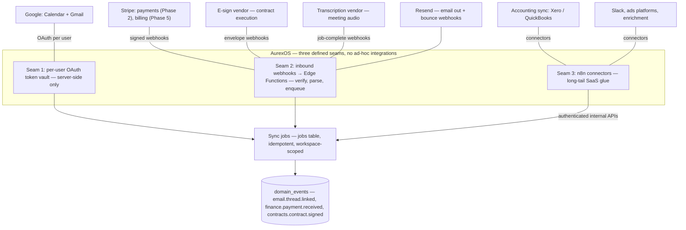

Every external system enters through one of three seams, and nothing enters any other way. Per-user OAuth (Google Calendar, Gmail) keeps tokens server-side in a vault and scopes every sync to the connecting user's own account and workspace. Inbound webhooks land exclusively on Edge Functions — signature-verified, Zod-parsed, then enqueued as idempotent jobs — keeping untrusted payloads off the Vercel app entirely (`../08_Tech_Stack.md` §3.4). The long tail rides n8n's connector catalog, which we should never hand-write, under the standing rule that n8n calls authenticated internal APIs and never the database.

The payoff of the discipline: every integration's effect on the system is expressed as domain events, so an inbound Stripe payment, a signed contract envelope, and a linked email thread are all first-class, automatable, notifiable, AI-visible facts with the same governance as internal mutations. Contract *sending* remains permanently human-gated regardless of vendor capability (`../07_AI_Strategy.md` §7). A public API and outbound webhooks for customers are Phase 5, riding the same event registry (`../06_Module_Breakdown.md` Appendix A).

---

## 11. Deployment Topology

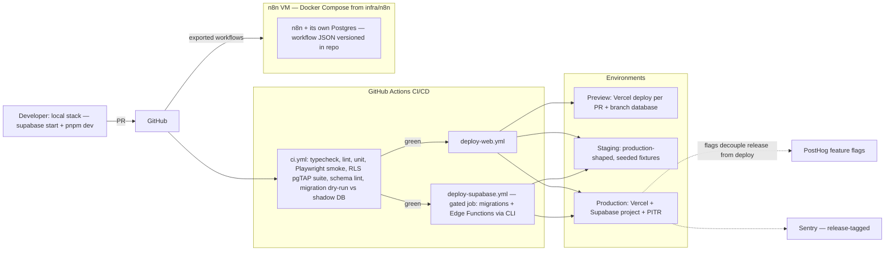

Four environments, one pipeline. Every PR gets a Vercel preview deploy — the review workflow — with branch databases for schema-affecting work; CI runs the full gauntlet including the two-tenant RLS smoke suite and pgTAP policy tests on every PR, and a migration dry-run against a production-shaped shadow DB (`../08_Tech_Stack.md` §7–8). Supabase migrations and Edge Functions deploy through a gated Actions job, never by hand. Migrations follow expand → migrate → contract without exception, and PITR with a quarterly-tested restore runbook is the data rollback story (`../09_Scaling_Strategy.md` §7).

The application itself is not containerized while on Vercel; Docker exists only for the n8n VM (with its own Postgres, deliberately separate from tenant data) and local dev parity. Feature flags in PostHog decouple release from deploy, which — combined with stateless compute and immutable Vercel deploys with instant rollback — is the zero-downtime story (`../09_Scaling_Strategy.md` §4.1, §7).

---

## 12. Future Scaling

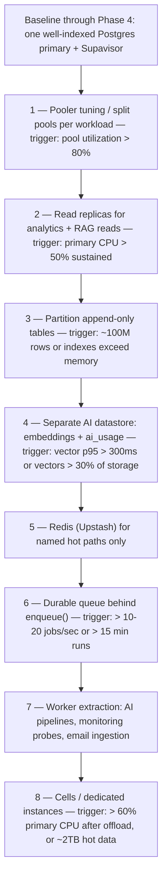

The ladder is `../09_Scaling_Strategy.md` §10 drawn as a picture: each rung is roughly 10× the operational cost of the previous one, each has a named quantitative trigger with a dashboard panel, and we take them strictly in order — nothing is built speculatively. The rungs are pre-designed but not pre-built: replicas already have their `dbRead('analytics')` handle, the queue hides behind `enqueue()`, the AI datastore is a second connection string in `packages/db`, and worker extraction follows the module seams with `domain_events` as the outbox. The likely first extractions are all workers, not user-facing services — the user-facing monolith survives to very large scale (`../09_Scaling_Strategy.md` §5).

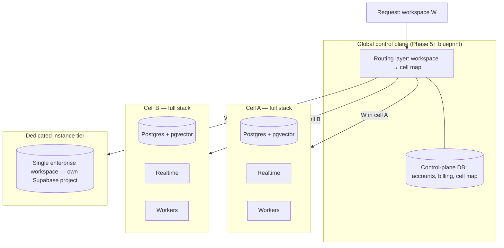

Cell-based sharding is the endgame blueprint, documented now so Phases 0–4 never accidentally create cross-workspace joins in product features (`../09_Scaling_Strategy.md` §2.5). Each cell is a complete stack hosting a set of workspaces; workspaces never span cells, preserving the everything-joins-locally property; the global layer holds only accounts, billing, and the workspace-to-cell map. The dedicated-instance tier is the same idea for one tenant — a filtered dump-and-restore onto its own Supabase project, sold as a premium isolation tier and built only when the first enterprise contract demands it. Both moves are cheap later precisely because every row, vector, file key, channel, and job already carries `workspace_id`: the tenancy model is the scaling model.

---

## 13. Revisit Triggers

This atlas is redrawn — not merely annotated — when any of the following occurs:

| Trigger | Diagrams affected |
|---|---|
| Any rung of the §12 ladder fires (replicas, partitioning, AI datastore, Redis, queue, extraction, cells) | 1, 3, 6, 12 |
| First worker service extracted per `../09_Scaling_Strategy.md` §5 | 1, 3, 11 |
| Portal Aurex enabled (Phase 4 opt-in decision, `../07_AI_Strategy.md` §8.7) | 5, 2 |
| `apps/portal` extraction escape hatch exercised (`../13_Folder_Structure.md` §4) | 2, 11 |
| Phase 5 public API + webhooks ship | 1, 10 |
| Stripe billing / `packages/billing` lands (Phase 5) | 10, 11 |
| Retrieval backend swap behind the `retrieval` interface (`../08_Tech_Stack.md` §4.4) | 5, 6 |
| Any ADR that changes a component drawn here | as scoped by the ADR |

Diagram changes follow the same review path as prose: a PR touching this file must cite the planning document or ADR that made the picture stale.
